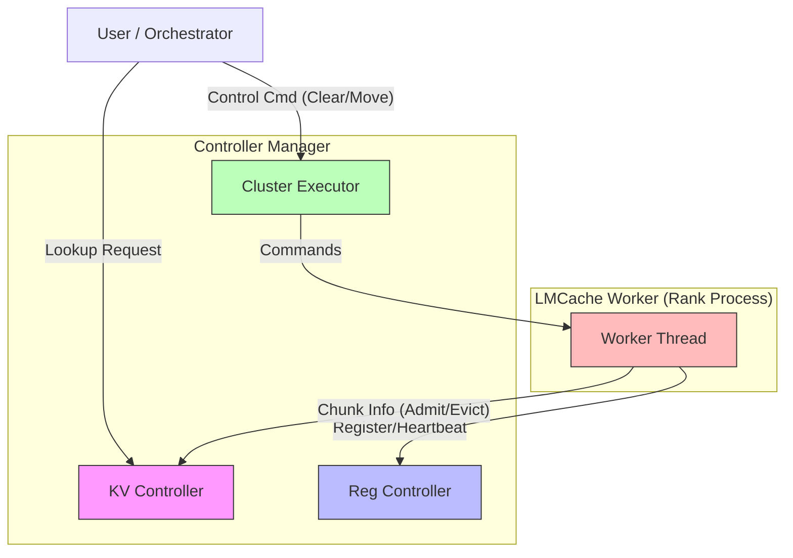

# LMCache Controller 解读


# LMCache Controller 解读

LMCache Controller 是 LMCache 系统中的核心管控组件，负责集群内的 KV Cache 管理、元数据同步以及 P2P 通信协调。本文将基于官方文档，深入解读 Controller 的架构设计、核心功能接口以及部署配置。

## 1. 架构概览 (Overview)

LMCache Controller 的整体架构主要由两大部分组成：**Controller Manager** (管控端) 和 **LMCache Worker** (节点端)。

### 1.1 核心组件

*   **Controller Manager**: 通常作为独立服务运行，包含以下三个核心子模块：
    *   **KV Controller**: 负责处理 Worker 上报的 Chunk 信息（Admit/Evict），并响应来自客户端的 Lookup 请求（查询 Chunk 位置）。
    *   **Reg Controller**: 负责节点的注册 (Register)、注销 (Deregister) 以及心跳 (Heartbeat) 管理。
    *   **Cluster Executor**: 集群执行器。当接收到用户的控制指令（如 Clear, Move）时，通过它向对应的 Worker 下发具体命令。

*   **LMCache Worker**: 运行在每个推理 Rank 进程中的线程，负责：
    *   向 Reg Controller 发送注册、注销和心跳信号。
    *   向 KV Controller 上报 Chunk 的变更信息（Admit/Evict）。
    *   监听指定端口，接收并执行来自 Cluster Executor 的指令。

### 1.2 架构图解

根据文档描述，LMCache Controller 的交互逻辑如下所示：



## 2. P2P 机制 (P2P Related)

如果启用了 `enable_p2p`，则必须启动 LMCache Controller。此时，Controller 扮演“中心节点”的角色，存储所有 Chunk 的位置信息。

*   **工作流程**：`P2PBackend` 首先从 LMCache Controller 查询所需的 Chunk 信息，然后通过 NIXL (或其他传输层) 进行点对点的数据传输。

> [!NOTE]
> 在 P2P 场景下，Controller 仅负责元数据（Metadata）的交换，实际的 KV Cache 数据流直接在 Worker 节点之间传输，从而避免单点瓶颈。

## 3. 核心功能与 API 详解 (Key Features)

Controller 为用户和编排系统（Orchestrator）提供了一组 RESTful API 来管理 KV Cache。同时，它也与 LMCache Worker 保持实时交互。

以下是 Controller 提供的核心 API 接口解读：

### 3.1 Clear (清除缓存)

`Clear` 接口用于清除指定实例 (`instance_id`) 在特定位置 (`location`) 的 KV Cache。

*   **接口定义**:
    ```python
    clear(instance_id: str, location: str) -> event_id: str, num_tokens: int
    ```
*   **功能**: 移除存储在指定位置的 KV Cache。返回 `event_id` 和被调度清除的 Token 数量。
*   **使用示例**:
    ```bash
    curl -X POST http://localhost:9000/clear \
      -H "Content-Type: application/json" \
      -d '{
            "instance_id": "lmcache_default_instance",
            "location": "LocalCPUBackend"
          }'
    ```

### 3.2 Compress (压缩/解压缓存)

`Compress` 和 `Decompress` 接口用于对指定 Token 的 KV Cache 进行压缩或解压操作，通常结合 `cachegen` 等压缩算法使用。

*   **接口定义**:
    ```python
    compress(instance_id: str, method: str, location: str, tokens: list[int]) -> event_id: str, num_tokens: int
    decompress(instance_id: str, method: str, location: str, tokens: list[int]) -> event_id: str, num_tokens: int
    ```
*   **功能**: 使用指定的方法 (`method`, 如 `cachegen`) 在指定位置 (`location`) 压缩或解压 `tokens` 对应的 KV Cache Chunk。

#### 完整验证流程

1.  **环境准备**:
    创建配置文件 `example.yaml` 并启动 vLLM (Port 8000) 和 LMCache Controller (Port 9000)。
    ```bash
    # 1. Start vLLM with LMCache
    CUDA_VISIBLE_DEVICES=0 LMCACHE_CONFIG_FILE=example.yaml vllm serve meta-llama/Llama-3.1-8B-Instruct \
      --max-model-len 4096 --gpu-memory-utilization 0.8 --port 8000 \
      --kv-transfer-config '{"kv_connector":"LMCacheConnectorV1", "kv_role":"kv_both"}'
    
    # 2. Start Controller
    lmcache_controller --host localhost --port 9000 --monitor-port 9001
    ```

2.  **生成 KV Cache**:
    发送推理请求以触发 KV Cache 的生成。
    ```bash
    curl -X POST http://localhost:8000/v1/completions \
      -H "Content-Type: application/json" \
      -d '{
        "model": "meta-llama/Llama-3.1-8B-Instruct",
        "prompt": "Explain the significance of KV cache in language models.",
        "max_tokens": 10
      }'
    ```

3.  **获取 Token IDs**:
    获取 Prompt 对应的 Token ID 序列，用于后续请求。
    ```bash
    curl -X POST http://localhost:8000/tokenize \
      -H "Content-Type: application/json" \
      -d '{
        "model": "meta-llama/Llama-3.1-8B-Instruct",
        "prompt": "Explain the significance of KV cache in language models."
      }'
    # Output: {"tokens":[128000, 849, 21435, ...]}
    ```

4.  **发送压缩请求 (Compress)**:
    ```bash
    curl -X POST http://localhost:9000/compress \
      -H "Content-Type: application/json" \
      -d '{
          "instance_id": "lmcache_default_instance",
          "method": "cachegen",
          "location": "LocalCPUBackend",
          "tokens": [128000, 849, 21435, 279, 26431, 315, 85748, 6636, 304, 4221, 4211, 13]
      }'
    ```
    **验证**: Controller 返回 `{"event_id": "xxx", "num_tokens": 12}`，表示压缩任务已下发。

5.  **发送解压请求 (Decompress)**:
    ```bash
    curl -X POST http://localhost:9000/decompress \
      -H "Content-Type: application/json" \
      -d '{
          "instance_id": "lmcache_default_instance",
          "method": "cachegen",
          "location": "LocalCPUBackend",
          "tokens": [128000, 849, 21435, 279, 26431, 315, 85748, 6636, 304, 4221, 4211, 13]
      }'
    ```
    **验证**: Controller 返回 `{"event_id": "xxx", "num_tokens": 12}`，表示解压任务已下发。


### 3.3 Health (健康检查)

`Health` 接口用于检查 Controller 及其管理的 Worker 节点的健康状态。

*   **接口定义**:
    ```python
    health(instance_id: str) -> event_id: str, error_codes: Dict[int, int]
    ```
*   **功能**: 返回一个字典，映射 `worker_id` 到 `error_code`。`0` 表示健康，非 `0` 表示异常。

#### 完整验证流程

1.  **环境准备**:
    启动 LMCache Controller。
    ```bash
    PYTHONHASHSEED=123 lmcache_controller --host localhost --port 9000 --monitor-port 9001
    ```

2.  **发送健康检查请求**:
    ```bash
    curl -X POST http://localhost:9000/health \
      -H "Content-Type: application/json" \
      -d '{"instance_id": "lmcache_default_instance"}'
    ```

3.  **验证**:
    Controller 返回包含 Worker 状态的 JSON 响应：
    ```json
    {"event_id": "health...", "error_codes": {"0": 0, "1": 0}}
    ```
    `error_codes` 为 `0` 表示 Worker 健康。

### 3.4 Lookup (查询缓存)

`Lookup` 是最常用的接口之一，用于查询给定 Token 序列的 KV Cache 存储位置。

*   **接口定义**:
    ```python
    lookup(tokens: List[int]) -> event_id: str, layout_info: Dict[str, Tuple[str, int]]
    ```
*   **功能**: 输入 Token 列表，返回 `layout_info`。这是一个字典，Key 为 `instance_id`，Value 为 `(location, matched_prefix_length)` 元组，表示在哪个实例的哪个位置找到了多长的匹配前缀。

#### 完整验证流程

1.  **环境准备**:
    创建配置文件 `example.yaml` 并启动服务 (vLLM & Controller)。
    ```bash
    # 1. Start vLLM with LMCache
    PYTHONHASHSEED=123 CUDA_VISIBLE_DEVICES=0 LMCACHE_CONFIG_FILE=example.yaml vllm serve meta-llama/Llama-3.1-8B-Instruct \
      --max-model-len 4096 --gpu-memory-utilization 0.8 --port 8000 \
      --kv-transfer-config '{"kv_connector":"LMCacheConnectorV1", "kv_role":"kv_both"}'
    
    # 2. Start Controller
    PYTHONHASHSEED=123 lmcache_controller --host localhost --port 9000 --monitor-port 9001
    ```
    > [!IMPORTANT]
    > 注意：这里显式设置了 `PYTHONHASHSEED=123`，确保跨进程的 Hash 一致性。

2.  **生成 KV Cache**:
    发送推理请求以触发 KV Cache 的生成。
    ```bash
    curl -X POST http://localhost:8000/v1/completions \
      -H "Content-Type: application/json" \
      -d '{
        "model": "meta-llama/Llama-3.1-8B-Instruct",
        "prompt": "Explain the significance of KV cache in language models.",
        "max_tokens": 10
      }'
    ```

3.  **获取 Token IDs**:
    获取 Prompt 对应的 Token ID 序列。
    ```bash
    curl -X POST http://localhost:8000/tokenize \
      -H "Content-Type: application/json" \
      -d '{
        "model": "meta-llama/Llama-3.1-8B-Instruct",
        "prompt": "Explain the significance of KV cache in language models."
      }'
    # Output: {"tokens":[128000, 849, 21435, ...]}
    ```

4.  **发送查询请求 (Lookup)**:
    向 Controller 查询这些 Tokens 的缓存位置。
    ```bash
    curl -X POST http://localhost:9000/lookup \
      -H "Content-Type: application/json" \
      -d '{
        "tokens": [128000, 849, 21435, 279, 26431, 315, 85748, 6636, 304, 4221, 4211, 13]
      }'
    ```
    **验证**: Controller 返回包含缓存位置的响应：
    ```json
    {
      "event_id": "xxx", 
      "lmcache_default_instance": ["LocalCPUBackend", 12]
    }
    ```
    结果显示在 `lmcache_default_instance` 的 `LocalCPUBackend` 中找到了 12 个匹配的 Token。


### 3.5 Move (迁移缓存)

`Move` 接口用于在不同实例或不同存储介质之间迁移 KV Cache，这是实现负载均衡和上下文共享的关键。

*   **接口定义**:
    ```python
    move(old_position: Tuple[str, str], new_position: Tuple[str, str],
         tokens: Optional[List[int]] = [], copy: Optional[bool] = False) -> event_id: str, num_tokens: int
    ```
*   **功能**: 将 `tokens` 对应的 KV Cache 从 `old_position` 移动到 `new_position`。
    *   `position` 定义为 `(instance_id, location)`。
    *   `copy=True` 表示复制而非移动。
    *   支持 P2P 传输（需安装 NIXL）。

#### 完整验证流程

1.  **环境准备**:
    准备两个配置文件 `instance1.yaml` 和 `instance2.yaml`，分别对应两个 vLLM 实例（模拟跨节点/跨卡迁移）。
    *   `instance1.yaml`: 配置 `lmcache_worker_ports: 8500`, `p2p_init_ports: 8200`
    *   `instance2.yaml`: 配置 `lmcache_worker_ports: 8501`, `p2p_init_ports: 8202`

    启动两个 vLLM 实例和 Controller：
    ```bash
    # 1. Start vLLM Instance 1 (Port 8000)
    PYTHONHASHSEED=123 UCX_TLS=rc CUDA_VISIBLE_DEVICES=0 LMCACHE_CONFIG_FILE=instance1.yaml \
    vllm serve meta-llama/Llama-3.1-8B-Instruct --max-model-len 4096 \
      --gpu-memory-utilization 0.8 --port 8000 --kv-transfer-config '{"kv_connector":"LMCacheConnectorV1", "kv_role":"kv_both"}'

    # 2. Start vLLM Instance 2 (Port 8001)
    PYTHONHASHSEED=123 UCX_TLS=rc CUDA_VISIBLE_DEVICES=1 LMCACHE_CONFIG_FILE=instance2.yaml \
    vllm serve meta-llama/Llama-3.1-8B-Instruct --max-model-len 4096 \
      --gpu-memory-utilization 0.8 --port 8001 --kv-transfer-config '{"kv_connector":"LMCacheConnectorV1", "kv_role":"kv_both"}'

    # 3. Start Controller
    PYTHONHASHSEED=123 lmcache_controller --host localhost --port 9000 --monitor-ports '{"pull": 8300, "reply": 8400}'
    ```

2.  **生成 KV Cache (Instance 1)**:
    向实例 1 发送推理请求。
    ```bash
    curl -X POST http://localhost:8000/v1/completions \
      -H "Content-Type: application/json" \
      -d '{
        "model": "meta-llama/Llama-3.1-8B-Instruct",
        "prompt": "Explain the significance of KV cache in language models.",
        "max_tokens": 10
      }'
    ```

3.  **获取 Token IDs**:
    ```bash
    curl -X POST http://localhost:8000/tokenize \
      -H "Content-Type: application/json" \
      -d '{
        "model": "meta-llama/Llama-3.1-8B-Instruct",
        "prompt": "Explain the significance of KV cache in language models."
      }'
    ```

4.  **发送迁移请求 (Move)**:
    将 KV Cache 从实例 1 迁移到实例 2。
    ```bash
    curl -X POST http://localhost:9000/move \
      -H "Content-Type: application/json" \
      -d '{
            "old_position": ["lmcache_instance_1", "LocalCPUBackend"],
            "new_position": ["lmcache_instance_2", "LocalCPUBackend"],
            "tokens": [128000, 849, 21435, 279, 26431, 315, 85748, 6636, 304, 4221, 4211, 13]
          }'
    ```

5.  **验证**:
    Controller 返回 `{"num_tokens": 12, "event_id": "xxx"}`，表明迁移任务已下发。

### 3.6 Pin (锁定缓存)

`Pin` 接口用于持久化（锁定）KV Cache，防止其被驱逐策略（如 LRU）移除。

*   **接口定义**:
    ```python
    pin(instance_id: str, location: str, tokens: List[int]) -> event_id: str, num_tokens: int
    ```
*   **功能**: 在指定 `location` 锁定 `tokens` 对应的 KV Cache Chunk。

#### 完整验证流程

1.  **环境准备**:
    启动 vLLM 和 Controller。
    ```bash
    # 1. Start vLLM
    CUDA_VISIBLE_DEVICES=0 LMCACHE_CONFIG_FILE=example.yaml vllm serve meta-llama/Llama-3.1-8B-Instruct \
      --max-model-len 4096 --gpu-memory-utilization 0.8 --port 8000 \
      --kv-transfer-config '{"kv_connector":"LMCacheConnectorV1", "kv_role":"kv_both"}'

    # 2. Start Controller
    lmcache_controller --host localhost --port 9000 --monitor-port 9001
    ```

2.  **生成 KV Cache & 获取 Token IDs**:
    (步骤同 Compress/Lookup 接口，先发送 `completions` 请求生成缓存，再调用 `tokenize` 获取 ID)

3.  **发送锁定请求 (Pin)**:
    ```bash
    curl -X POST http://localhost:9000/pin \
      -H "Content-Type: application/json" \
      -d '{
            "tokens": [128000, 849, 21435, 279, 26431, 315, 85748, 6636, 304, 4221, 4211, 13],
            "instance_id": "lmcache_default_instance",
            "location": "LocalCPUBackend"
          }'
    ```

4.  **验证**:
    Controller 返回 `{"event_id": "xxx", "num_tokens": 12}`，表示这 12 个 Token 的 Cache 已被锁定。

### 3.7 CheckFinish (检查完成状态)

*   **状态**: *Coming soon...* (文档显示该功能即将推出)
*   **功能预期**: 用于检查异步控制事件（如 Move, Compress 等返回的 `event_id`）是否执行完成。

### 3.8 QueryWorkerInfo (查询 Worker 信息)

`QueryWorkerInfo` 接口用于获取指定 Worker 的详细连接信息。

*   **接口定义**:
    ```python
    query_worker_info(instance_id: str, worker_ids: List[int]) -> event_id: str, worker_infos: List[WorkerInfo]
    ```
*   **功能**: 返回指定 `worker_ids` 的详细信息，包括 IP、端口、P2P 初始化 URL、注册时间及最后心跳时间等。

#### 完整验证流程

1.  **环境准备**:
    启动 vLLM (Worker) 和 LMCache Controller。
    ```bash
    # 1. Start vLLM (Worker)
    CUDA_VISIBLE_DEVICES=0 LMCACHE_CONFIG_FILE=example.yaml vllm serve meta-llama/Llama-3.1-8B-Instruct \
      --max-model-len 4096 --gpu-memory-utilization 0.8 --port 8000 \
      --kv-transfer-config '{"kv_connector":"LMCacheConnectorV1", "kv_role":"kv_both"}'
    
    # 2. Start Controller
    lmcache_controller --host localhost --port 9000 --monitor-port 9001
    ```

2.  **发送查询请求**:
    向 Controller 查询 ID 为 `0` 的 Worker 信息。
    ```bash
    curl -X POST http://localhost:9000/query_worker_info \
      -H "Content-Type: application/json" \
      -d '{
            "instance_id": "lmcache_default_instance",
            "worker_ids": [0]
          }'
    ```

3.  **验证**:
    Controller 返回包含 Worker 详细信息的 JSON 响应：
    ```json
    {
      "event_id": "xxx", 
      "worker_infos": [
        {
          "instance_id": "lmcache_default_instance", 
          "worker_id": 0, 
          "ip": "127.0.0.1", 
          "port": 8001, 
          "peer_init_url": "127.0.0.1:8200", 
          "registration_time": 123456, 
          "last_heartbeat_time": 456789
        }
      ]
    }
    ```
    响应中包含了 Worker 的 IP、端口、P2P 地址以及心跳时间戳，表明 Worker 已成功注册并在线。


## 4. 快速开始 (Quick Start)

本节介绍如何启动和配置 LMCache Controller。

### 4.1 启动 Controller

可以通过 Python 模块直接启动 Controller 服务：

```bash
python3 -m lmcache.v1.api_server
```

启动成功后，控制台将输出类似如下日志，表明 Controller 已在 9000 端口监听：

```text
INFO:     Started server process [50664]
INFO:     Uvicorn running on http://0.0.0.0:9000 (Press CTRL+C to quit)
```

### 4.2 启动参数详解

Controller 支持以下命令行参数配置：

*   `--host`: 绑定 IP 地址，默认为 `0.0.0.0`。
*   `--port`: 监听端口，默认为 `9000`。这是对外暴露 API（如 `lookup`）的端口。
*   `--monitor-ports`: 监控端口配置，默认为 `None`。用于 LMCache Worker 与 Controller Manager 通信。需传入 JSON 格式字符串，例如 `{"pull": 8300, "reply": 8400}`。
*   `--monitor-port`: (已废弃) 仅指定 pull 端口。

### 4.3 YAML 配置示例

在实际部署中，通常配合 YAML 文件来配置 LMCache 实例。以下是一个包含 Controller 和 P2P 配置的完整示例：

```yaml
# 启用 Controller
enable_controller: True
lmcache_instance_id: "lmcache_instance_id"

# Controller 通信配置
controller_pull_url: ip:pull_port
# 如果 Controller 的 reply port 为 None，则无需配置 reply url
controller_reply_url: ip:reply_port

# LMCache Worker 端口配置 (需与 Rank 数量一致)
lmcache_worker_ports: [1, 2, 3]

# P2P 配置
p2p_host: localhost
p2p_init_port: [11, 12, 13]
```

> [!TIP]
> 确保 `lmcache_worker_ports` 和 `p2p_init_port` 的数量与启动的 vLLM Rank (GPU) 数量保持一致。

## 参考资料 (References)

*   [LMCache Controller Documentation](https://docs.lmcache.ai/kv_cache_management/index.html)


