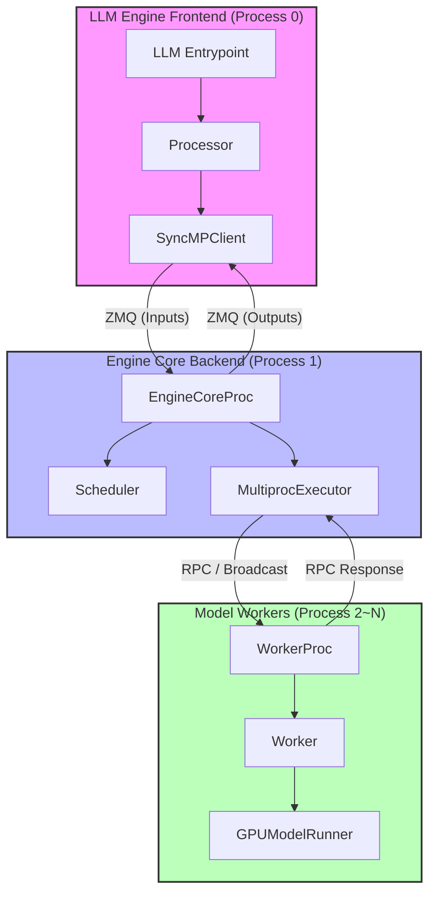
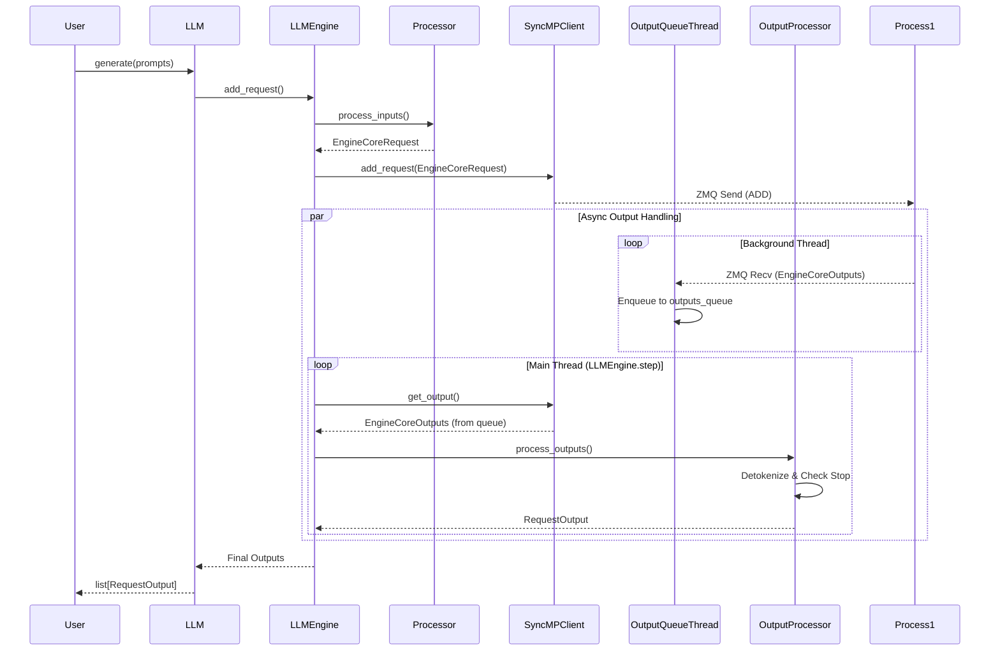
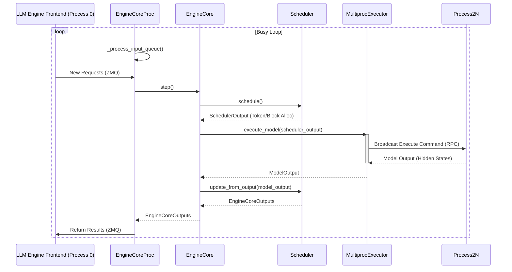
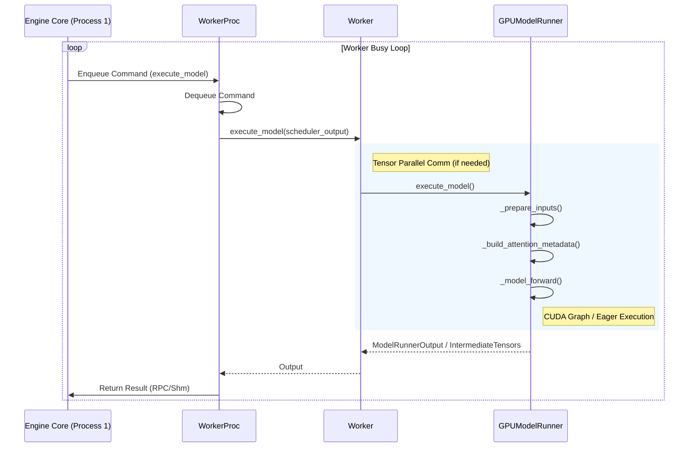

# LMCache-MoonCake-vLLM源码剖析


# LMCache-MoonCake-vLLM 源码剖析

本文旨在深入剖析 vLLM V1 架构及其与 LMCache 和 MoonCake 的集成。我们将从 vLLM V1 的整体架构出发，逐步深入到各个核心组件的源码实现。

## 1. vLLM V1 整体架构概览

vLLM V1 采用了多进程架构，将 CPU 密集型的预处理/后处理任务与 GPU 密集型的模型推理任务分离，以实现流水线并行和更高的资源利用率。主要包含以下三类进程：

*   **LLM Engine Frontend (Process 0, 前端引擎):** 运行 `LLMEngine`，负责请求接收、分词 (Tokenization)、反分词 (Detokenization) 和结果返回。
*   **Engine Core Backend (Process 1, 核心后端):** 运行 `EngineCore`，负责请求调度 (Scheduler) 和 GPU 任务协调。
*   **Model Worker (Process 2~N, 模型工作者):** 运行 `Worker`，负责实际的模型前向计算 (Model Execution)。



## 2. LLM Engine Frontend (Process 0) 源码解析

**LLM Engine Frontend (Process 0)** 是用户与 vLLM 交互的入口，主要运行在 CPU 上。以下是其核心组件的源码分析。



### 2.1 LLM Entrypoint (用户接口)

`LLM` 类是 vLLM 离线推理的主要入口点。它负责初始化引擎并提供 `generate` 接口。

*   **文件位置**: [llm.py](external/vllm/entrypoints/llm.py)
*   **核心类**: `LLM`

在 `__init__` 方法中，`LLM` 会根据参数创建 `LLMEngine`。值得注意的是，它会根据配置自动选择 V1 引擎。

```python
# external/vllm/entrypoints/llm.py

class LLM:
    def __init__(self, ...):
        # ... (配置参数处理)
        
        # Create the Engine (autoselects V0 vs V1)
        # 见 external/vllm/entrypoints/llm.py#L343
        self.llm_engine = LLMEngine.from_engine_args(
            engine_args=engine_args, usage_context=UsageContext.LLM_CLASS
        )
```

`generate` 方法是用户发起推理请求的入口：

```python
# external/vllm/entrypoints/llm.py

    def generate(
        self,
        prompts: PromptType | Sequence[PromptType],
        ...
    ) -> list[RequestOutput]:
        # ...
        
        # 验证并添加请求
        # 见 external/vllm/entrypoints/llm.py#L440
        self._validate_and_add_requests(...)

        # 运行引擎循环直到所有请求完成
        # 见 external/vllm/entrypoints/llm.py#L448
        outputs = self._run_engine(use_tqdm=use_tqdm)
        return self.engine_class.validate_outputs(outputs, RequestOutput)
```

### 2.2 Processor (输入预处理)

`Processor` 类负责处理输入请求，包括参数校验、多模态数据处理和 Tokenization。它将用户输入转换为 `EngineCoreRequest` 发送给后端。

*   **文件位置**: [processor.py](external/vllm/v1/engine/processor.py)
*   **核心类**: `Processor`

`process_inputs` 是其核心方法：

```python
# external/vllm/v1/engine/processor.py

    def process_inputs(
        self,
        request_id: str,
        prompt: PromptType,
        params: SamplingParams | PoolingParams,
        ...
    ) -> EngineCoreRequest:
        # 1. 校验 LoRA 和采样参数
        # 见 external/vllm/v1/engine/processor.py#L382-L383
        self._validate_lora(lora_request)
        self._validate_params(params)

        # 2. 预处理输入 (包括 Tokenization)
        # 见 external/vllm/v1/engine/processor.py#L426
        processed_inputs: ProcessorInputs = self.input_preprocessor.preprocess(
            prompt,
            tokenization_kwargs=tokenization_kwargs,
            mm_uuids=mm_uuids,
        )
        
        # ... (构建 EngineCoreRequest 对象)
```

### 2.3 SyncMPClient (跨进程通信)

`SyncMPClient` (继承自 `MPClient`) 负责 **LLM Engine Frontend (Process 0)** 与 **Engine Core Backend (Process 1)** 之间的通信。它使用 ZeroMQ (ZMQ) 实现高效的消息传递。

*   **文件位置**: [core_client.py](external/vllm/v1/engine/core_client.py)
*   **核心类**: `SyncMPClient`

`SyncMPClient` 在初始化时会启动一个后台线程 `output_queue_thread` 来接收后端返回的结果：

```python
# external/vllm/v1/engine/core_client.py

class SyncMPClient(MPClient):
    def __init__(self, ...):
        # ...
        # Process outputs from engine in separate thread.
        # 见 external/vllm/v1/engine/core_client.py#L693
        self.output_queue_thread = Thread(
            target=process_outputs_socket,
            name="EngineCoreOutputQueueThread",
            daemon=True,
        )
        self.output_queue_thread.start()
```

`add_request` 方法将请求发送给 EngineCore：

```python
# external/vllm/v1/engine/core_client.py

    def add_request(self, request: EngineCoreRequest) -> None:
        if self.is_dp:
            self.engines_running = True
        # 发送 ADD 类型请求
        # 见 external/vllm/v1/engine/core_client.py#L742
        self._send_input(EngineCoreRequestType.ADD, request)
```

`get_output` 方法从队列中获取推理结果：

```python
# external/vllm/v1/engine/core_client.py

    def get_output(self) -> EngineCoreOutputs:
        # ...
        # 从队列获取结果
        # 见 external/vllm/v1/engine/core_client.py#L707
        outputs = self.outputs_queue.get()
        # ...
        return outputs
```

### 2.4 OutputProcessor (输出后处理)

`OutputProcessor` 负责处理从 EngineCore 返回的 `EngineCoreOutputs`，执行反分词 (Detokenization) 并更新请求状态。

*   **文件位置**: [output_processor.py](external/vllm/v1/engine/output_processor.py)
*   **核心类**: `OutputProcessor`

`process_outputs` 是主要的处理逻辑：

```python
# external/vllm/v1/engine/output_processor.py

    def process_outputs(
        self,
        engine_core_outputs: list[EngineCoreOutput],
        ...
    ) -> OutputProcessorOutput:
        # ...
        for engine_core_output in engine_core_outputs:
            # ...
            # Detokenize the token ids into text and perform stop checks.
            # 见 external/vllm/v1/engine/output_processor.py#L481
            stop_string = req_state.detokenizer.update(
                new_token_ids, finish_reason == FinishReason.STOP
            )
            
            # ...
            
            # Create and handle RequestOutput objects.
            # 见 external/vllm/v1/engine/output_processor.py#L493
            if request_output := req_state.make_request_output(...):
                # ...
```

## 3. Engine Core Backend (Process 1) 源码剖析

**Engine Core Backend (Process 1)** 是 vLLM 的核心后端进程，负责请求调度 (Scheduler)、模型执行协调 (Executor) 以及 KV Cache 管理。它通过 ZeroMQ (ZMQ) 与 **LLM Engine Frontend (Process 0)** 进行通信。



### 3.1 EngineCoreProc: 进程入口

`EngineCoreProc` 是 `EngineCore` 的子类，专门用于在后台进程中运行。它的核心是 `run_busy_loop` 方法，该方法在一个无限循环中不断处理输入队列的请求并执行引擎步进。

*   **文件位置**: [external/vllm/v1/engine/core.py:L553](file:///Users/admin/Documents/Docs/HugoBlogs/external/vllm/v1/engine/core.py#L553)

```python
# external/vllm/v1/engine/core.py

class EngineCoreProc(EngineCore):
    """ZMQ-wrapper for running EngineCore in background process."""

    def run_busy_loop(self):
        """Core busy loop of the EngineCore."""
        # Loop until process is sent a SIGINT or SIGTERM
        while True:
            # 1) Poll the input queue until there is work to do.
            # 见 external/vllm/v1/engine/core.py#L860
            self._process_input_queue()
            # 2) Step the engine core and return the outputs.
            # 见 external/vllm/v1/engine/core.py#L862
            self._process_engine_step()
```

### 3.2 EngineCore: 核心逻辑

`EngineCore` 类包含了实际的调度和执行逻辑。

#### 3.2.1 初始化

在初始化时，`EngineCore` 会创建 `ModelExecutor` (通常是 `MultiprocExecutor`)、`Scheduler` 和 `KVCacheManager`。

*   **文件位置**: [external/vllm/v1/engine/core.py:L69](file:///Users/admin/Documents/Docs/HugoBlogs/external/vllm/v1/engine/core.py#L69)

```python
# external/vllm/v1/engine/core.py

class EngineCore:
    def __init__(self, ...):
        # ...
        # Setup Model.
        # 见 external/vllm/v1/engine/core.py#L90
        self.model_executor = executor_class(vllm_config)

        # Setup KV Caches and update CacheConfig after profiling.
        # 见 external/vllm/v1/engine/core.py#L93
        num_gpu_blocks, num_cpu_blocks, kv_cache_config = self._initialize_kv_caches(
            vllm_config
        )

        # Setup scheduler.
        # 见 external/vllm/v1/engine/core.py#L97-L106
        Scheduler = vllm_config.scheduler_config.get_scheduler_cls()
        self.scheduler: SchedulerInterface = Scheduler(
            vllm_config=vllm_config,
            kv_cache_config=kv_cache_config,
            # ...
        )
```

#### 3.2.2 Step 方法

`step` 方法是引擎的心跳。它调用调度器获取待执行的请求，然后调用执行器执行模型，最后更新调度器状态。

*   **文件位置**: [external/vllm/v1/engine/core.py:L327](file:///Users/admin/Documents/Docs/HugoBlogs/external/vllm/v1/engine/core.py#L327)

```python
# external/vllm/v1/engine/core.py

    def step(self) -> tuple[dict[int, EngineCoreOutputs], bool]:
        """Schedule, execute, and make output."""
        
        # ...
        if not self.scheduler.has_requests():
            return {}, False
        
        # 1. 调度请求
        # 见 external/vllm/v1/engine/core.py#L338
        scheduler_output = self.scheduler.schedule()
        
        # 2. 执行模型 (异步非阻塞)
        # 见 external/vllm/v1/engine/core.py#L339
        future = self.model_executor.execute_model(scheduler_output, non_block=True)
        
        # ...
        
        # 3. 获取结果
        # 见 external/vllm/v1/engine/core.py#L342
        model_output = future.result()
        
        # 4. 更新调度器状态
        # 见 external/vllm/v1/engine/core.py#L346-L348
        engine_core_outputs = self.scheduler.update_from_output(
            scheduler_output, model_output
        )

        return engine_core_outputs, scheduler_output.total_num_scheduled_tokens > 0
```

### 3.3 Scheduler: 请求调度

`Scheduler` 负责决定当前 Step 应该执行哪些请求，以及为这些请求分配多少 Token 和 KV Cache 块。

*   **文件位置**: [external/vllm/v1/core/sched/scheduler.py:L52](file:///Users/admin/Documents/Docs/HugoBlogs/external/vllm/v1/core/sched/scheduler.py#L52)

#### 3.3.1 schedule 方法

`schedule` 方法实现了具体的调度算法。它遍历 `running` 队列，为每个请求分配 Token Budget，并调用 `kv_cache_manager` 分配显存块。

*   **文件位置**: [external/vllm/v1/core/sched/scheduler.py:L189](file:///Users/admin/Documents/Docs/HugoBlogs/external/vllm/v1/core/sched/scheduler.py#L189)

```python
# external/vllm/v1/core/sched/scheduler.py

    def schedule(self) -> SchedulerOutput:
        # ...
        # First, schedule the RUNNING requests.
        req_index = 0
        while req_index < len(self.running) and token_budget > 0:
            request = self.running[req_index]
            
            # 计算新 Token 数量
            # 见 external/vllm/v1/core/sched/scheduler.py#L223-L230
            num_new_tokens = (
                request.num_tokens_with_spec
                + request.num_output_placeholders
                - request.num_computed_tokens
            )
            # ...
            
            # 为请求分配 KV Cache 块
            # 见 external/vllm/v1/core/sched/scheduler.py#L278
            new_blocks = self.kv_cache_manager.allocate_slots(
                request,
                num_new_tokens,
                num_lookahead_tokens=self.num_lookahead_tokens,
            )
            # ...
```

### 3.4 MultiprocExecutor: 多进程执行器

`MultiprocExecutor` 负责管理一组 Model Worker 进程 (Process 2~N)。它在初始化时启动 Worker 进程，并通过广播消息队列将调度结果发送给 Worker。

*   **文件位置**: [external/vllm/v1/executor/multiproc_executor.py:L26](file:///Users/admin/Documents/Docs/HugoBlogs/external/vllm/v1/executor/multiproc_executor.py#L26)

(具体 Worker 管理细节将在 Model Worker 章节展开)

## 4. Model Worker (Process 2~N) 源码解析

Model Worker (Process 2~N) 负责实际的模型推理计算。它们通常运行在 GPU 上，由 `MultiprocExecutor` 启动和管理。



### 4.1 WorkerProc: 进程封装

`WorkerProc` 是运行在 Worker 进程中的封装类。它通过 `worker_busy_loop` 监听来自 Engine Core Backend (Process 1) 的 RPC 请求，并调用 `Worker` 实例的相应方法。

*   **文件位置**: [multiproc_executor.py:L468](external/vllm/v1/executor/multiproc_executor.py#L468)

```python
# external/vllm/v1/executor/multiproc_executor.py

class WorkerProc:
    def worker_busy_loop(self, cancel: threading.Event | None = None):
        """Main busy loop for Multiprocessing Workers"""
        while True:
            # 1. 从队列接收命令
            # 见 external/vllm/v1/executor/multiproc_executor.py#L801
            method, args, kwargs, output_rank = self.rpc_broadcast_mq.dequeue(
                cancel=cancel, indefinite=True
            )
            try:
                # 2. 调用 Worker 实例的方法
                # 见 external/vllm/v1/executor/multiproc_executor.py#L806
                if isinstance(method, str):
                    func = getattr(self.worker, method)
                # ...
                output = func(*args, **kwargs)
            except Exception as e:
                # ...
                
            # 3. 发送结果回 Engine Core Backend (Process 1)
            # 见 external/vllm/v1/executor/multiproc_executor.py#L823
            if output_rank is None or self.rank == output_rank:
                self.handle_output(output)
```

### 4.2 Worker: 任务执行者

`Worker` (具体实现为 `gpu_worker.py` 中的 `Worker`) 是 Worker 进程的核心。它负责管理 GPU 资源、初始化模型执行器 (`GPUModelRunner`) 并执行具体的推理任务。

*   **文件位置**: [gpu_worker.py:L542](external/vllm/v1/worker/gpu_worker.py#L542)

`execute_model` 是其核心方法：

```python
# external/vllm/v1/worker/gpu_worker.py

    @torch.inference_mode()
    def execute_model(
        self, scheduler_output: "SchedulerOutput"
    ) -> ModelRunnerOutput | None:
        # ...
        # 1. 处理 Tensor Parallel (TP) 通信 (如果是中间层)
        if forward_pass and not get_pp_group().is_first_rank:
            # 见 external/vllm/v1/worker/gpu_worker.py#L555
            intermediate_tensors = IntermediateTensors(...)

        # 2. 调用 ModelRunner 执行模型
        # 见 external/vllm/v1/worker/gpu_worker.py#L563
        with self.annotate_profile(scheduler_output):
            output = self.model_runner.execute_model(
                scheduler_output, intermediate_tensors
            )
            
        # ...
        return output
```

### 4.3 GPUModelRunner: 模型执行器

`GPUModelRunner` 负责更底层的模型执行逻辑，包括输入准备 (`_prepare_inputs`)、CUDA Graph 调度和模型前向传播 (`_model_forward`)。

*   **文件位置**: [gpu_model_runner.py:L2630](external/vllm/v1/worker/gpu_model_runner.py#L2630)

```python
# external/vllm/v1/worker/gpu_model_runner.py

    @torch.inference_mode()
    def execute_model(
        self,
        scheduler_output: "SchedulerOutput",
        intermediate_tensors: IntermediateTensors | None = None,
    ) -> ModelRunnerOutput | IntermediateTensors | None:
        # ...
        
        # 1. 准备输入 (将调度结果转换为 Tensor)
        # 见 external/vllm/v1/worker/gpu_model_runner.py#L2701
        (
            logits_indices,
            spec_decode_metadata,
            ubatch_slices,
            num_tokens_across_dp,
        ) = self._prepare_inputs(
            scheduler_output, num_scheduled_tokens_np, max_num_scheduled_tokens
        )

        # 2. 构建 Attention Metadata
        # 见 external/vllm/v1/worker/gpu_model_runner.py#L2725
        attn_metadata, spec_decode_common_attn_metadata = (
            self._build_attention_metadata(...)
        )

        # 3. 执行模型 (支持 CUDA Graph)
        # 见 external/vllm/v1/worker/gpu_model_runner.py#L2799
        with (
            set_forward_context(...),
            # 获取 KV Connector 输出 (可能用于 LMCache/MoonCake 集成)
            self.maybe_get_kv_connector_output(scheduler_output) as kv_connector_output,
        ):
            model_output = self._model_forward(
                input_ids=input_ids,
                positions=positions,
                intermediate_tensors=intermediate_tensors,
                inputs_embeds=inputs_embeds,
                **model_kwargs,
            )
            
        # ...
```

## 5. LMCache 源码剖析

*(待补充: LMCache 集成细节)*

### 5.1 潜在集成点 (Hypothesis)

基于 vLLM V1 的架构分析，LMCache 可能在以下环节与 vLLM 集成：

1.  **Engine Core Backend (Process 1)**: 在 `_initialize_kv_caches` 阶段可能需要初始化 LMCache 的后端存储。
2.  **Engine Core Backend (Process 1)**: 调度器 (`Scheduler`) 可能需要感知 LMCache 的状态（如哪些 Block 在远程缓存中），以便进行 Cache-aware Scheduling。
3.  **Model Worker (Process 2~N)**: 在 `GPUModelRunner.execute_model` 中，通过 `kv_connector` (见 4.3 节) 触发 KV Cache 的预取 (Prefetch) 或卸载 (Offload)。

## 6. MoonCake 源码剖析

*(待补充: MoonCake 集成细节)*

### 6.1 潜在集成点 (Hypothesis)

MoonCake 作为分布式 KV Cache 存储，预计会涉及跨节点的通信：

1.  **LLM Engine Frontend (Process 0)**: `SyncMPClient` 可能需要传递全局的 Request ID 或 Cache Key。
2.  **Engine Core Backend (Process 1)**: `MultiprocExecutor` 在广播调度结果时，可能包含 MoonCake 的元数据 (如远程存储地址)。
3.  **Model Worker (Process 2~N)**: `GPUModelRunner` 在执行模型前向计算前，可能通过 RDMA/TCP 从 MoonCake 集群拉取 KV Cache 数据到 GPU 显存。

