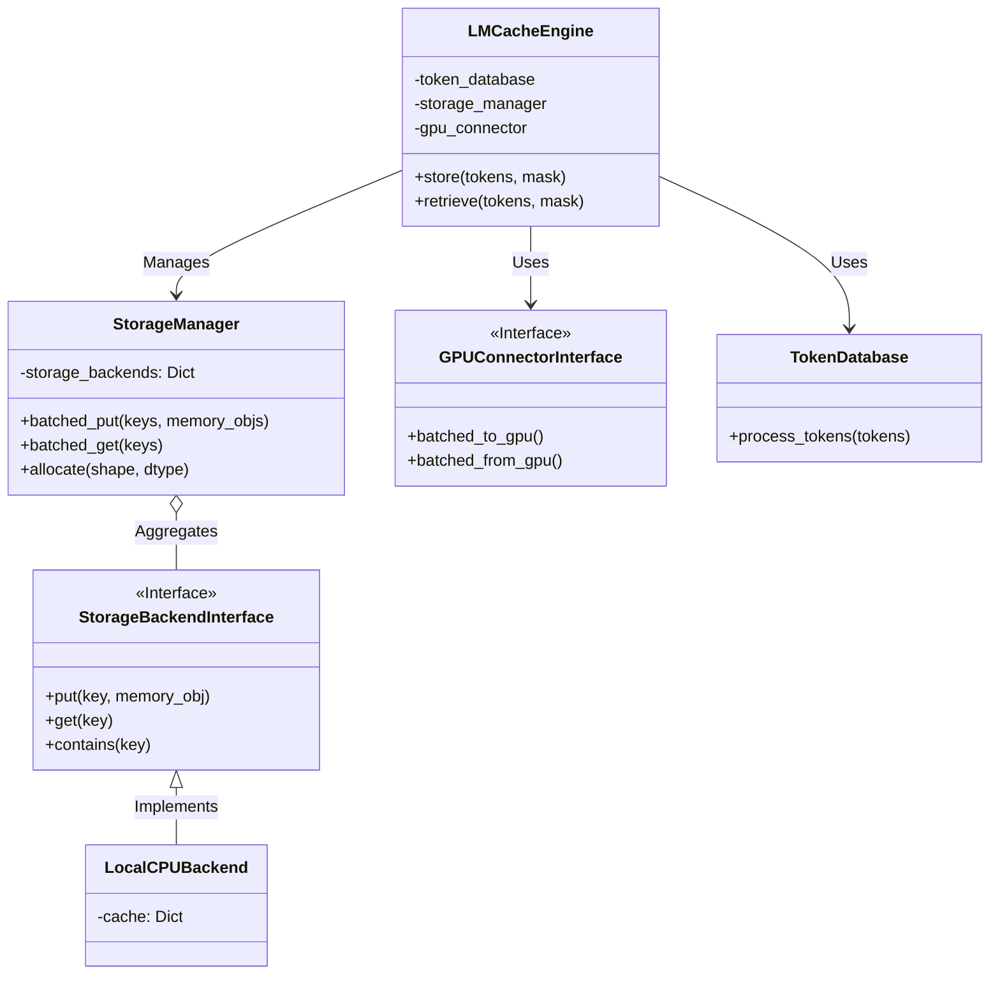
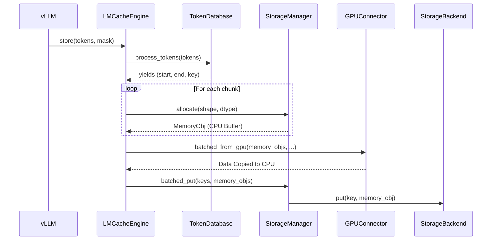
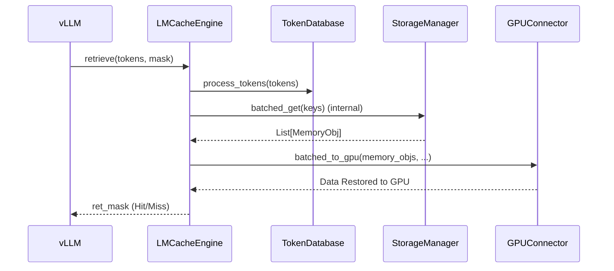
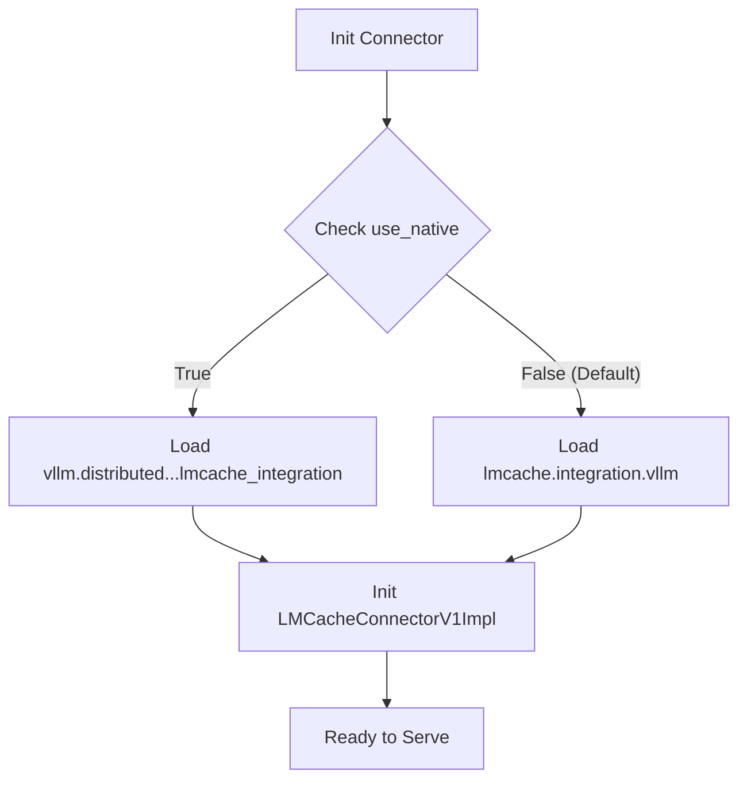
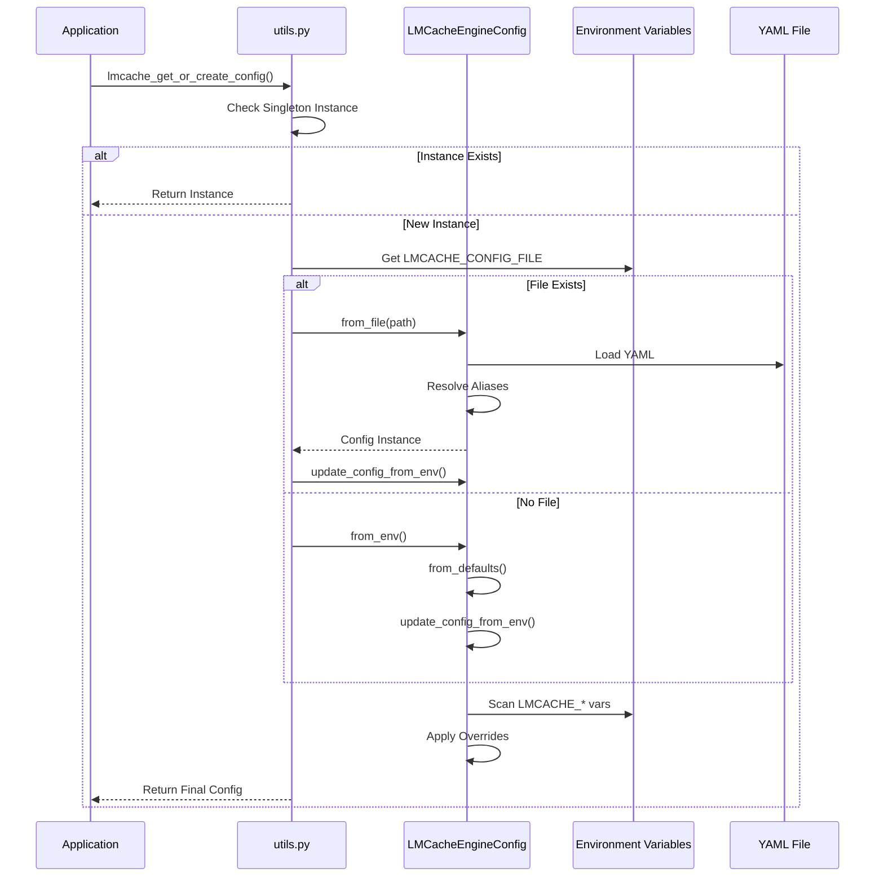

# LMCache源码剖析


# LMCache 源码剖析

> [!NOTE]
> 本文基于 LMCache 最新代码（v1 架构）撰写，重点剖析其核心架构、KV Cache 存取流程以及与 vLLM 的集成机制。

LMCache 是一个专为大语言模型（LLM）设计的 KV Cache 存储与管理系统，旨在通过高效的缓存机制加速 Context 复用，降低首字延迟（TTFT）。它支持多种存储后端（Local CPU, Disk, Redis, Remote 等），并能无缝集成到 vLLM 等推理框架中。

## 1. 项目结构与架构概览

LMCache 的代码组织清晰，核心逻辑位于 `external/lmcache/v1` 下，而与外部框架的集成代码则位于 `external/lmcache/integration`。

### 1.1 目录结构 (Tree)

以下展示了 LMCache 的核心文件组织及其职责划分：

```text
external/lmcache/
├── integration/                  # [Adapter] 外部框架集成适配器
│   └── vllm/
│       ├── vllm_v1_adapter.py    # [Bridge] vLLM V1 接口适配
│       └── ...
├── v1/                           # [Core] LMCache V1 核心逻辑
│   ├── cache_engine.py           # [Engine] LMCacheEngine，核心控制器
│   ├── protocol.py               # [Protocol] 通信协议与消息定义
│   ├── gpu_connector.py          # [Connector] 负责 GPU <-> CPU 数据搬运
│   ├── memory_management.py      # [Memory] 内存对象 (MemoryObj) 管理
│   ├── storage_backend/          # [Storage] 存储后端实现
│   │   ├── abstract_backend.py   # [Interface] 存储后端基类
│   │   ├── local_cpu_backend.py  # [Impl] 本地 CPU 内存后端
│   │   ├── storage_manager.py    # [Manager] 存储管理器，调度多个后端
│   │   └── ...
│   └── ...
└── utils.py                      # [Utils] 通用工具类
```

### 1.2 核心架构类图

LMCache 的架构采用了典型的分层设计：**Engine** 负责统筹，**StorageManager** 管理存储层级，**Backend** 实现具体存储，**GPUConnector** 处理硬件数据搬运。



> [!TIP]
> `StorageManager` 是这一架构的枢纽，它屏蔽了底层存储的复杂性（如本地内存、磁盘、远程 Redis 等），向 Engine 提供统一的 `allocate`, `put`, `get` 接口。

## 2. 核心流程与源码解析

LMCache 的核心在于 **Store (存储)** 和 **Retrieve (读取)** 两个对称的操作流程。

### 2.1 KV Cache 存储流程 (Store)

当 vLLM 完成 Prefill 或 Decode 阶段的计算后，会将生成的 KV Cache 存入 LMCache。

**核心步骤：**
1.  **Token 处理**: `TokenDatabase` 将输入的 Token 序列切分为标准的 Chunk，并计算对应的 CacheKey。
2.  **内存分配**: `StorageManager` 在 CPU 侧分配 `MemoryObj`。
3.  **数据搬运 (GPU->CPU)**: `GPUConnector` 将 KV Cache 从 GPU 显存拷贝到 CPU `MemoryObj` 中。
4.  **持久化存储**: `StorageManager` 将 `MemoryObj` 写入具体的后端（如 Redis 或 Local Disk）。



**代码定位：**
*   **LMCacheEngine.store**: [cache_engine.py:L186](file:///Users/admin/Documents/Docs/HugoBlogs/external/lmcache/v1/cache_engine.py#L186)
*   **StorageManager.allocate**: [storage_manager.py:L292](file:///Users/admin/Documents/Docs/HugoBlogs/external/lmcache/v1/storage_backend/storage_manager.py#L292)

### 2.2 KV Cache 读取流程 (Retrieve)

在新的请求到来时，LMCache 会尝试根据 Token 序列检索已缓存的 KV Cache。

**核心步骤：**
1.  **Token 匹配**: `TokenDatabase` 匹配输入 Token 对应的 CacheKey。
2.  **数据获取**: `StorageManager` 从后端检索对应的 `MemoryObj`。如果是远程后端，此时会触发网络传输。
3.  **数据搬运 (CPU->GPU)**: `GPUConnector` 将 `MemoryObj` 中的数据直接拷贝回 GPU 显存的特定位置。



**代码定位：**
*   **LMCacheEngine.retrieve**: [cache_engine.py:L436](file:///Users/admin/Documents/Docs/HugoBlogs/external/lmcache/v1/cache_engine.py#L436)

> [!WARNING]
> `retrieve` 操作通常在临界路径上，因此 LMCache 设计了 `retrieve_layer` [cache_engine.py:L546](file:///Users/admin/Documents/Docs/HugoBlogs/external/lmcache/v1/cache_engine.py#L546) 接口，支持 Layer-wise 的流水线式加载，即一边计算第 i 层，一边加载第 i+1 层，从而掩盖传输延迟。

## 3. 核心数据结构与协议

为了支持跨进程和跨节点的传输，LMCache 定义了统一的数据容器和通信协议。

### 3.1 MemoryObj (内存对象)

`MemoryObj` 是 LMCache 中承载 KV 数据的核心对象，它封装了 Tensor 数据及其元数据。

*   **定义**: `lmcache.v1.memory_management.MemoryObj`
*   **属性**:
    *   `tensor`: 实际的 PyTorch Tensor 数据。
    *   `meta`: 包含 `shape`, `dtype`, `fmt` (格式) 等信息。

### 3.2 CacheEngineKey (缓存键)

LMCache 使用 `CacheEngineKey` 来唯一标识一个 KV Cache Chunk。它通常基于 Token 序列的 Hash 生成。

*   **定义**: `lmcache.utils.CacheEngineKey`

### 3.3 通信协议 (Protocol)

在 Client-Server 模式下（如连接 Remote Backend），LMCache 使用自定义的序列化协议。

**ClientMetaMessage**: 客户端发送的请求元数据。
```python
# [external/lmcache/v1/protocol.py:L128]
@dataclass
class ClientMetaMessage:
    command: ClientCommand   # PUT, GET, EXIST...
    key: Union[CacheEngineKey, LayerCacheEngineKey]
    length: int
    fmt: MemoryFormat
    dtype: Optional[torch.dtype]
    shape: torch.Size
    location: Optional[str]
```

**ServerMetaMessage**: 服务端返回的响应。
```python
# [external/lmcache/v1/protocol.py:L188]
@dataclass
class ServerMetaMessage:
    code: ServerReturnCode   # SUCCESS, FAIL
    length: int
    fmt: MemoryFormat
    # ...
```

### 3.4 缓存匹配与 PYTHONHASHSEED

在分离式架构（Disaggregated Serving）中，Prefill 和 Decode 实例往往运行在不同的进程甚至机器上。为了确保它们对相同的 Token 序列生成的 Block Hash 一致（从而能正确匹配和复用缓存），vLLM 引入了基于 `PYTHONHASHSEED` 的一致性哈希机制。

虽然 LMCache 内部可能使用确定性的哈希算法（如 SHA256），但 vLLM 自身的 KV Block 管理依赖于 `NONE_HASH` 种子。如果该种子不一致，会导致 vLLM 无法正确识别 LMCache 返回的数据块对应的逻辑位置。

**实现原理：**

vLLM 在 `vllm/v1/core/kv_cache_utils.py` 中初始化全局哈希种子 `NONE_HASH`：

```python
# [vllm/v1/core/kv_cache_utils.py](file:///Users/admin/Documents/Docs/HugoBlogs/external/vllm/vllm/v1/core/kv_cache_utils.py#L89-L105)
def init_none_hash(hash_fn: Callable[[Any], bytes]):
    global NONE_HASH
    hash_seed = os.getenv("PYTHONHASHSEED")
    if hash_seed is None:
        # 随机模式：每次启动生成的 Hash 不一致
        NONE_HASH = BlockHash(os.urandom(32))
    else:
        # 确定性模式：保证跨进程一致性
        NONE_HASH = BlockHash(hash_fn(hash_seed))
```

> [!IMPORTANT]
> 在部署 LMCache + vLLM 集群时，必须在所有节点显式设置相同的 `PYTHONHASHSEED` 环境变量。

## 4. 与 vLLM 的深度集成

LMCache 通过 `vllm_v1_adapter.py` 实现了 vLLM 的 `KVConnectorBase` 接口，从而无侵入地接入 vLLM 生态。

### 4.1 适配器逻辑

`LMCacheConnectorV1` 充当了 vLLM 和 LMCacheEngine 之间的桥梁。

*   **代码路径**: `external/lmcache/integration/vllm/vllm_v1_adapter.py`
*   **职责**:
    1.  **Request Tracking**: 维护 `RequestTracker`，跟踪每个请求的 Token 变化。
    2.  **Select**: 在 `select_connector_for_request` 中判断是否命中缓存。
    3.  **Execution**: 在 `load_kv` 和 `save_kv` 中调用 `LMCacheEngine` 的 `retrieve` 和 `store`。

```
# [external/lmcache/integration/vllm/vllm_v1_adapter.py]
class LMCacheConnectorV1(KVConnectorBase_V1):
    def __init__(self):
        # 初始化 LMCacheEngine
        self.engine = LMCacheEngine(...)

    def get_num_new_matched_tokens(self, request, ...):
        # 计算可以复用的 Token 数量
        pass

    def load_kv(self, ...):
        # 调用 engine.retrieve
        self.engine.retrieve(...)
```

### 4.2 模块加载策略 (Native vs External)

vLLM 在集成 LMCache 时，采用了一种独特的“双源加载”策略。它并没有直接硬编码使用 `vllm/distributed/kv_transfer/kv_connector/v1/lmcache_integration/vllm_v1_adapter.py` 下的代码，而是优先尝试加载外部安装的 `lmcache` 包。

**核心代码实现：**

```python
# [vllm/distributed/kv_transfer/kv_connector/v1/lmcache_connector.py]
use_native = vllm_config.kv_transfer_config.get_from_extra_config("use_native", False)
if use_native:
    # 路径 A: 使用 vLLM 源码树中的内置适配器
    from vllm.distributed.kv_transfer.kv_connector.v1 import lmcache_integration
    cls = lmcache_integration.vllm_v1_adapter.LMCacheConnectorV1Impl
else:
    # 路径 B: 使用外部 lmcache 包中的适配器 (默认)
    from lmcache.integration.vllm.vllm_v1_adapter import (
        LMCacheConnectorV1Impl as LMCacheConnectorLatestImpl,
    )
    cls = LMCacheConnectorLatestImpl
```

**为什么这样设计？**

1.  **解耦迭代周期**：LMCache 是一个独立演进的项目。如果 vLLM 强制依赖其源码树内的适配器，那么 LMCache 的每一次 Bug 修复或新特性发布都需要等待 vLLM 发版（通常 1-2 周）。通过优先加载 `lmcache` 包，用户只需升级 `pip install lmcache` 即可获得最新功能。
2.  **兜底保障**：vLLM 源码中保留的 `lmcache_integration` 目录作为 "Native" 实现，确保了在没有安装外部包或外部包版本不兼容时的基本可用性。

**加载流程图：**



## 6. 配置系统详解 (Configuration System)

LMCache 采用了一套灵活的动态配置系统，支持 **YAML 配置文件** 和 **环境变量** 双重输入。配置定义位于 `external/lmcache/v1/config.py`，核心类 `LMCacheEngineConfig` 通过 `dataclass` 动态生成。

### 6.1 配置加载流程

LMCache 的配置加载遵循 **“Environment Overrides File”**（环境变量覆盖文件）原则。这意味着如果同时在配置文件和环境变量中定义了同一个参数，环境变量的值将生效。

**加载时序图：**



**代码实现：**

```python
# [vllm/distributed/kv_transfer/kv_connector/v1/lmcache_integration/utils.py](file:///Users/admin/Documents/Docs/HugoBlogs/external/vllm/vllm/distributed/kv_transfer/kv_connector/v1/lmcache_integration/utils.py#L32-L73)
def lmcache_get_or_create_config() -> Config | V1Config:
    global _config_instance
    # ... (Singleton Check) ...
    if "LMCACHE_CONFIG_FILE" in os.environ:
        config_file = os.environ["LMCACHE_CONFIG_FILE"]
        _config_instance = LMCacheEngineConfig.from_file(config_file)
        # 环境变量覆盖配置文件
        _config_instance.update_config_from_env()
    else:
        _config_instance = LMCacheEngineConfig.from_env()
    return _config_instance
```

### 6.2 配置结构与代码实现

LMCache 的配置类 `LMCacheEngineConfig` 并非静态定义，而是通过 `_CONFIG_DEFINITIONS` 字典和 `dataclasses.make_dataclass` 动态构建的。这种设计使得新增配置项非常简便，只需修改字典定义即可。

#### 6.2.1 动态生成配置类 (Code View)

```python
# [external/lmcache/v1/config.py](file:///Users/admin/Documents/Docs/HugoBlogs/external/lmcache/v1/config.py)

# 1. 核心定义字典 (Config Definitions)
_CONFIG_DEFINITIONS = {
    # ... (基础配置)
    "chunk_size": {"type": int, "default": 256, "env_converter": int},
    
    # ... (PD: Prefill-Decode Disaggregation)
    "enable_pd": {"type": bool, "default": False, "env_converter": _to_bool},
    
    # ... (扩展配置字典)
    "extra_config": {
        "type": Optional[dict],
        "default": None,
        "env_converter": lambda x: x if isinstance(x, dict) else json.loads(x) if x else None,
    },
}

# 2. 动态构建 Dataclass
def _create_config_class():
    # ...
    # 使用 make_dataclass 动态生成类
    cls = make_dataclass(
        "LMCacheEngineConfig",
        [(name, type_, default) for name, (type_, default) in fields_dict.items()],
        namespace={
            # 注入 helper 方法
            "from_file": classmethod(_from_file),
            "from_env": classmethod(_from_env),
            # ...
        },
    )
    return cls

LMCacheEngineConfig = _create_config_class()
```

#### 6.2.2 基础配置 vs 扩展配置 (Base vs Extra)

LMCache 的配置文件结构实际上包含两个层级：

1.  **Base Config**: 直接位于 YAML 根层级的字段，对应 `_CONFIG_DEFINITIONS` 中的大多数键（如 `chunk_size`, `remote_url`）。
2.  **Extra Config**: 位于 `extra_config` 字段下的嵌套字典。这通常用于传递给特定后端（如 Mooncake, NIXL）的定制参数，避免污染主配置命名空间。

**完整 YAML 配置示例：**

```yaml
# --- 基础配置 (Base Config) ---
chunk_size: 256
remote_url: "mooncakestore://mooncake-master:50053/"
enable_pd: false             # 是否启用 PD (Prefill-Decode Disaggregation) 模式

# --- 扩展配置 (Extra Config) ---
# 用于传递特定后端的参数，如 MooncakeStore 或 NIXL
extra_config:
  local_hostname: "prefiller-1"
  metadata_server: "http://mooncake-master:8080"
  transfer_timeout: 1
  enable_nixl_storage: false

# --- 其他常见配置 ---
use_layerwise: false         # 是否启用逐层流水线加载
save_decode_cache: false     # 是否保存 Decode 产生的 Cache
```

> [!TIP]
> 每一个配置项都可以通过对应的环境变量覆盖，格式为 `LMCACHE_<KEY_UPPERCASE>`。
> 例如：`chunk_size` 可以通过 `export LMCACHE_CHUNK_SIZE=512` 进行覆盖。

## 6. 核心机制详解: chunk_size

`chunk_size` 是 LMCache 中最核心的配置参数之一，它决定了 KV Cache 数据被切分、存储和检索的粒度。

### 6.1 作用机制与源码分析

在 `lmcache/v1/token_database.py` 的 `ChunkedTokenDatabase` 类中，`chunk_size` 直接控制 token 的切分逻辑。

**源码定位**: `_chunk_tokens` 方法
```python
def _chunk_tokens(self, tokens: Union[torch.Tensor, List[int]]) -> Iterable[Union[torch.Tensor, List[int]]]:
    end = len(tokens) if self.save_unfull_chunk else (len(tokens) - len(tokens) % self.chunk_size)
    for i in range(0, end, self.chunk_size):
        yield tokens[i : i + self.chunk_size]
```

**关键逻辑解析**:
1.  **切分 (Chunking)**: 输入的 token 序列会被按照 `chunk_size` (默认 256) 进行切分。例如，输入 1000 个 token，`chunk_size=256`，会被切分为 `[0:256], [256:512], [512:768]` 三个完整的 chunk。
2.  **尾部丢弃 (Tail Dropping)**: 默认情况下，`save_unfull_chunk` 为 `False`。这意味着不足 `chunk_size` 的剩余部分（如 1000 % 256 = 232 个 token）会被**直接丢弃**，不会生成对应的 cache key，也就不会触发后续的存储 (store) 或检索 (retrieve) 操作。
3.  **链式哈希 (Chain Hash)**: 每个 chunk 的 hash 值依赖于前一个 chunk 的 hash（Prefix Hash），确保了序列的顺序一致性。

### 6.2 存储与检索触发条件

基于上述逻辑，我们可以得出以下结论：

*   **不会触发 Store/Retrieve 的情况**:
    *   当 prompt 长度小于 `chunk_size` 时，不会生成任何 chunk，LMCache 不会介入。
    *   当 prompt 长度不是 `chunk_size` 的整数倍时，尾部多余的 token 不会被缓存。
*   **超过 chunk_size 的处理**:
    *   会被切分为多个 `chunk_size` 大小的块。
    *   例如 512 个 token 会生成 2 个 chunk，分别存储/检索。

### 6.3 验证方法

可以通过观察日志或构造特定长度的请求来验证 `chunk_size` 是否生效。

**方法 1: 构造请求验证**

假设 `chunk_size=256`。

1.  **发送长度为 200 的请求**:
    *   预期结果: LMCache 无任何存储操作日志。再次发送相同请求，无缓存命中。
2.  **发送长度为 300 的请求**:
    *   预期结果: LMCache 存储前 256 个 token 对应的一个 chunk。
    *   再次发送相同请求: 前 256 个 token 命中缓存，后 44 个 token 重新计算。

**方法 2: 查看日志与调试**

在启动 vLLM 时设置日志级别为 DEBUG，或者修改源码打印关键变量。

**推荐 Watch 变量**:
*   `tokens`: 在 `process_tokens` 中查看输入 token 长度。
*   `end`: 在 `_chunk_tokens` 中查看计算出的截止索引。

**Curl 验证示例**:
```bash
# 假设 chunk_size=256
# 发送一个较短的 prompt (约 10 tokens) -> 不会触发 LMCache PUT
curl http://localhost:8000/v1/completions \
  -H "Content-Type: application/json" \
  -d '{
    "model": "meta-llama/Llama-2-7b-hf",
    "prompt": "Hello, how are you?",
    "max_tokens": 10
  }'

# 发送一个较长的 prompt (超过 256 tokens) -> 会触发 LMCache PUT
# 再次发送 -> 会触发 LMCache GET (HIT)
```

## 附录: LMCache 配置手册 (Configuration Reference)

本附录整理自官方文档，列出了 LMCache 支持的所有配置项。

### 配置方式

LMCache 支持两种配置方式：

1.  **配置文件**: YAML (推荐) 或 JSON 文件。
2.  **环境变量**: 以 `LMCACHE_` 开头的环境变量。

若要使用配置文件，需设置环境变量 `LMCACHE_CONFIG_FILE` 指向文件路径。
> **注意**: 如果存在配置文件，环境变量中的配置将被忽略（但在代码实现中，`update_config_from_env` 实际上会让环境变量覆盖配置文件，请参考正文 6.1 节）。

### General Configurations (通用配置)

控制 LMCache 核心功能的基础设置。

| YAML 配置项 | 环境变量 | 说明 |
| :--- | :--- | :--- |
| **chunk_size** | `LMCACHE_CHUNK_SIZE` | **KV Cache 分块大小**。<br>**默认值**: 256。<br>**机制**: 决定了 LMCache 存储和检索的最小粒度。Token 序列会被切分为该大小的块。较小的值能提高命中率但增加索引开销；较大的值减少开销但可能降低命中率。**建议**: 保持默认 256 或根据模型层数调整。 |
| **local_cpu** | `LMCACHE_LOCAL_CPU` | **是否启用本地 CPU 缓存**。<br>**默认值**: `true`。<br>**说明**: 若为 true，则在本地 RAM 中缓存 KV 数据。这是 LMCache 的第一级缓存，速度最快。 |
| **max_local_cpu_size** | `LMCACHE_MAX_LOCAL_CPU_SIZE` | **本地 CPU 缓存最大容量 (GB)**。<br>**默认值**: 5.0。<br>**说明**: LMCache 占用的最大系统内存。超过此限制将触发 LRU 淘汰。请确保系统有足够剩余内存供 vLLM 模型权重和推理使用。 |
| **local_disk** | `LMCACHE_LOCAL_DISK` | **本地磁盘缓存路径**。<br>**默认值**: 无。<br>**格式**: `file:///path/to/cache` 或 `/path/to/cache`。<br>**说明**: 设置后启用磁盘作为第二级缓存。适用于内存不足但磁盘空间充足的场景。 |
| **max_local_disk_size** | `LMCACHE_MAX_LOCAL_DISK_SIZE` | **本地磁盘缓存最大容量 (GB)**。<br>**默认值**: 0.0。<br>**说明**: 磁盘缓存的大小限制。 |
| **remote_url** | `LMCACHE_REMOTE_URL` | **远程存储 URL**。<br>**默认值**: 无。<br>**格式**: `redis://:password@host:port` 或 `lm://...`。<br>**说明**: 指定远程后端（如 Redis）用于元数据共享或 KV 存储。PD 模式下必须为 null。 |
| **remote_serde** | `LMCACHE_REMOTE_SERDE` | **远程序列化格式**。<br>**默认值**: `naive`。<br>**选项**: `naive` (直接序列化), `cachegen` (压缩)。<br>**说明**: `cachegen` 使用 CacheGen 算法对 KV Cache 进行编码压缩，可显著减少网络传输量，但增加 CPU 编解码开销。 |
| **save_decode_cache** | `LMCACHE_SAVE_DECODE_CACHE` | **是否保存 Decode 阶段的 KV Cache**。<br>**默认值**: `false`。<br>**说明**: 通常只缓存 Prefill 阶段的 KV (长 Context)。开启此项会缓存生成过程中的 token，极占空间。**注意**: PD 模式下强制为 `false`。 |
| **use_layerwise** | `LMCACHE_USE_LAYERWISE` | **是否启用逐层流水线**。<br>**默认值**: `false`。<br>**说明**: 开启后，LMCache 会逐层处理和传输 KV Cache，实现计算与传输的流水线并行，降低首 token 延迟。 |
| **pre_caching_hash_algorithm** | `LMCACHE_PRE_CACHING_HASH_ALGORITHM` | **前缀哈希算法**。<br>**默认值**: `builtin`。<br>**说明**: 用于计算 Token 块 Hash 的算法。需确保所有节点使用相同算法。 |
| **save_unfull_chunk** | `LMCACHE_SAVE_UNFULL_CHUNK` | **是否保存未满的 Chunk**。<br>**默认值**: `false`。<br>**说明**: 若为 `true`，则不足 `chunk_size` 的尾部 token 也会被保存。这可能导致碎片化。Blending 模式下会自动设为 `true`。 |
| **blocking_timeout_secs** | `LMCACHE_BLOCKING_TIMEOUT_SECS` | **阻塞操作超时时间 (秒)**。<br>**默认值**: 10。<br>**说明**: 某些同步操作的最大等待时间。 |
| **py_enable_gc** | `LMCACHE_PY_ENABLE_GC` | **是否启用 Python GC**。<br>**默认值**: `true`。<br>**说明**: 在高吞吐场景下，关闭 GC (`false`) 可以减少“世界暂停”带来的延迟抖动，但可能增加内存占用。代码中通过 `gc.disable()` 实现。 |
| **cache_policy** | `LMCACHE_CACHE_POLICY` | **缓存淘汰策略**。<br>**默认值**: `LRU`。<br>**说明**: 当缓存满时，选择淘汰哪些数据。目前主要支持 `LRU` (Least Recently Used)。 |
| **numa_mode** | `LMCACHE_NUMA_MODE` | **NUMA 亲和性模式**。<br>**默认值**: null。<br>**选项**: `auto`, `manual`。<br>**说明**: 优化多路 CPU 服务器上的内存访问性能。 |
| **external_lookup_client** | `LMCACHE_EXTERNAL_LOOKUP_CLIENT` | **外部 Lookup 服务 URI**。<br>**默认值**: null。<br>**说明**: 使用外部服务进行缓存查找。 |
| **priority_limit** | `LMCACHE_PRIORITY_LIMIT` | **优先级限制**。<br>**默认值**: None。<br>**说明**: 仅缓存优先级值 `<= limit` 的请求。用于区分不同重要性的请求缓存策略。 |
| **extra_config** | `LMCACHE_EXTRA_CONFIG` | **扩展配置**。<br>**默认值**: `{}`。<br>**说明**: JSON 格式的字典，用于传递特定后端（如 Mooncake, NIXL）的参数。 |

### Lazy Memory Allocator Configurations (懒加载内存配置)

针对大内存场景的优化，通过渐进式内存分配减少启动时间和初始占用。

> **核心特性**:
> *   **单向扩展**: 内存只增不减，直到达到 `max_local_cpu_size`。
> *   **自动激活**: 仅当 `max_local_cpu_size` > `lazy_memory_safe_size` 时生效。

| YAML 配置项 | 环境变量 | 说明 |
| :--- | :--- | :--- |
| **enable_lazy_memory_allocator** | `LMCACHE_ENABLE_LAZY_MEMORY_ALLOCATOR` | **是否启用懒加载**。<br>**默认值**: `false`。 |
| **lazy_memory_initial_ratio** | `LMCACHE_LAZY_MEMORY_INITIAL_RATIO` | **初始分配比例**。<br>**默认值**: 0.2 (20%)。<br>**说明**: 启动时预分配的内存比例。 |
| **lazy_memory_expand_trigger_ratio** | `LMCACHE_LAZY_MEMORY_EXPAND_TRIGGER_RATIO` | **扩容触发阈值**。<br>**默认值**: 0.5。<br>**说明**: 当内存使用率达到此比例时，触发下一次扩容。 |
| **lazy_memory_step_ratio** | `LMCACHE_LAZY_MEMORY_STEP_RATIO` | **扩容步长**。<br>**默认值**: 0.1 (10%)。<br>**说明**: 每次扩容增加的内存比例。 |
| **lazy_memory_safe_size** | `LMCACHE_LAZY_MEMORY_SAFE_SIZE` | **安全阈值 (GB)**。<br>**默认值**: 0.0。<br>**说明**: `max_local_cpu_size` 必须超过此值才会启用懒加载。 |
| **reserve_local_cpu_size** | `LMCACHE_RESERVE_LOCAL_CPU_SIZE` | **保留内存 (GB)**。<br>**默认值**: 0.0。<br>**说明**: 预留给系统或其他进程的内存大小，LMCache 不会占用。 |

### Cache Blending Configurations (混合缓存配置)

| YAML 配置项 | 环境变量 | 说明 |
| :--- | :--- | :--- |
| **enable_blending** | `LMCACHE_ENABLE_BLENDING` | **是否启用混合检索**。<br>**默认值**: `false`。<br>**说明**: 允许近似匹配，即 retrieve 时不要求完全一致，而是通过加权混合计算 Attention。 |
| **blend_recompute_ratios** | `LMCACHE_BLEND_RECOMPUTE_RATIOS` | **重计算比例**。<br>**默认值**: 0.15。<br>**说明**: 混合检索中，部分 token 需要重新计算 KV 的比例。 |
| **blend_check_layers** | `LMCACHE_BLEND_CHECK_LAYERS` | **检查层数**。<br>**默认值**: 1。<br>**说明**: 用于判断 token 相似度的层数。 |
| **blend_special_str** | `LMCACHE_BLEND_SPECIAL_STR` | **分隔符**。<br>**默认值**: " # # "。<br>**说明**: 文本中用于标记混合区域的特殊字符串。 |

### Peer-to-Peer Sharing Configurations (P2P 共享配置)

| YAML 配置项 | 环境变量 | 说明 |
| :--- | :--- | :--- |
| **enable_p2p** | `LMCACHE_ENABLE_P2P` | **是否启用 P2P 共享**。<br>**默认值**: `false`。<br>**说明**: 允许 vLLM 实例之间直接传输 KV Cache，无需经过中心化存储。 |
| **p2p_host** | `LMCACHE_P2P_HOST` | **P2P 主机地址**。<br>**说明**: 当前节点的 IP 地址或 Hostname。启用 P2P 时必填。 |
| **peer_init_ports** | `LMCACHE_PEER_INIT_PORTS` | **初始化端口列表**。<br>**说明**: 用于 P2P 握手和元数据交换的端口。 |
| **peer_lookup_ports** | `LMCACHE_PEER_LOOKUP_PORTS` | **查找端口列表**。<br>**说明**: 用于 P2P 查找请求的端口。 |
| **transfer_channel** | `LMCACHE_TRANSFER_CHANNEL` | **传输通道**。<br>**说明**: 指定传输协议，如 "nixl"。 |

### Controller Configurations (控制器配置)

| YAML 配置项 | 环境变量 | 说明 |
| :--- | :--- | :--- |
| **enable_controller** | `LMCACHE_ENABLE_CONTROLLER` | **是否启用控制器**。<br>**默认值**: `false`。<br>**说明**: 连接到中心化 Controller 进行集群管理。 |
| **lmcache_instance_id** | `LMCACHE_INSTANCE_ID` | **实例 ID**。<br>**说明**: 当前 LMCache 实例的唯一标识。若不指定则随机生成。 |
| **controller_url** | `LMCACHE_CONTROLLER_URL` | **控制器 URL**。<br>**说明**: Controller 服务的地址。 |
| **lmcache_worker_port** | `LMCACHE_WORKER_PORT` | **Worker 端口**。<br>**说明**: 本地 Worker 监听的端口。 |

### Disaggregated Prefill Configurations (PD 分离配置)

> **注意**: 启用 PD 模式时，`remote_url` 必须为 null，`save_decode_cache` 必须为 false，`enable_p2p` 必须为 false。

| YAML 配置项 | 环境变量 | 说明 |
| :--- | :--- | :--- |
| **enable_pd** | `LMCACHE_ENABLE_PD` | **是否启用 PD 模式**。<br>**默认值**: `false`。<br>**说明**: 启用存算分离架构（Prefill-Decode Disaggregation）。 |
| **transfer_channel** | `LMCACHE_TRANSFER_CHANNEL` | **传输通道**。<br>**默认值**: 无。<br>**选项**: "nixl"。<br>**说明**: 指定 PD 传输使用的高性能通道。 |
| **pd_role** | `LMCACHE_PD_ROLE` | **PD 角色**。<br>**选项**: "sender" (Prefill 节点), "receiver" (Decode 节点)。 |
| **pd_buffer_size** | `LMCACHE_PD_BUFFER_SIZE` | **传输缓冲区大小 (Bytes)**。<br>**说明**: 用于 PD 数据传输的内存缓冲区大小。 |
| **pd_buffer_device** | `LMCACHE_PD_BUFFER_DEVICE` | **缓冲区设备**。<br>**选项**: "cpu", "cuda"。<br>**说明**: 缓冲区所在的硬件设备。 |
| **nixl_backends** | `LMCACHE_NIXL_BACKENDS` | **Nixl 后端列表**。<br>**默认值**: ["UCX"]。<br>**说明**: 底层传输后端。 |
| **pd_peer_host** | `LMCACHE_PD_PEER_HOST` | **对端主机地址**。<br>**说明**: 目标节点的地址。 |
| **pd_peer_init_port** | `LMCACHE_PD_PEER_INIT_PORT` | **对端初始化端口**。 |
| **pd_peer_alloc_port** | `LMCACHE_PD_PEER_ALLOC_PORT` | **对端分配端口**。 |
| **pd_proxy_host** | `LMCACHE_PD_PROXY_HOST` | **代理主机地址**。 |
| **pd_proxy_port** | `LMCACHE_PD_PROXY_PORT` | **代理端口**。 |

### P2P Backend Configurations

通过 `extra_config` 配置的 P2P 超时参数。

```yaml
extra_config:
  p2p_socket_recv_timeout_ms: 30000
  p2p_socket_send_timeout_ms: 10000
```

| 配置键 (extra_config) | 默认值 | 说明 |
| :--- | :--- | :--- |
| **p2p_socket_recv_timeout_ms** | 30000 | **接收超时 (ms)**。<br>Socket 接收数据的超时时间。 |
| **p2p_socket_send_timeout_ms** | 10000 | **发送超时 (ms)**。<br>Socket 发送数据的超时时间。 |

### Nixl Storage Configurations

使用 Nixl 作为存储后端（非 PD 模式）。

```yaml
extra_config:
  # enable_nixl_storage will disable disaggregated prefill mode.
  enable_nixl_storage: true
  nixl_backend: "POSIX"  # Options: "GDS", "GDS_MT", "POSIX", "HF3FS"
  nixl_path: "/path/to/storage/"
  nixl_file_pool_size: 64
```

| 配置键 (extra_config) | 说明 |
| :--- | :--- |
| **enable_nixl_storage** | **是否启用 Nixl 存储**。<br>注意：启用后会自动禁用 PD 模式。 |
| **nixl_backend** | **存储后端类型**。<br>**选项**: "GDS" (GPUDirect Storage), "GDS_MT", "POSIX", "HF3FS"。 |
| **nixl_path** | **存储路径**。<br>文件系统上的存储目录。 |
| **nixl_file_pool_size** | **文件池大小**。<br>存储池中的文件数量。 |

### Additional Storage Configurations

| YAML 配置项 | 环境变量 | 说明 |
| :--- | :--- | :--- |
| **gds_path** | `LMCACHE_GDS_PATH` | **GDS 路径**。<br>**说明**: GPUDirect Storage 的挂载路径。 |
| **cufile_buffer_size** | `LMCACHE_CUFILE_BUFFER_SIZE` | **cuFile 缓冲区大小**。<br>**说明**: 用于 GDS 操作的缓冲区大小。 |

### Internal API Server Configurations

管理和调试 API 服务设置。

| YAML 配置项 | 环境变量 | 说明 |
| :--- | :--- | :--- |
| **internal_api_server_enabled** | `LMCACHE_INTERNAL_API_SERVER_ENABLED` | **是否启用内部 API 服务**。<br>**默认值**: `false`。 |
| **internal_api_server_host** | `LMCACHE_INTERNAL_API_SERVER_HOST` | **API 服务主机**。<br>**默认值**: "0.0.0.0"。 |
| **internal_api_server_port_start** | `LMCACHE_INTERNAL_API_SERVER_PORT_START` | **起始端口**。<br>**默认值**: 6999。 |
| **internal_api_server_include_index_list** | `LMCACHE_INTERNAL_API_SERVER_INCLUDE_INDEX_LIST` | **包含的索引列表**。<br>**说明**: 指定哪些 Worker/Scheduler 启用 API 服务。 |
| **internal_api_server_socket_path_prefix** | `LMCACHE_INTERNAL_API_SERVER_SOCKET_PATH_PREFIX` | **Socket 路径前缀**。<br>**说明**: Unix Domain Socket 的前缀。 |

### Plugin Configurations

| YAML 配置项 | 环境变量 | 说明 |
| :--- | :--- | :--- |
| **plugin_locations** | `LMCACHE_PLUGIN_LOCATIONS` | **插件位置列表**。<br>**默认值**: []。<br>**说明**: 外部插件的加载路径。 |

### Advanced & Experimental Configurations (高级与实验性配置)

| YAML 配置项 | 环境变量 | 说明 |
| :--- | :--- | :--- |
| **external_backends** | `LMCACHE_EXTERNAL_BACKENDS` | **外部后端列表**。<br>**默认值**: `null`。<br>**说明**: 指定要加载的外部存储后端名称。 |
| **lookup_timeout_ms** | `LMCACHE_LOOKUP_TIMEOUT_MS` | **查找超时 (ms)**。<br>**默认值**: 3000。<br>**说明**: 客户端在查找缓存时的最大等待时间。 |
| **hit_miss_ratio** | `LMCACHE_HIT_MISS_RATIO` | **命中/未命中比率**。<br>**默认值**: `null`。<br>**说明**: 模拟测试中强制设定的命中率，仅用于调试。 |
| **lookup_server_worker_ids** | `LMCACHE_LOOKUP_SERVER_WORKER_IDS` | **Lookup Server Worker ID**。<br>**默认值**: `null` (MLA 模式下默认为 [0])。<br>**说明**: 指定哪些 Worker 运行查找服务。 |
| **enable_scheduler_bypass_lookup** | `LMCACHE_ENABLE_SCHEDULER_BYPASS_LOOKUP` | **Scheduler 绕过查找**。<br>**默认值**: `false`。<br>**说明**: 是否允许 Scheduler 直接进行缓存查找而不经过常规路径。 |
| **script_allowed_imports** | `LMCACHE_SCRIPT_ALLOWED_IMPORTS` | **允许导入的模块**。<br>**默认值**: `null`。<br>**说明**: 在执行动态脚本时允许导入的 Python 模块列表，用于安全控制。 |
| **lmcache_worker_heartbeat_delay_time** | `LMCACHE_WORKER_HEARTBEAT_DELAY_TIME` | **Worker 心跳延迟启动 (秒)**。<br>**默认值**: 10。<br>**说明**: 服务启动后延迟发送心跳的时间，等待注册完成。 |
| **lmcache_worker_heartbeat_time** | `LMCACHE_WORKER_HEARTBEAT_TIME` | **Worker 心跳间隔 (秒)**。<br>**默认值**: `null`。<br>**说明**: 定期发送心跳的间隔时间。 |
| **weka_path** | `LMCACHE_WEKA_PATH` | **Weka 存储路径**。<br>**默认值**: `null`。<br>**说明**: Weka 文件系统的挂载路径。 |


