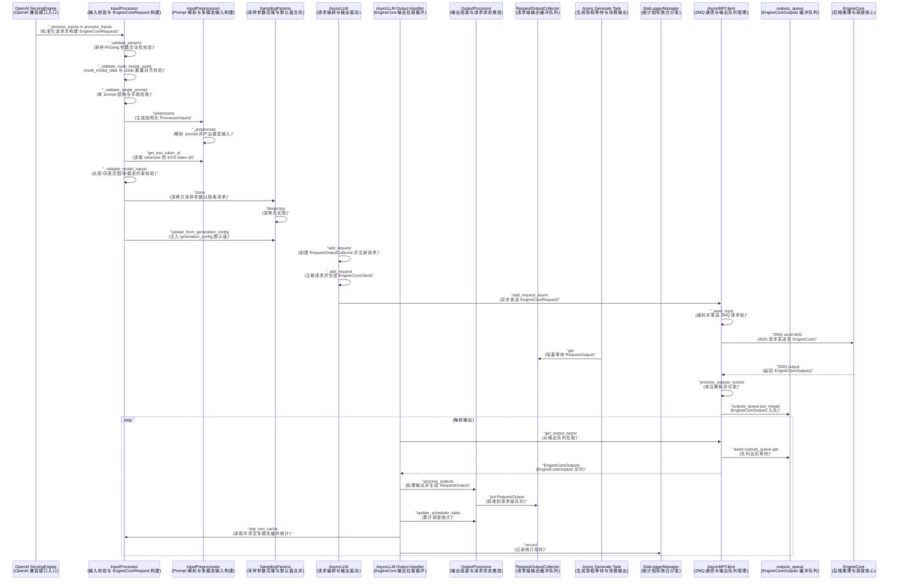

# vLLM EngineCore 源码剖析-EngineCoreClient


## 调用栈详解（AsyncLLM / EngineCoreClient / AsyncMPClient）





### 输入处理链路：请求校验与预处理

- 文件路径：[serving_engine.py](file:///Users/admin/Documents/Docs/HugoBlogs/external/vllm/vllm/entrypoints/openai/serving_engine.py#L1225-L1250)
- 关键函数：`_process_inputs` ➜ `input_processor.process_inputs`
- 作用：将 OpenAI 请求转换为 EngineCoreRequest 所需的标准化输入，并填充 tokenization 参数

```python
# vllm/entrypoints/openai/serving_engine.py:1225-1250
async def _process_inputs(...):
    tokenization_kwargs = {}
    _validate_truncation_size(...)
    engine_request = self.input_processor.process_inputs(
        request_id, engine_prompt, params,
        lora_request=lora_request,
        tokenization_kwargs=tokenization_kwargs,
        trace_headers=trace_headers,
        priority=priority,
    )
    return engine_request, tokenization_kwargs
```

> [!TIP]
> 这里是 AsyncLLM 输入链路入口，后续所有校验/预处理都在 `InputProcessor.process_inputs` 内完成。

- 文件路径：[input_processor.py](file:///Users/admin/Documents/Docs/HugoBlogs/external/vllm/vllm/v1/engine/input_processor.py#L392-L487)
- 关键函数：`process_inputs`
- 作用：串联校验、预处理、EOS 获取、模型输入检查与参数克隆更新

```python
# vllm/v1/engine/input_processor.py:392-487
def process_inputs(...):
    self._validate_lora(lora_request)
    self._validate_params(params)
    ...
    self._validate_multi_modal_uuids(prompt)
    processed_inputs = self.input_preprocessor.preprocess(...)
    eos_token_id = self.input_preprocessor.get_eos_token_id()
    encoder_inputs, decoder_inputs = split_enc_dec_inputs(processed_inputs)
    self._validate_model_inputs(encoder_inputs, decoder_inputs)
    ...
    sampling_params = params.clone()
    sampling_params.update_from_generation_config(..., eos_token_id)
```

> [!NOTE]
> 此处展示 `_validate_params`、`preprocess`、`get_eos_token_id`、`_validate_model_inputs` 的调用位置，便于顺序阅读。

#### 参数校验

- 文件路径：[input_processor.py](file:///Users/admin/Documents/Docs/HugoBlogs/external/vllm/vllm/v1/engine/input_processor.py#L165-L180)
- 关键函数：`_validate_params`
- 作用：校验 Sampling/Pooling 参数合法性；Pooling 模式直接跳过部分采样参数校验

```python
# vllm/v1/engine/input_processor.py:165-180
def _validate_params(self, params):
    if isinstance(params, PoolingParams):
        return
    self._validate_logprobs(params)
    self._validate_sampling_params(params)
    self._validate_supported_sampling_params(params)
```

> [!WARNING]
> `logits_processors` 在 V1 不支持，会直接抛出 ValueError。

#### 多模态 UUID 对齐校验

- 文件路径：[input_processor.py](file:///Users/admin/Documents/Docs/HugoBlogs/external/vllm/vllm/v1/engine/input_processor.py#L181-L237)
- 关键函数：`_validate_multi_modal_uuids` / `_validate_single_prompt`
- 作用：校验 multi_modal_data 与 multi_modal_uuids 数量一致，避免错位

```python
# vllm/v1/engine/input_processor.py:181-237
def _validate_multi_modal_uuids(self, prompt):
    def _validate_single_prompt(single_prompt):
        if not isinstance(single_prompt, dict):
            return
        mm_data = single_prompt.get("multi_modal_data")
        mm_uuids = single_prompt.get("multi_modal_uuids")
        # 长度不一致时抛错
        ...
    # encoder/decoder 或单 prompt 两种分支
    ...
```

> [!NOTE]
> 这里仅校验长度，并不生成 uuid，生成逻辑在 `_maybe_build_mm_uuids`。

#### 预处理：prompt ➜ ProcessorInputs

- 文件路径：[preprocess.py](file:///Users/admin/Documents/Docs/HugoBlogs/external/vllm/vllm/inputs/preprocess.py#L652-L701)
- 关键函数：`preprocess` / `_preprocess`
- 作用：将 prompt 解析成模型可消费的结构化输入（token ids / embeds / mm data）

```python
# vllm/inputs/preprocess.py:652-701
def preprocess(self, prompt, tokenization_kwargs=None, *, mm_uuids=None):
    res = self._preprocess(prompt, tokenization_kwargs, mm_uuids=mm_uuids)
    if self.mm_processor_cache and self.mm_cache_stats is not None:
        delta = self.mm_processor_cache.make_stats(delta=True)
        self.mm_cache_stats.requests += 1
        self.mm_cache_stats.queries += delta.total
        self.mm_cache_stats.hits += delta.hits
    return res
```

> [!TIP]
> 这里会更新多模态缓存统计信息，供后续 `stat_mm_cache` 上报。

#### EOS 获取

- 文件路径：[preprocess.py](file:///Users/admin/Documents/Docs/HugoBlogs/external/vllm/vllm/inputs/preprocess.py#L79-L86)
- 关键函数：`get_eos_token_id`
- 作用：返回 tokenizer 的 EOS token id（未初始化时为 None）

```python
# vllm/inputs/preprocess.py:79-86
def get_eos_token_id(self):
    if self.tokenizer is None:
        logger.warning_once(...)
        return None
    return self.tokenizer.eos_token_id
```

#### 模型输入检查

- 文件路径：[input_processor.py](file:///Users/admin/Documents/Docs/HugoBlogs/external/vllm/vllm/v1/engine/input_processor.py#L533-L639)
- 关键函数：`_validate_model_inputs`
- 作用：长度/词表范围/多模态约束等校验

```python
# vllm/v1/engine/input_processor.py:533-639
def _validate_model_inputs(self, encoder_inputs, decoder_inputs):
    if encoder_inputs is not None:
        self._validate_model_input(encoder_inputs, prompt_type="encoder")
    self._validate_model_input(decoder_inputs, prompt_type="decoder")
```

> [!WARNING]
> prompt 超过 `max_model_len` 会直接抛错，避免 EngineCore 侧异常。

#### 深拷贝 SamplingParams

- 文件路径：[sampling_params.py](file:///Users/admin/Documents/Docs/HugoBlogs/external/vllm/vllm/sampling_params.py#L536-L553)
- 关键函数：`SamplingParams.clone`
- 作用：深拷贝采样参数，避免多请求并发时参数被互相污染

```python
# vllm/sampling_params.py:536-553
def clone(self):
    logit_processor_refs = {...}
    return copy.deepcopy(self, memo=logit_processor_refs)
```

> [!NOTE]
> 这一步是深拷贝，成本较高但保证线程安全。

#### 合并 generation_config

- 文件路径：[sampling_params.py](file:///Users/admin/Documents/Docs/HugoBlogs/external/vllm/vllm/sampling_params.py#L453-L479)
- 关键函数：`update_from_generation_config`
- 作用：将 generation_config 中的 eos_token_id 等默认值注入采样参数

```python
# vllm/sampling_params.py:453-479
def update_from_generation_config(self, generation_config, model_eos_token_id=None):
    if model_eos_token_id is not None:
        self._all_stop_token_ids.add(model_eos_token_id)
    eos_ids = generation_config.get("eos_token_id")
    ...
```

### AsyncLLM 发送请求到 EngineCore

- 文件路径：[async_llm.py](file:///Users/admin/Documents/Docs/HugoBlogs/external/vllm/vllm/v1/engine/async_llm.py#L271-L353)
- 关键函数：`add_request` ➜ `_add_request`
- 作用：创建请求输出队列、将 EngineCoreRequest 投递给 EngineCoreClient

```python
# vllm/v1/engine/async_llm.py:271-353
async def add_request(...):
    queue = RequestOutputCollector(output_kind=params.output_kind)
    request = self.input_processor.process_inputs(...)
    ...
    await self._add_request(request, prompt_text, None, 0, queue)
    return queue

async def _add_request(self, request, prompt, parent_req, index, queue):
    self.output_processor.add_request(request, prompt, parent_req, index, queue)
    await self.engine_core.add_request_async(request)
```

- 文件路径：[async_llm.py](file:///Users/admin/Documents/Docs/HugoBlogs/external/vllm/vllm/v1/engine/async_llm.py#L338-L353)
- 关键函数：`_add_request`
- 作用：本地注册请求后，交由 EngineCoreClient 发送到 EngineCore

```python
# vllm/v1/engine/async_llm.py:338-353
def _add_request(...):
    self.output_processor.add_request(...)
    await self.engine_core.add_request_async(request)
```

> [!TIP]
> 该段展示“前端逻辑”到“后端 EngineCore”的关键交接点。

- 文件路径：[core_client.py](file:///Users/admin/Documents/Docs/HugoBlogs/external/vllm/vllm/v1/engine/core_client.py#L955-L958)
- 关键函数：`AsyncMPClient.add_request_async`
- 作用：设置 client_index 并通过 ZMQ 发送 ADD 请求

```python
# vllm/v1/engine/core_client.py:955-958
async def add_request_async(self, request):
    request.client_index = self.client_index
    await self._send_input(EngineCoreRequestType.ADD, request)
    self._ensure_output_queue_task()
```

- 文件路径：[core_client.py](file:///Users/admin/Documents/Docs/HugoBlogs/external/vllm/vllm/v1/engine/core_client.py#L898-L908)
- 关键函数：`_send_input`
- 作用：将请求序列化为 ZMQ message 并发给 EngineCore

```python
# vllm/v1/engine/core_client.py:898-908
def _send_input(self, request_type, request, engine=None):
    if engine is None:
        engine = self.core_engine
    message = (request_type.value, *self.encoder.encode(request))
    return self._send_input_message(message, engine, request)
```

> [!NOTE]
> ZMQ 发送是 async-compatible 的，`_ensure_output_queue_task` 确保后台收包任务启动。

### 生成任务等待输出

- 文件路径：[output_processor.py](file:///Users/admin/Documents/Docs/HugoBlogs/external/vllm/vllm/v1/engine/output_processor.py#L63-L71)
- 关键函数：`RequestOutputCollector.get`
- 作用：生成协程阻塞等待输出，直到 `output_handler` 生产结果

```python
# vllm/v1/engine/output_processor.py:63-71
async def get(self):
    while (output := self.output) is None:
        await self.ready.wait()
    self.output = None
    self.ready.clear()
    if isinstance(output, Exception):
        raise output
    return output
```

> [!TIP]
> 这一点体现了 “消费者-生产者” 分离：生成协程不直接读 ZMQ，而是读队列。

### ZMQ 收包回调

- 文件路径：[core_client.py](file:///Users/admin/Documents/Docs/HugoBlogs/external/vllm/vllm/v1/engine/core_client.py#L858-L882)
- 关键函数：`process_outputs_socket`
- 作用：从 ZMQ socket 收包，解析成 EngineCoreOutputs 推入 outputs_queue

```python
# vllm/v1/engine/core_client.py:858-882
async def process_outputs_socket():
    while True:
        frames = await output_socket.recv_multipart(copy=False)
        outputs: EngineCoreOutputs = decoder.decode(frames)
        if outputs.utility_output:
            _process_utility_output(...)
            continue
        if output_handler is not None:
            await output_handler(_self, outputs)
        if outputs.outputs or outputs.scheduler_stats:
            outputs_queue.put_nowait(outputs)
```

> [!WARNING]
> 这里异常会直接入队，让上层 `get_output_async` 抛错，触发 AsyncLLM 失败处理。

### AsyncLLM 输出处理与统计

#### 取 EngineCoreOutputs

- 文件路径：[core_client.py](file:///Users/admin/Documents/Docs/HugoBlogs/external/vllm/vllm/v1/engine/core_client.py#L887-L896)
- 关键函数：`get_output_async`
- 作用：从 outputs_queue 读取 EngineCoreOutputs 或异常

```python
# vllm/v1/engine/core_client.py:887-896
async def get_output_async(self):
    self._ensure_output_queue_task()
    outputs = await self.outputs_queue.get()
    if isinstance(outputs, Exception):
        raise self._format_exception(outputs) from None
    return outputs
```

- 文件路径：[async_llm.py](file:///Users/admin/Documents/Docs/HugoBlogs/external/vllm/vllm/v1/engine/async_llm.py#L486-L536)
- 关键函数：`output_handler`
- 作用：从 EngineCore 拉取输出并依次处理、更新统计与日志

```python
# vllm/v1/engine/async_llm.py:486-536
async def output_handler():
    outputs = await engine_core.get_output_async()
    processed_outputs = output_processor.process_outputs(...)
    await engine_core.abort_requests_async(processed_outputs.reqs_to_abort)
    output_processor.update_scheduler_stats(outputs.scheduler_stats)
    if logger_manager:
        logger_manager.record(..., mm_cache_stats=input_processor.stat_mm_cache())
```

> [!NOTE]
> 该段展示了 process_outputs、update_scheduler_stats、stat_mm_cache、record 的调用顺序。

#### 处理输出并投递给请求队列

- 文件路径：[output_processor.py](file:///Users/admin/Documents/Docs/HugoBlogs/external/vllm/vllm/v1/engine/output_processor.py#L441-L545)
- 关键函数：`process_outputs`
- 作用：更新统计、detokenize、构建 RequestOutput 并放入 RequestOutputCollector

```python
# vllm/v1/engine/output_processor.py:441-545
def process_outputs(self, engine_core_outputs, engine_core_timestamp=None, iteration_stats=None):
    for engine_core_output in engine_core_outputs:
        ...
        if request_output := req_state.make_request_output(...):
            if req_state.queue is not None:
                req_state.queue.put(request_output)
            else:
                request_outputs.append(request_output)
        if finish_reason is not None:
            self.request_states.pop(req_id)
            if not engine_core_output.finished:
                reqs_to_abort.append(req_id)
    return OutputProcessorOutput(request_outputs, reqs_to_abort)
```

> [!NOTE]
> AsyncLLM 场景下不会返回 `request_outputs`，而是直接写入每个请求的队列。

#### 更新调度统计

- 文件路径：[output_processor.py](file:///Users/admin/Documents/Docs/HugoBlogs/external/vllm/vllm/v1/engine/output_processor.py#L547-L548)
- 关键函数：`update_scheduler_stats`
- 作用：将 scheduler_stats 累积到 logger 数据结构

```python
# vllm/v1/engine/output_processor.py:547-548
def update_scheduler_stats(self, scheduler_stats):
    self.lora_states.update_scheduler_stats(scheduler_stats)
```

#### 多模态缓存统计

- 文件路径：[input_processor.py](file:///Users/admin/Documents/Docs/HugoBlogs/external/vllm/vllm/v1/engine/input_processor.py#L639-L640)
- 关键函数：`stat_mm_cache`
- 作用：返回本轮多模态缓存统计并清空计数器

```python
# vllm/v1/engine/input_processor.py:639-640
def stat_mm_cache(self):
    return self.input_preprocessor.stat_mm_cache()
```

#### 统计日志记录

- 文件路径：[loggers.py](file:///Users/admin/Documents/Docs/HugoBlogs/external/vllm/vllm/v1/metrics/loggers.py#L1278-L1293)
- 关键函数：`StatLoggerManager.record`
- 作用：将本轮 scheduler_stats / iteration_stats / mm_cache_stats 投递给日志实现

```python
# vllm/v1/metrics/loggers.py:1278-1293
def record(self, scheduler_stats, iteration_stats, mm_cache_stats=None, engine_idx=None):
    if engine_idx is None:
        engine_idx = 0
    for logger in self.stat_loggers:
        logger.record(scheduler_stats, iteration_stats, mm_cache_stats=mm_cache_stats, engine_idx=engine_idx)
```

> [!TIP]
> 这一层统一聚合日志接口，具体落地可为 Prometheus 或自定义 logger。


