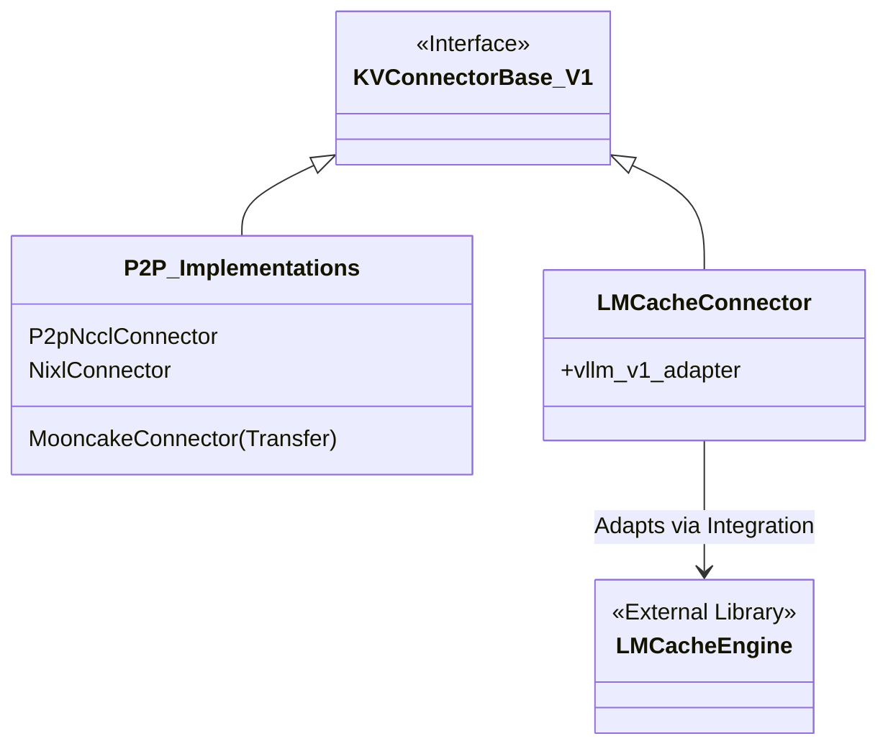
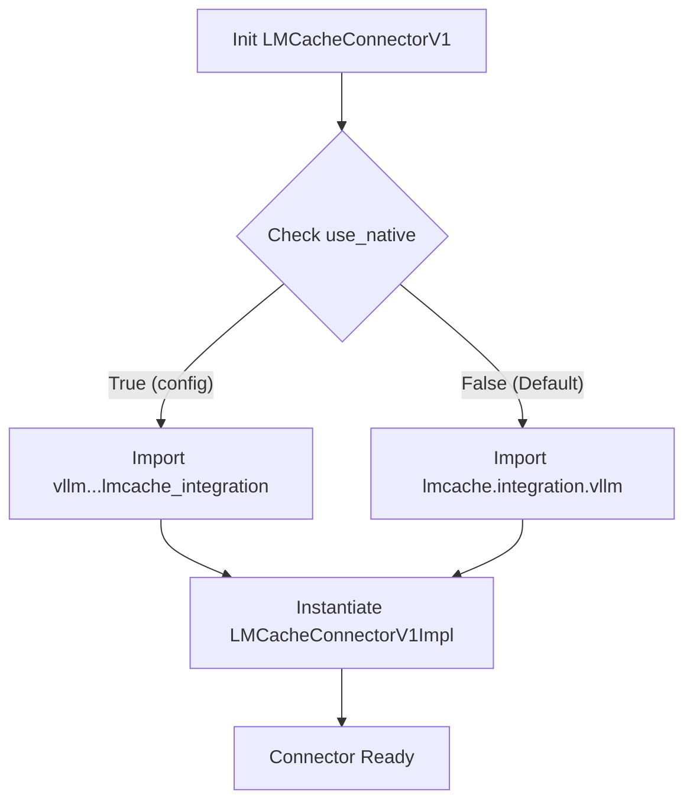
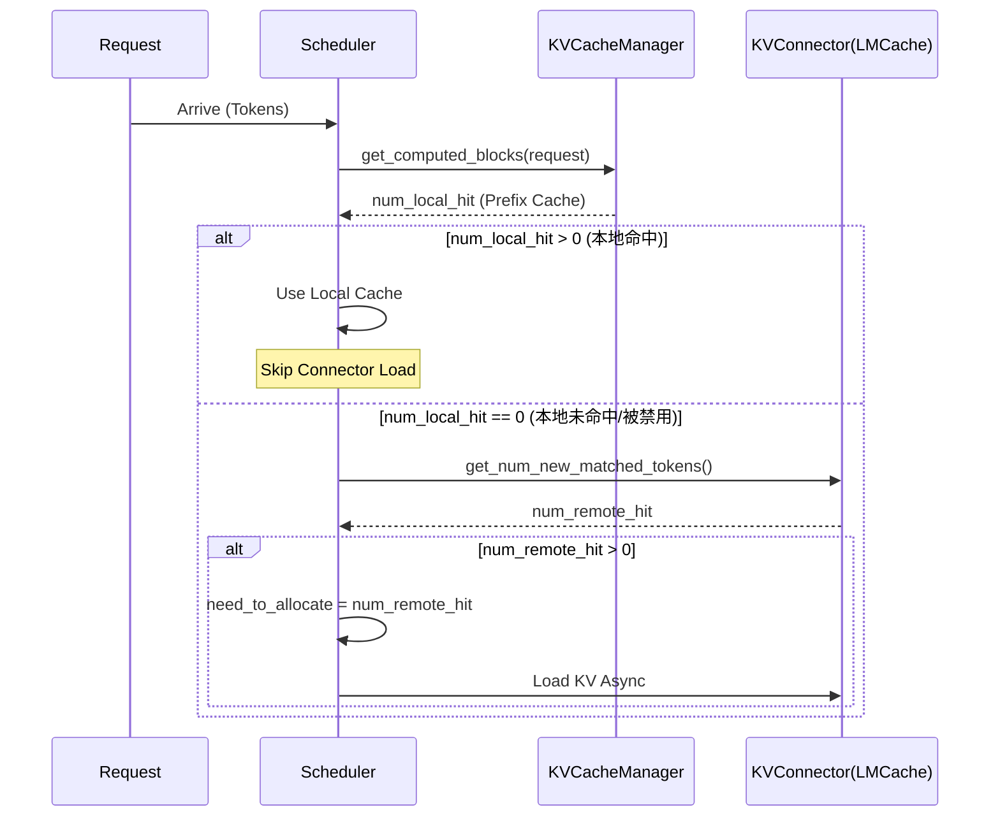

# vLLM-KVTransfor 缓存机制源码剖析


# vLLM-KVTransfor 缓存机制源码剖析

> [!NOTE]
> 本文基于 vLLM 最新代码（v1 架构）撰写，重点剖析其 KV Cache 传输与复用机制。

随着大模型推理对长文本（Context）需求的增加，KV Cache 的管理变得愈发重要。在 vLLM V1 架构中，为了支持 **KV Cache 分离（Disaggregation）**——即将 Prefill（预填充）和 Decode（解码）阶段分离到不同的实例甚至机器上，vLLM 引入了一套灵活的 **KV Transfer** 机制。

本文将深入剖析 vLLM 的 `KVConnector` 接口及其两大类实现：**P2P 直接传输**（如 Mooncake, Nixl, NCCL）和 **集中式存储**（如 LMCache），并提供核心源码的深度解读。

## 1. 架构概览：KVConnector 接口

在 vLLM V1 的多进程架构中（Process 0 前端，Process 1 核心引擎，Process 2~N Worker），KV Cache 的传输主要发生在 Worker 之间，但调度逻辑由 Engine Core (Process 1) 控制。为了解耦具体的传输协议，vLLM 定义了 `KVConnectorBase_V1` 抽象基类。

> [!TIP]
> `KVConnector` 的设计遵循了控制面（Control Plane）与数据面（Data Plane）分离的原则。

## 2. 核心代码项目结构

vLLM 的 KV Transfer 模块结构清晰，采用了 **Factory Pattern** 和 **Mixin Pattern** 来管理多种 Connector 实现。其中，代码被明确划分为 **P2P 直接传输** 和 **基于存储的传输** 两大类，并通过适配器模式集成第三方库。

### 2.1 目录结构 (Tree)

以下展示了 `vllm/distributed/kv_transfer/kv_connector/` 下的核心文件组织及其职责划分：

```text
vllm/distributed/kv_transfer/kv_connector/
├── factory.py                  # [Core] KVConnectorFactory，负责 Connector 的注册与实例化
├── v1/
│   ├── base.py                 # [Interface] KVConnectorBase_V1 抽象基类定义
│   ├── multi_connector.py      # [Strategy] MultiConnector，支持同时使用多个 Connector
│   │
│   │   # --- P2P Implementations (Direct Transfer) ---
│   ├── p2p/
│   │   └── p2p_nccl_connector.py # [Impl] vLLM 原生 P2P 实现，基于 NCCL 进行 GPU 直连
│   ├── nixl_connector.py       # [Impl] 基于 NIXL 库的 P2P 传输实现
│   ├── mooncake_connector.py   # [Impl] 基于 Mooncake Transfer Engine 的传输实现
│   │
│   │   # --- Storage/Centralized Implementations (LMCache) ---
│   ├── lmcache_connector.py    # [Impl] LMCache 连接器入口
│   └── lmcache_integration/    # [Adapter] LMCache 的深度集成适配代码
│       ├── vllm_v1_adapter.py  # [Bridge] 将 vLLM KVConnector 接口适配到 LMCacheEngine
│       └── ...
└── ...
```

### 2.2 应用逻辑与组件联系

vLLM 的应用逻辑围绕 `KVConnector` 接口展开，不同的实现对应不同的传输范式：

1.  **Interface (Connector)**: `KVConnectorBase_V1` 定义了标准化的 `load/save` 和 `match` 接口，屏蔽了底层差异。
2.  **P2P (Peer-to-Peer)**:
    *   **逻辑**: 数据直接在 Worker 之间传输（Prefill -> Decode），不经过中间存储。
    *   **代码**: `p2p/p2p_nccl_connector.py` (Native), `nixl_connector.py`, `mooncake_connector.py`.
    *   **特点**: 极低延迟，适合实时 Disaggregation。
3.  **Integration (Storage/Centralized)**:
    *   **逻辑**: 数据先写入共享存储（或缓存层），再由接收方读取。
    *   **代码**: `lmcache_connector.py` 及其下属的 `lmcache_integration`。
    *   **联系**: `lmcache_connector.py` 充当 **Proxy**，它不直接实现存储逻辑，而是通过 `vllm_v1_adapter.py` 调用外部的 `LMCacheEngine`。`LMCacheEngine` 再根据配置选择具体的后端（Redis, MooncakeStore 等）。



## 3. 核心接口与对称操作源码解析

KV Connector 的核心在于一组对称的操作：**加载 (Load)** 与 **保存 (Save)**，以及调度侧的 **选择 (Select)** 与 **匹配 (Match)**。

### 3.1 调度侧：请求匹配与 Connector 选择

在 Engine Core 侧，`MultiConnector` 负责协调多个 Connector（例如同时开启 LMCache 和 Mooncake）。

**`select_connector_for_request` & `get_num_new_matched_tokens`**

这两个方法决定了当前请求应该使用哪个 Connector 来加载数据，以及有多少 Token 可以复用。

```python
# [vllm/distributed/kv_transfer/kv_connector/v1/multi_connector.py:L271-L290]
def get_num_new_matched_tokens(self, request: "Request", num_computed_tokens: int) -> tuple[int | None, bool]:
    to_return = (0, False)
    # 遍历所有注册的 Connector，寻找最佳匹配
    for i, c in enumerate(self._connectors):
        toks, load_async = c.get_num_new_matched_tokens(request, num_computed_tokens)
        if toks is None:
            return (None, False)
        # 贪心策略：选择能提供复用 Token 的 Connector
        if to_return[0] == 0 and toks > 0:
            self._requests_to_connector[request.request_id] = i
            to_return = (toks, load_async)
    return to_return
```

### 3.2 Worker 侧：对称的 Load/Save 操作

在 Model Worker 侧，数据传输的操作是对称的。

**1. 开始加载 (Start Load)**

异步触发 KV 加载，通常在 Attention 层计算之前调用。

```python
# [vllm/distributed/kv_transfer/kv_connector/v1/lmcache_connector.py:L110-L115]
def start_load_kv(self, forward_context: "ForwardContext", **kwargs: Any) -> None:
    # 委托给底层的 LMCache Engine 执行异步加载
    self._lmcache_engine.start_load_kv(forward_context, **kwargs)
```

**2. 等待加载 (Wait for Load)**

在每一层 Attention 计算前，必须确保该层的 KV Cache 已经就绪。这是一个同步屏障点。

```python
# [vllm/distributed/kv_transfer/kv_connector/v1/lmcache_connector.py:L117-L123]
def wait_for_layer_load(self, layer_id: int, layer_name: str, **kwargs: Any) -> None:
    # 阻塞直到指定层的 KV 数据加载完成
    self._lmcache_engine.wait_for_layer_load(layer_id, layer_name, **kwargs)
```

**3. 保存层数据 (Save Layer)**

在 Decode 阶段或 Prefill 完成后，将生成的 KV Cache 保存到远端或存储中。

```python
# [vllm/distributed/kv_transfer/kv_connector/v1/lmcache_connector.py:L125-L130]
def save_kv_layer(self, layer_id: int, layer_name: str, kv_cache: torch.Tensor, **kwargs: Any) -> None:
    # 将当前层的 KV Tensor 提交给引擎进行存储
    self._lmcache_engine.save_kv_layer(layer_id, layer_name, kv_cache, **kwargs)
```

### 3.3 关键机制：一致性哈希与 PYTHONHASHSEED

在 KV Cache 分离（Disaggregation）场景下，Prefill 实例和 Decode 实例必须对相同的 Token 序列生成完全一致的 Block Hash，才能在共享存储中正确匹配数据。vLLM 使用 `PYTHONHASHSEED` 环境变量来控制这一行为。

**原理与实现：**

vLLM 的 Block Hash 计算依赖于一个初始种子 `NONE_HASH`。
*   如果未设置 `PYTHONHASHSEED`，`NONE_HASH` 将由 `os.urandom(32)` 随机生成，导致不同进程间的 Hash 不一致。
*   如果设置了 `PYTHONHASHSEED`，则使用该值生成固定的 `NONE_HASH`，确保跨进程的一致性。

```python
# [vllm/v1/core/kv_cache_utils.py:L89-L105](file:///Users/admin/Documents/Docs/HugoBlogs/external/vllm/vllm/v1/core/kv_cache_utils.py#L89-L105)
def init_none_hash(hash_fn: Callable[[Any], bytes]):
    global NONE_HASH
    hash_seed = os.getenv("PYTHONHASHSEED")
    # ...
    if hash_seed is None:
        # 随机种子，导致跨进程 Hash 不一致
        NONE_HASH = BlockHash(os.urandom(32))
    else:
        # 固定种子，保证一致性
        NONE_HASH = BlockHash(hash_fn(hash_seed))
```

> [!WARNING]
> 在部署分离式架构时，必须显式设置所有实例（Prefiller 和 Decoder）的 `PYTHONHASHSEED` 为相同的值，否则 Decode 实例将无法命中 Prefill 实例生成的缓存。

## 4. Mooncake：双重角色的高性能引擎

**Mooncake** 在 vLLM 生态中扮演着独特且重要的角色。它既是一个高性能的 **KV 传输引擎 (Transfer Engine)**，也是一个分布式的 **KV 存储系统 (Mooncake Store)**。这使得它既可以独立作为 P2P Connector 使用，也可以作为 LMCache 的高性能后端。

### 4.1 架构特点：Transfer vs Store

Mooncake 的设计充分利用了 RDMA 网络优势，其架构包含两个核心层面：

*   **Transfer Engine (用于 P2P)**:
    *   提供极致的 `send/recv` 原语。
    *   **分离架构**: 严格区分 Scheduler 和 Worker 逻辑。
    *   **零拷贝**: 利用 RDMA 直接在 GPU 显存或 CPU 内存间传输数据。
*   **Mooncake Store (用于 Storage)**:
    *   基于 Transfer Engine 构建的分布式缓存池。
    *   支持分层存储（DRAM/SSD/Remote），可作为 LMCache 的后端接入，提供比 Redis 更高的吞吐量。

### 4.2 源码细节：MooncakeConnector

在 vLLM 的代码库中，`mooncake_connector.py` 主要封装了其 **Transfer Engine** 的能力，用于实现 Worker 间的 P2P 直接传输。

```python
# [vllm/distributed/kv_transfer/kv_connector/v1/mooncake_connector.py:L45-L60]
class MooncakeConnectorWorker:
    def __init__(self, ...):
        # 独立的发送线程池，避免阻塞主计算流
        self._sender_executor = ThreadPoolExecutor(max_workers=self.num_workers)
        # 独立的接收线程，处理来自其他 Worker 的 RDMA 请求
        self._mooncake_receiver_t = threading.Thread(target=self._receiver_loop, ...)

    # Mooncake 内部通过 transfer_engine 提交 send/recv 请求
    # 它维护了 local_memory_pool 和 remote_memory_pool 的映射关系，
    # 确保数据能直接写入目标缓冲区的正确位置
```

> [!WARNING]
> Mooncake 强依赖 RDMA 硬件环境 (RoCE 或 InfiniBand)。虽然支持 TCP 回退，但在非 RDMA 环境下性能优势无法发挥，甚至可能不如普通 TCP 实现。

## 5. Nixl：兼容性与控制面辅助

**Nixl** 在 vLLM 的 KV Transfer 生态中扮演着辅助角色，主要解决 **配置兼容性检查** 和 **控制面信令** 问题。

### 5.1 兼容性哈希 (Compatibility Hash)

为了防止不同配置的 vLLM 实例之间错误地传输 KV Cache（例如 Model 架构不同、Dtype 不同），Nixl 引入了 Compatibility Hash 机制。

```python
# [vllm/distributed/kv_transfer/kv_connector/v1/nixl_connector.py:L30-L45]
def compute_nixl_compatibility_hash(vllm_config, attn_backend_name):
    factors = {
        "vllm_version": vllm_version,
        "model": model_config.model,
        "dtype": str(model_config.dtype),
        "tp_size": parallel_config.tensor_parallel_size,
        # ...
    }
    # 生成唯一的哈希标识
    return hash_factors(factors)
```

### 5.2 ZMQ Side Channel

Nixl 维护了一个基于 ZeroMQ 的 Side Channel，用于在实例间交换控制信息（如“我已经准备好接收数据”），这在 P2P 传输握手阶段非常有用。

## 6. LMCache 后端与 vLLM 传输生态 (Updated)

LMCache 并非单一的存储系统，而是一个支持多种后端的 **KV Cache 管理框架**。它既支持集中式的存储共享，也支持通过特定后端实现 P2P 传输。根据最新的调研与代码分析，vLLM 中的 KV Transfer 生态可以归纳如下：

### 6.1 LMCache 后端分类：P2P vs 集中式存储

LMCache 的后端（Backends）根据其在 vLLM 中的应用模式，主要分为两类：**Storage Mode (存储/卸载模式)** 和 **Transport Mode (传输模式)**。

| 组件/后端 | 类型 | 应用于 vLLM P2P (Transport) | 对接 LMCache 存储 (Storage) | 描述 |
| :--- | :--- | :---: | :---: | :--- |
| **Redis** | Storage | | ✅ | 作为 LMCache 的元数据存储或数据存储后端，实现跨实例共享。 |
| **InfiniStore** | Storage | | ✅ | 高性能云原生 KV 存储，作为 LMCache 的高性能后端。 |
| **Local Disk/CPU** | Storage | | ✅ | LMCache 的本地层，用于 KV Cache Offloading (卸载) 以节省显存。 |
| **NIXL** | Transport | ✅ | (Via Connector) | 专注于低延迟 P2P 传输。vLLM 有原生 `NixlConnector`，LMCache 也可集成其作为传输通道。 |
| **Mooncake** | **Both** | ✅ | ✅ | **双重角色**：<br>1. **Store**: 作为 LMCache 后端提供分布式 KV 存储。<br>2. **Transfer**: 作为传输引擎提供 RDMA 加速的 P2P 传输。 |
| **NCCL** | Transport | ✅ (Native) | | vLLM 原生的 `P2pNcclConnector`，不依赖 LMCache，直接利用 NCCL 进行 GPU 显存互传。 |

### 6.2 深入对比

#### 1. 纯 P2P 传输 (Transport Mode)
此类组件专注于将 KV Cache 从 Prefill 实例 **直接** 推送到 Decode 实例，追求极低延迟。
*   **NCCL (Native)**: vLLM 自带实现，利用 GPU 集群内部的高速互联，无需额外依赖。
*   **NIXL**: 提供了兼容性检查和基于 UCX 的高效传输，适合异构或需要握手控制的 P2P 场景。
*   **Mooncake Transfer Engine**: 利用 RDMA 极致优化传输路径，适合高性能集群。

#### 2. 集中式存储/共享 (Storage Mode)
此类组件通过 LMCache 框架接入，将 KV Cache **持久化** 或 **暂存** 到第三方介质，支持“写后读”和“多对多”共享。
*   **Redis**: 通用性最强，易于部署，适合作为元数据索引或中小规模 KV 存储。
*   **InfiniStore/Mooncake Store**: 专为大模型设计，支持分层存储（DRAM/SSD/Remote）和智能预取，解决容量和带宽瓶颈。

### 6.3 总结：二者兼顾的 Mooncake
Mooncake 是一个特例，它既包含底层的 **Transfer Engine** (用于 P2P 加速)，也构建了上层的 **Mooncake Store** (作为 LMCache 后端)。在 vLLM 中，你可以单独使用 `MooncakeConnector` 进行 P2P 传输，也可以通过 `LMCacheConnector` 配置 Mooncake 后端来实现持久化存储。

### 6.4 LMCache 模块加载策略 (Native vs External)

vLLM 在集成 LMCache 时采用了一种灵活的“双源”加载策略，允许用户在 **vLLM 内置适配器** 和 **LMCache 独立包** 之间进行选择。

**加载流程：**



**设计意图：**
1.  **解耦迭代 (Decoupling)**: 默认使用 `external/lmcache` (即 `pip install lmcache`) 中的代码。这允许 LMCache 团队独立于 vLLM 的发版周期进行快速迭代和 Bug 修复。
2.  **兜底兼容 (Fallback)**: vLLM 源码树中保留了一份 `lmcache_integration` (`use_native=True`)，确保在未安装外部包或需要特定版本绑定时仍可工作。

**代码实现：**

```python
# [vllm/distributed/kv_transfer/kv_connector/v1/lmcache_connector.py:L83-L101](file:///Users/admin/Documents/Docs/HugoBlogs/external/vllm/vllm/distributed/kv_transfer/kv_connector/v1/lmcache_connector.py#L83-L101)
use_native = vllm_config.kv_transfer_config.get_from_extra_config("use_native", False)
if use_native:
    # 使用 vLLM 源码树中的适配器
    from vllm.distributed.kv_transfer.kv_connector.v1 import lmcache_integration
    cls = lmcache_integration.vllm_v1_adapter.LMCacheConnectorV1Impl
else:
    # 使用安装在环境中的 lmcache 包（默认）
    from lmcache.integration.vllm.vllm_v1_adapter import (
        LMCacheConnectorV1Impl as LMCacheConnectorLatestImpl,
    )
    cls = LMCacheConnectorLatestImpl
```

## 6.5 LMCache 配置详解 (`LMCACHE_CONFIG_FILE`)

在 vLLM 中启用 LMCache 后，可以通过环境变量 `LMCACHE_CONFIG_FILE` 指定一个 YAML 配置文件来精细控制 LMCache 的行为。

### 6.5.1 配置加载机制与结构体代码

LMCache 的配置系统采用了一种**动态生成 Dataclass** 的设计模式。配置项并非硬编码在类属性中，而是定义在一个名为 `_CONFIG_DEFINITIONS` 的字典中，最后通过 `dataclasses.make_dataclass` 动态构建 `LMCacheEngineConfig` 类。

**代码实现：**

```python
# [external/lmcache/v1/config.py](file:///Users/admin/Documents/Docs/HugoBlogs/external/lmcache/v1/config.py)

# 1. 配置定义字典
_CONFIG_DEFINITIONS = {
    "chunk_size": {"type": int, "default": 256, "env_converter": int},
    "local_cpu": {"type": bool, "default": True, "env_converter": _to_bool},
    # ...
    # 2. Extra Config：用于扩展配置（如 NIXL 后端参数）
    "extra_config": {
        "type": Optional[dict],
        "default": None,
        "env_converter": lambda x: x if isinstance(x, dict) else json.loads(x) if x else None,
    },
    # ...
    "enable_pd": {"type": bool, "default": False, "env_converter": _to_bool}, # PD: Prefill-Decode Disaggregation
}

# 3. 动态创建配置类
def _create_config_class():
    # ...
    cls = make_dataclass(
        "LMCacheEngineConfig",
        [(name, type_, default) for name, (type_, default) in fields_dict.items()],
        # ...
    )
    return cls

LMCacheEngineConfig = _create_config_class()
```

### 6.5.2 配置结构：Base vs Extra

LMCache 的配置结构分为两部分：
1.  **基础配置 (Base Config)**: 直接定义在 `_CONFIG_DEFINITIONS` 中的常用选项，如 `chunk_size`, `remote_url` 等。
2.  **扩展配置 (Extra Config)**: 通过 `extra_config` 字段传入的字典，通常用于存储后端特定的高级参数（如 NIXL 或 Mooncake 的特定参数）。

**YAML 配置文件示例：**

```yaml
chunk_size: 256
remote_url: "mooncakestore://mooncake-master:50053/"
enable_pd: true  # 开启 Prefill-Decode 分离模式

# 扩展配置
extra_config:
  local_hostname: "prefiller-node-1"
  metadata_server: "http://mooncake-master:8080/metadata"
  transfer_timeout: 1
```

### 6.5.3 常用关键配置

以下是 vLLM 用户最常需要关注的配置项：

*   **`chunk_size`**: KV Cache 切分的粒度，默认 256。需要根据网络带宽和延迟进行调优。
*   **`local_cpu` / `max_local_cpu_size`**: 控制是否使用本地内存作为缓存及其大小。
*   **`remote_url`**: 指定远程存储后端。例如使用 Redis 作为共享存储：`redis://localhost:6379`。
*   **`enable_p2p`**: 是否开启 Worker 间的 P2P 直连。

## 7. LMCache 缓存命中机制与调试分析

在实际使用中，理解 vLLM 如何决定“复用本地缓存”还是“从远端加载”至关重要。本节将结合日志现象、源码逻辑及调试方案，深入剖析这一机制。

### 7.1 核心机制：本地优先 (Local First)

vLLM V1 的调度器 (Scheduler) 遵循 **“本地显存优先，远端存储为辅”** 的原则。只有当本地没有命中的缓存块时，才会尝试从 KV Connector (如 LMCache) 加载数据。

以下时序图展示了这一决策流程：



### 7.2 源码级逻辑解析

这一优先级的代码实现主要集中在 `Scheduler` 和 `LMCacheAdapter` 中。

#### 1. 调度器的优先判定

Scheduler 会首先检查 `get_computed_blocks`。如果本地已经有计算好的 Block（Prefix Caching 命中），则直接使用，**不会** 再去问 Connector 要数据。

```python
# [vllm/v1/core/sched/scheduler.py:L476-L489](file:///Users/admin/Documents/Docs/HugoBlogs/external/vllm/vllm/v1/core/sched/scheduler.py#L476-L489)
# Get already-cached tokens.
if request.num_computed_tokens == 0:
    # 1. 优先获取本地缓存 (Prefix Caching)
    new_computed_blocks, num_new_local_computed_tokens = (
        self.kv_cache_manager.get_computed_blocks(request)
    )

    # 2. 仅当本地命中数确定后，才结合本地情况查询外部缓存
    if self.connector is not None:
        ext_tokens, load_kv_async = (
            self.connector.get_num_new_matched_tokens(
                request, num_new_local_computed_tokens  # <--- 传入本地已匹配数
            )
        )
```

#### 2. LMCache 的分配计算

在 Adapter 层，决定是否从远端加载的公式非常直观：**远端命中的 Token 数 减去 本地已有的 Token 数**。

```python
# [lmcache/integration/vllm/vllm_v1_adapter.py:L1581](file:///Users/admin/Documents/Docs/HugoBlogs/external/LMCache/lmcache/integration/vllm/vllm_v1_adapter.py#L1581)
# need_to_allocate: 真正需要从远端传输的 Token 数
need_to_allocate = num_external_hit_tokens - num_computed_tokens
```

### 7.3 日志分析实例

> [!NOTE]
> **现象**：用户观察到日志 `Total tokens 37, LMCache hit tokens: 32, need to load: 0`。

根据上述公式，我们可以精准还原其背后的逻辑：

1.  **`num_external_hit_tokens` = 32**: LMCache 在远端 (Mooncake) 成功找到了 32 个 Token (通常是因为 32 是 Chunk Size 16 的倍数，发生了 **Chunk Alignment**，尾部 5 个 Token 被忽略)。
2.  **`need_to_allocate` = 0**: 意味着 `32 - num_computed_tokens <= 0`。
3.  **结论**: `num_computed_tokens` 至少为 32。这说明 vLLM **已经在本地显存中找到了这些数据**。

### 7.4 调试技巧：如何强制读取 Remote Cache？

在开发或调试 LMCache/Mooncake 时，我们经常需要验证“远端传输”链路是否通畅。如果 vLLM 总是命中本地缓存，就无法触发传输逻辑。

此时，我们需要**禁用 vLLM 的 Prefix Caching**，并确保 LMCache 不使用本地层。

> [!TIP]
> **调试配置方案**：通过以下两步操作，可以强制 vLLM 忽略本地缓存，必然发起远程读取请求。

#### 步骤 1：禁用 vLLM Prefix Caching

在 vLLM 启动参数中添加 `--no-enable-prefix-caching`。

这将导致 `KVCacheManager.get_computed_blocks` 强制返回 0。

```python
# [vllm/v1/core/kv_cache_manager.py](file:///Users/admin/Documents/Docs/HugoBlogs/external/vllm/vllm/v1/core/kv_cache_manager.py)
def get_computed_blocks(self, request: Request) -> tuple[KVCacheBlocks, int]:
    # 禁用缓存时，直接返回空和 0
    if not self.enable_caching or request.skip_reading_prefix_cache:
        return self.empty_kv_cache_blocks, 0
```

#### 步骤 2：禁用 LMCache 本地缓存

修改 LMCache 配置文件（`lmcache_config.yaml`），关闭本地 CPU 和磁盘缓存，迫使请求穿透到 Remote Backend。

```yaml
chunk_size: 256
pipelined_backend:
  local_cpu: false      # [Debug] 禁用本地 CPU 缓存
  local_disk: false     # [Debug] 禁用本地磁盘缓存
  remote_url: "lm://..." 
  remote_serde: "cachegen"
```

#### 预期结果

配置生效后，再次运行相同请求，日志将变为：

```text
Total tokens 37, LMCache hit tokens: 32, need to load: 32
```

此时 `need_to_allocate = 32 - 0 = 32`，系统将成功触发从 Mooncake 到 GPU 的数据传输。

## 8. 总结

vLLM V1 的 KV Transfer 机制展示了极高的灵活性，为大模型推理的性能优化提供了广阔空间：

1.  **接口标准化**: `KVConnectorBase` 屏蔽了底层传输与存储的差异，使得上层调度逻辑保持简洁。
2.  **范式多样化**: 提供了 **P2P 直连** (NCCL, Nixl, Mooncake Transfer) 和 **集中式存储** (LMCache, Mooncake Store) 两种范式。用户可以根据对 **延迟**（倾向 P2P）和 **持久化/共享范围**（倾向 Storage）的不同需求灵活选择。
3.  **生态融合**: LMCache 可以使用 Mooncake 作为后端，Nixl 为整个链路提供安全检查，各组件并非孤立，而是相互协作，共同构建了高效的 KV Cache 管理生态。

对于开发者而言，理解这些 Connector 的源码结构与适用场景，是进行性能调优或定制化开发（如适配私有存储系统）的关键。

