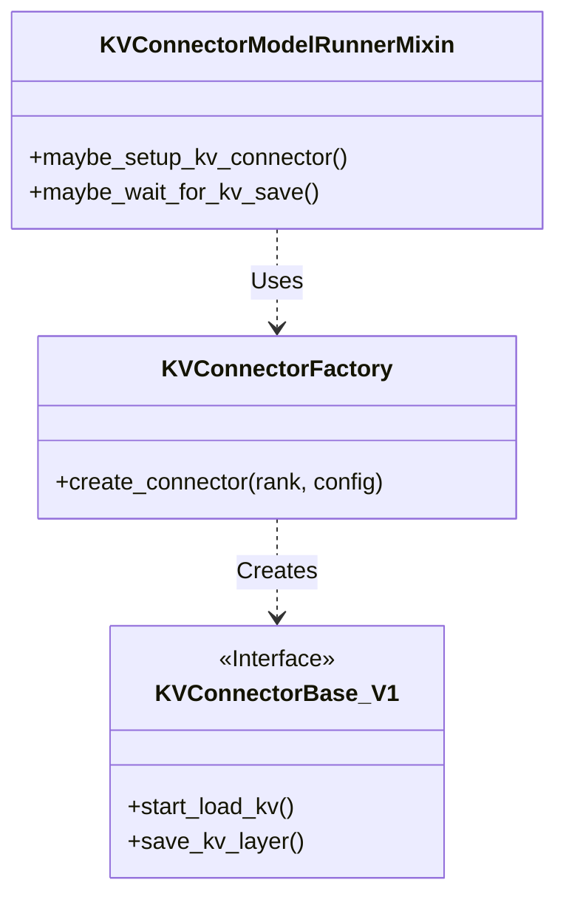

# vLLM-KVTransformer 缓存机制源码剖析


# vLLM-KVTransformer 缓存机制源码剖析

> [!NOTE]
> 本文基于 vLLM 最新代码（v1 架构）撰写，重点剖析其 KV Cache 传输与复用机制。

随着大模型推理对长文本（Context）需求的增加，KV Cache 的管理变得愈发重要。在 vLLM V1 架构中，为了支持 **KV Cache 分离（Disaggregation）**——即将 Prefill（预填充）和 Decode（解码）阶段分离到不同的实例甚至机器上，vLLM 引入了一套灵活的 **KV Transfer** 机制。

本文将深入剖析 vLLM 的 `KVConnector` 接口及其三种主要实现：**LMCache**、**Mooncake** 和 **Nixl**，并提供核心源码的深度解读。

## 1. 架构概览：KVConnector 接口

在 vLLM V1 的多进程架构中（Process 0 前端，Process 1 核心引擎，Process 2~N Worker），KV Cache 的传输主要发生在 Worker 之间，但调度逻辑由 Engine Core (Process 1) 控制。为了解耦具体的传输协议，vLLM 定义了 `KVConnectorBase_V1` 抽象基类。

> [!TIP]
> `KVConnector` 的设计遵循了控制面（Control Plane）与数据面（Data Plane）分离的原则。

## 2. 核心代码项目结构

vLLM 的 KV Transfer 模块结构清晰，采用了 **Factory Pattern** 和 **Mixin Pattern** 来管理多种 Connector 实现。

### 2.1 目录结构 (Tree)

以下展示了 `vllm/distributed/kv_transfer` 下的核心文件组织：

```text
vllm/distributed/kv_transfer/kv_connector/
├── factory.py                  # [Core] KVConnectorFactory，负责 Connector 的注册与实例化
├── v1/
│   ├── base.py                 # [Interface] KVConnectorBase_V1 抽象基类定义
│   ├── multi_connector.py      # [Strategy] MultiConnector，支持同时使用多个 Connector
│   ├── lmcache_connector.py    # [Impl] LMCache 实现
│   ├── mooncake_connector.py   # [Impl] Mooncake 实现
│   ├── nixl_connector.py       # [Impl] Nixl 实现
│   ├── p2p/
│   │   └── p2p_nccl_connector.py # [Impl] 基于 NCCL 的点对点传输实现
│   └── lmcache_integration/    # [Adapter] LMCache 的深度集成适配代码
│       ├── vllm_v1_adapter.py  # LMCache 核心逻辑适配
│       └── ...
└── ...
```

### 2.2 关键设计模式

为了将 KV Connector 无缝集成到 Model Runner 中，vLLM 使用了 `KVConnectorFactory` 进行延迟加载，并通过 `KVConnectorModelRunnerMixin` 将功能注入到 Worker 中。



## 3. 核心接口与对称操作源码解析

KV Connector 的核心在于一组对称的操作：**加载 (Load)** 与 **保存 (Save)**，以及调度侧的 **选择 (Select)** 与 **匹配 (Match)**。

### 3.1 调度侧：请求匹配与 Connector 选择

在 Engine Core 侧，`MultiConnector` 负责协调多个 Connector（例如同时开启 LMCache 和 Mooncake）。

**`select_connector_for_request` & `get_num_new_matched_tokens`**

这两个方法决定了当前请求应该使用哪个 Connector 来加载数据，以及有多少 Token 可以复用。

```python
# [vllm/distributed/kv_transfer/kv_connector/v1/multi_connector.py:L271-L290]
def get_num_new_matched_tokens(self, request: "Request", num_computed_tokens: int) -> tuple[int | None, bool]:
    to_return = (0, False)
    # 遍历所有注册的 Connector，寻找最佳匹配
    for i, c in enumerate(self._connectors):
        toks, load_async = c.get_num_new_matched_tokens(request, num_computed_tokens)
        if toks is None:
            return (None, False)
        # 贪心策略：选择能提供复用 Token 的 Connector
        if to_return[0] == 0 and toks > 0:
            self._requests_to_connector[request.request_id] = i
            to_return = (toks, load_async)
    return to_return
```

### 3.2 Worker 侧：对称的 Load/Save 操作

在 Model Worker 侧，数据传输的操作是对称的。

**1. 开始加载 (Start Load)**

异步触发 KV 加载，通常在 Attention 层计算之前调用。

```python
# [vllm/distributed/kv_transfer/kv_connector/v1/lmcache_connector.py:L110-L115]
def start_load_kv(self, forward_context: "ForwardContext", **kwargs: Any) -> None:
    # 委托给底层的 LMCache Engine 执行异步加载
    self._lmcache_engine.start_load_kv(forward_context, **kwargs)
```

**2. 等待加载 (Wait for Load)**

在每一层 Attention 计算前，必须确保该层的 KV Cache 已经就绪。这是一个同步屏障点。

```python
# [vllm/distributed/kv_transfer/kv_connector/v1/lmcache_connector.py:L117-L123]
def wait_for_layer_load(self, layer_id: int, layer_name: str, **kwargs: Any) -> None:
    # 阻塞直到指定层的 KV 数据加载完成
    self._lmcache_engine.wait_for_layer_load(layer_id, layer_name, **kwargs)
```

**3. 保存层数据 (Save Layer)**

在 Decode 阶段或 Prefill 完成后，将生成的 KV Cache 保存到远端或存储中。

```python
# [vllm/distributed/kv_transfer/kv_connector/v1/lmcache_connector.py:L125-L130]
def save_kv_layer(self, layer_id: int, layer_name: str, kv_cache: torch.Tensor, **kwargs: Any) -> None:
    # 将当前层的 KV Tensor 提交给引擎进行存储
    self._lmcache_engine.save_kv_layer(layer_id, layer_name, kv_cache, **kwargs)
```

## 4. Mooncake：RDMA 加速的传输引擎

**Mooncake** 是一个高性能的 KV 传输引擎，专为利用 RDMA 网络设计。它在 vLLM 中既可以作为独立的 Connector 存在，也可以作为 LMCache 的后端之一。

### 4.1 架构特点

*   **分离的 Scheduler/Worker**: Mooncake 严格区分了调度器和工作节点的逻辑。
*   **Transfer Engine**: 核心是一个 C++ 编写的高性能传输库，通过 Pybind 暴露给 Python。
*   **Async Connector Worker**: 使用独立的线程池处理传输任务，避免阻塞 GPU 计算主循环。

### 4.2 源码细节

```python
# [vllm/distributed/kv_transfer/kv_connector/v1/mooncake_connector.py:L45-L60]
class MooncakeConnectorWorker:
    def __init__(self, ...):
        # 独立的发送线程池
        self._sender_executor = ThreadPoolExecutor(max_workers=self.num_workers)
        # 独立的接收线程
        self._mooncake_receiver_t = threading.Thread(target=self._receiver_loop, ...)

    # TODO: 补充具体的 transfer 和 storage 逻辑
    # Mooncake 内部通过 transfer_engine 提交 send/recv 请求
    # 需要处理 local_memory_pool 和 remote_memory_pool 的映射关系
```

> [!WARNING]
> Mooncake 强依赖 RDMA 硬件环境。在非 RDMA 环境下回退到 TCP 可能会有性能损耗。

## 5. Nixl：兼容性与控制面辅助

**Nixl** 在 vLLM 的 KV Transfer 生态中扮演着辅助角色，主要解决 **配置兼容性检查** 和 **控制面信令** 问题。

### 5.1 兼容性哈希 (Compatibility Hash)

为了防止不同配置的 vLLM 实例之间错误地传输 KV Cache（例如 Model 架构不同、Dtype 不同），Nixl 引入了 Compatibility Hash 机制。

```python
# [vllm/distributed/kv_transfer/kv_connector/v1/nixl_connector.py:L30-L45]
def compute_nixl_compatibility_hash(vllm_config, attn_backend_name):
    factors = {
        "vllm_version": vllm_version,
        "model": model_config.model,
        "dtype": str(model_config.dtype),
        "tp_size": parallel_config.tensor_parallel_size,
        # ...
    }
    # 生成唯一的哈希标识
    return hash_factors(factors)
```

### 5.2 ZMQ Side Channel

Nixl 维护了一个基于 ZeroMQ 的 Side Channel，用于在实例间交换控制信息（如“我已经准备好接收数据”），这在 P2P 传输握手阶段非常有用。

## 6. 三方组件分类与对比 (Updated)

为了支持生产级的 KV Cache 分离与复用，vLLM 集成了多种第三方组件。根据网络检索与代码分析，我们将它们分为“P2P 传输”和“集中式存储”两大类。

### 6.1 P2P 共享 vs 集中式存储 (Storage) 共享

| 特性       | P2P 共享 (P2P NCCL / Mooncake Transfer)                          | 集中式存储共享 (LMCache / Redis / InfiniStore)                     |
| :------- | :------------------------------------------------------------- | :---------------------------------------------------------- |
| **核心理念** | Prefill 实例直接将 KV 发送给 Decode 实例                                 | KV 写入共享存储池，Decode 实例按需读取                                    |
| **优势**   | 低延迟（内存直传），无需额外存储组件                                             | 解耦性强，支持多对多，持久化能力强                                           |
| **典型组件** | `P2pNcclConnector` (vLLM Native), `Mooncake` (Transfer Engine) | `LMCache` (Redis/Local/S3), `InfiniStore`, `Mooncake Store` |
| **适用场景** | 实时性要求极高，集群拓扑相对固定                                               | 弹性伸缩频繁，需跨集群/长周期复用 KV                                        |

### 6.2 LMCache 后端对比 (Storage Backends)

LMCache 作为一个统一的 KV 存储抽象层，支持多种后端以适应不同需求。

| 后端类型        | InfiniStore      | Mooncake Store                      | Nixl               | Redis                |
| :---------- | :--------------- | :---------------------------------- | :----------------- | :------------------- |
| **定位**      | 高性能云原生 KV 存储     | RDMA 优化的分层缓存池                       | 兼容性握手协议与传输         | 通用内存数据库              |
| **传输协议**    | TCP / RDMA       | RDMA (RoCE) / TCP                   | UCX (支持多种底层协议)     | TCP                  |
| **特点**      | 专为大模型推理设计，支持智能预取 | 零拷贝传输，利用闲置内存/SSD，极致性能               | 兼容性好，支持异构网络环境      | 成熟稳定，易于部署，适合元数据管理    |
| **vLLM 集成** | 通过 LMCache 插件    | 原生 `MooncakeConnector` 或 LMCache 后端 | 原生 `NixlConnector` | 作为 LMCache 的元数据或数据后端 |

### 6.3 关键组件深度说明

#### Mooncake (Transfer Engine & Store)
Mooncake 不仅是一个传输引擎，还提供了分布式的 KV 存储能力。
- **Transfer Engine**: 核心组件，支持 RDMA/TCP/NVMe-of 等多种协议，提供统一的批量数据传输接口。
- **Mooncake Store**: 基于 Transfer Engine 构建的分布式 KV 缓存池，支持分层存储（DRAM/SSD/Remote）。
- **vLLM 配置**:
  - `kv_connector`: "MooncakeConnector"
  - `kv_role`: "kv_producer" (Prefill) / "kv_consumer" (Decode) / "kv_both"
  - **Environment**: `VLLM_MOONCAKE_BOOTSTRAP_PORT` (用于握手)

#### Nixl (兼容性传输)
Nixl 专注于解决异构环境下的 KV 传输兼容性问题。
- **Side Channel**: 使用 ZMQ 建立带外控制通道，交换握手信息。
- **Transport**: 基于 UCX，可自动适配底层网络硬件（如 IB, RoCE, Ethernet）。
- **vLLM 配置**:
  - `kv_connector`: "NixlConnector"
  - **Environment**: `VLLM_NIXL_SIDE_CHANNEL_HOST`, `VLLM_NIXL_SIDE_CHANNEL_PORT`

#### P2P NCCL (原生直连)
vLLM 原生实现的基于 NCCL 的点对点传输。
- **设计**: 利用 NCCL 的 `send/recv` 原语实现高效的 GPU-GPU 传输。
- **1P1D 架构**: 典型的 1 个 Prefill 实例对应 1 个 Decode 实例，通过 Proxy 进行请求路由。
- **动态扩缩容**: 支持动态添加 P/D 实例，无需重启集群（基于 ZMQ 握手）。

## 7. 总结

vLLM V1 的 KV Transfer 机制展示了极高的灵活性：
1.  **接口标准化**: `KVConnectorBase` 屏蔽了底层差异。
2.  **实现多样化**: 从简单的 P2P 到复杂的分布式存储（LMCache）和高性能传输（Mooncake），覆盖了不同用户的需求。
3.  **生态融合**: LMCache 可以使用 Mooncake 作为后端，Nixl 为整个链路提供安全检查，各组件并非孤立，而是相互协作。

对于开发者而言，理解这些 Connector 的源码有助于针对特定硬件环境（如 RDMA 集群）进行定制优化，或开发新的存储后端以适应私有化部署需求。

