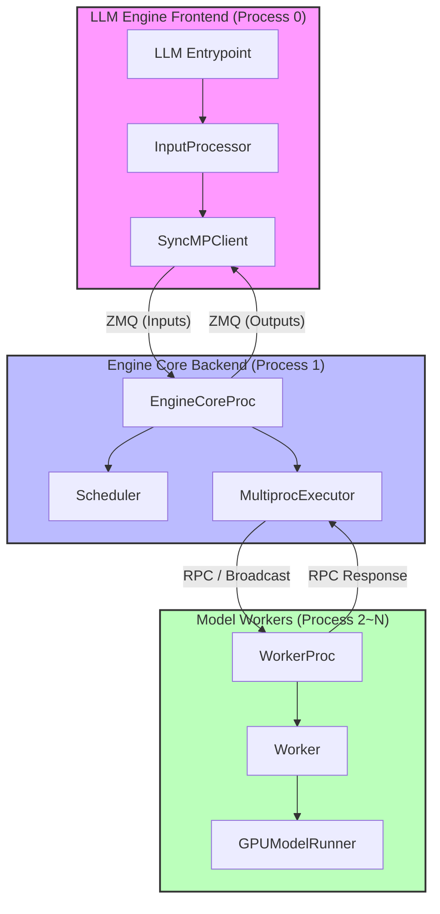
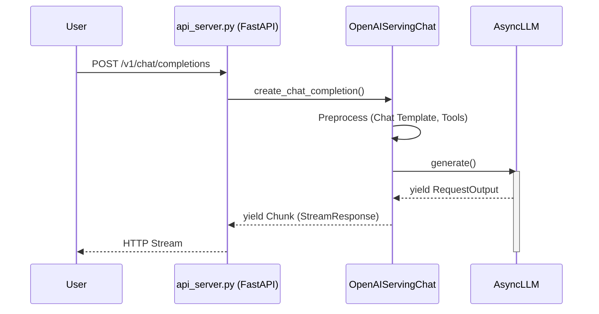
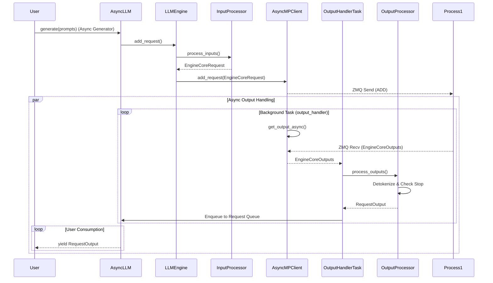
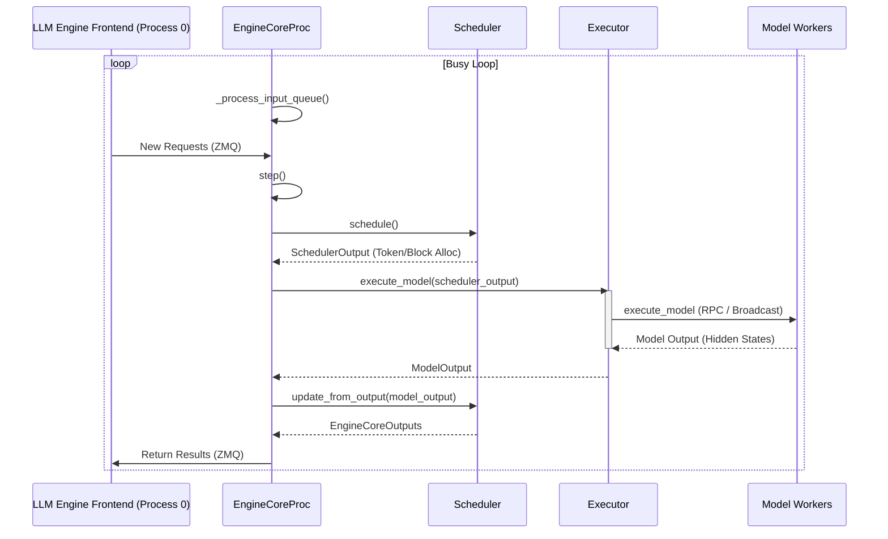
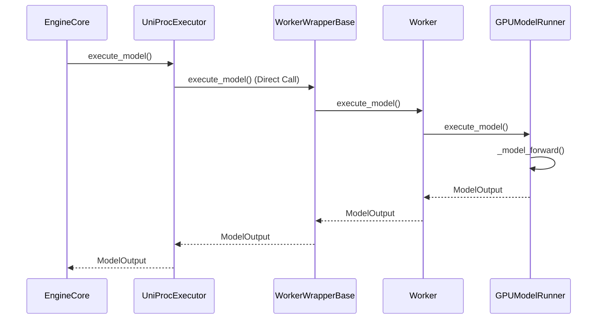
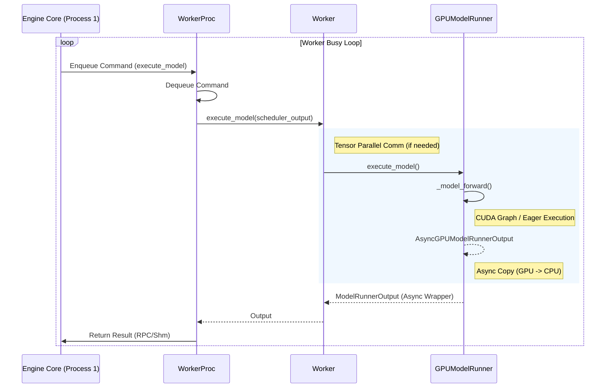
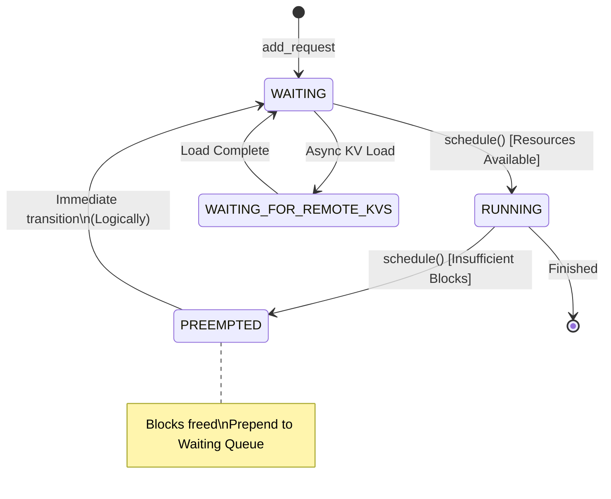

# vLLM 原理解读


# vLLM 原理解读

> [!NOTE]
> 本文基于 vLLM v0.13.0 撰写。

本文旨在深入剖析 vLLM V1 架构及其与 LMCache 和 MoonCake 的集成。我们将从 vLLM V1 的整体架构出发，逐步深入到各个核心组件的源码实现。

## 1. vLLM V1 整体架构概览

vLLM V1 采用了多进程架构，将 CPU 密集型的预处理/后处理任务与 GPU 密集型的模型推理任务分离，以实现流水线并行和更高的资源利用率。主要包含以下三类进程：

*   **LLM Engine Frontend (Process 0, 前端引擎):** 运行 `LLMEngine`，负责请求接收、分词 (Tokenization)、反分词 (Detokenization) 和结果返回。
*   **Engine Core Backend (Process 1, 核心后端):** 运行 `EngineCore`，负责请求调度 (Scheduler) 和 GPU 任务协调。
*   **Model Worker (Process 2~N, 模型工作者):** 运行 `Worker`，负责实际的模型前向计算 (Model Execution)。



## 2. LLM Engine Frontend (Process 0) 源码解析

**LLM Engine Frontend (Process 0)** 是用户与 vLLM 交互的入口，主要运行在 CPU 上。vLLM 提供了多种入口方式，包括 OpenAI Compatible Server (`api_server`)、`AsyncLLM` (用于自定义异步服务) 和 `LLM` (用于同步批处理)。

本节将首先介绍 **OpenAI API Server** 的架构，然后深入剖析 **`AsyncLLM`** 的核心实现。

### 2.1 OpenAI API Server Architecture

当使用 `vllm serve` 命令启动服务时，请求首先经过 OpenAI API Server 层。该层负责处理 HTTP 请求、协议适配以及 Chat Template 渲染。

*   **文件位置**:
    *   [api_server.py](vllm/entrypoints/openai/api_server.py): FastAPI 应用入口，负责路由分发。
    *   [serving_chat.py](vllm/entrypoints/openai/serving_chat.py): `OpenAIServingChat` 类，处理 `/v1/chat/completions` 请求。
    *   [serving_engine.py](vllm/entrypoints/openai/serving_engine.py): `OpenAIServing` 基类，管理 `EngineClient`。



`OpenAIServingChat` 在接收到请求后，会进行参数校验、应用 Chat Template 将消息转换为 Prompt，然后调用底层的 `AsyncLLM.generate` 方法提交请求。

对于流式请求 (`stream=True`)，它使用 `chat_completion_stream_generator` 将 `AsyncLLM` 返回的 `RequestOutput` 实时转换为 OpenAI 兼容的 chunk 格式 (`data: {...}`) 并推送给客户端。对于非流式请求，则使用 `chat_completion_full_generator` 收集所有输出后一次性返回。

### 2.2 AsyncLLM Entrypoint (流式返回)

`AsyncLLM` 类是 vLLM 核心引擎的异步入口。无论是通过 API Server 还是直接使用 Python 代码调用，最终都会进入这里。



`AsyncLLM` 基于 `asyncio` 实现了完全异步的请求处理流程。

*   **文件位置**: [async_llm.py](vllm/v1/engine/async_llm.py)
*   **核心类**: `AsyncLLM`

在 `__init__` 方法中，`AsyncLLM` 初始化 `EngineCoreClient` (用于与后端进程通信) 并启动一个后台任务 `_run_output_handler` 来持续处理引擎输出。

```python
# vllm/v1/engine/async_llm.py

class AsyncLLM(EngineClient):
    def __init__(self, ...):
        # ...
        # EngineCore (starts the engine in background process).
        # 见 vllm/v1/engine/async_llm.py#L134
        self.engine_core = EngineCoreClient.make_async_mp_client(...)
        
        # Start the background output processing loop
        # 见 vllm/v1/engine/async_llm.py#L164
        self._run_output_handler()
```

#### 2.2.1 generate 方法 (流式接口)

`generate` 方法是核心入口。它首先调用 `add_request` 将请求发送给后端，并获取一个 `asyncio.Queue`，然后通过监听该队列逐个 `yield` 生成的结果。

```python
# vllm/v1/engine/async_llm.py

    async def generate(
        self,
        prompt: str,
        sampling_params: SamplingParams,
        request_id: str,
        ...
    ) -> AsyncGenerator[RequestOutput, None]:
        
        # 1. 验证并添加请求到 Engine
        # add_request 会调用 self.engine_core.add_request_async 发送给后端
        # 并返回一个用于接收结果的 Queue
        # 见 vllm/v1/engine/async_llm.py#L418
        q = await self.add_request(...)

        # 2. 流式返回结果
        # RequestOutput 队列由 _run_output_handler 负责填充
        try:
            while not finished:
                # 等待新的输出
                # 见 vllm/v1/engine/async_llm.py#L436
                out = q.get_nowait() or await q.get()
                finished = out.finished
                yield out
        except asyncio.CancelledError:
            # 处理请求取消
            await self.abort(request_id)
            raise
```

#### 2.2.2 _run_output_handler (后台输出处理)

`_run_output_handler` 是一个无限循环的后台任务，它不断从 `EngineCore` 获取输出，并通过 `OutputProcessor` 处理后分发到各个请求的队列中。

```python
# vllm/v1/engine/async_llm.py

    async def _run_output_handler(self):
        # 见 vllm/v1/engine/async_llm.py#L486
        async def output_handler():
            while True:
                # 1. 异步获取 EngineCore 的输出
                # 这里调用的是 AsyncMPClient.get_output_async
                outputs = await self.engine_core.get_output_async()
                
                # 2. 处理输出 (Detokenization 等)
                # 见 vllm/v1/engine/async_llm.py#L510
                self.output_processor.process_outputs(outputs, ...)
                
        # ...
        await output_handler()
```

### 2.3 LLM Entrypoint (非流式返回)

`LLM` 类主要用于离线批处理场景。与 `AsyncLLM` 不同，它不使用异步协程，而是通过阻塞循环来等待结果。

*   **文件位置**: [llm.py](vllm/entrypoints/llm.py)
*   **核心类**: `LLM`

**处理逻辑对比**:

*   **初始化**: `LLM` 内部会创建一个 `LLMEngine` 实例，而 `LLMEngine` 会初始化 `SyncMPClient` 作为 `engine_core`。
*   **同步阻塞**: `LLM.generate` 方法会调用 `_run_engine`，该方法内部运行一个 `while` 循环 (`while has_unfinished_requests`)。
*   **主动轮询**: 在循环中，它不断调用 `self.llm_engine.step()`。`step()` 方法会阻塞调用 `SyncMPClient.get_output()` 直到从后端获取到一批结果。
*   **一次性返回**: 虽然内部是分步执行的，但 `LLM.generate` 会收集所有请求的最终结果 (`RequestOutput`)，并在所有请求完成后一次性返回一个列表 `list[RequestOutput]`，而不是流式 `yield`。

### 2.3 InputProcessor (输入预处理)

> [!NOTE]
> 在 v0.13.0 中，`Processor` 类被重命名为 `InputProcessor`，并移动到了 `input_processor.py` 文件中。

`InputProcessor` 类被 `AsyncLLM` 和 `LLM` 共享，负责处理输入请求，包括参数校验、多模态数据处理和 Tokenization。它将用户输入转换为 `EngineCoreRequest` 发送给后端。

*   **文件位置**: [input_processor.py](vllm/v1/engine/input_processor.py)
*   **核心类**: `InputProcessor`

`process_inputs` 是其核心方法：

```python
# vllm/v1/engine/input_processor.py

    def process_inputs(
        self,
        request_id: str,
        prompt: PromptType,
        params: SamplingParams | PoolingParams,
        ...
    ) -> EngineCoreRequest:
        # 1. 校验 LoRA 和采样参数
        # 见 vllm/v1/engine/input_processor.py#L404
        self._validate_lora(lora_request)
        self._validate_params(params)

        # ...

        # 2. 预处理输入 (包括 Tokenization)
        # 见 vllm/v1/engine/input_processor.py#L448
        processed_inputs: ProcessorInputs = self.input_preprocessor.preprocess(
            prompt,
            tokenization_kwargs=tokenization_kwargs,
            mm_uuids=mm_uuids,
        )
        
        # ... (构建 EngineCoreRequest 对象)
```

### 2.5 AsyncMPClient vs SyncMPClient (跨进程通信)

这两个类负责 **LLM Engine Frontend (Process 0)** 与 **Engine Core Backend (Process 1)** 之间的 ZMQ 通信。

*   **文件位置**: [core_client.py](vllm/v1/engine/core_client.py)

#### AsyncMPClient (AsyncLLM 使用)

`AsyncMPClient` 使用 `asyncio.Queue` 来缓存从 ZMQ 接收到的消息。

*   **get_output_async**: 这是一个 `async` 方法，通过 `await self.outputs_queue.get()` 非阻塞地等待后端结果。这使得 `AsyncLLM` 的后台处理循环 (`_run_output_handler`) 可以与请求生成循环并发运行。

```python
# vllm/v1/engine/core_client.py

class AsyncMPClient(MPClient):
    async def get_output_async(self) -> EngineCoreOutputs:
        # 异步等待队列结果
        # 见 vllm/v1/engine/core_client.py#L887
        outputs = await self.outputs_queue.get()
        if isinstance(outputs, Exception):
            raise self._format_exception(outputs) from None
        return outputs
```

#### SyncMPClient (LLM 使用)

`SyncMPClient` 使用标准的线程安全队列 `queue.Queue` 和后台线程 (`output_queue_thread`)。

*   **get_output**: 这是一个同步阻塞方法，通过 `self.outputs_queue.get()` 阻塞当前线程直到有结果返回。

```python
# vllm/v1/engine/core_client.py

class SyncMPClient(MPClient):
    def __init__(self, ...):
        # ...
        # Process outputs from engine in separate thread.
        # 见 vllm/v1/engine/core_client.py#L701
        self.output_queue_thread = Thread(
            target=process_outputs_socket,
            name="EngineCoreOutputQueueThread",
            daemon=True,
        )
        self.output_queue_thread.start()

    def get_output(self) -> EngineCoreOutputs:
        # 阻塞等待结果
        # 见 vllm/v1/engine/core_client.py#L711
        outputs = self.outputs_queue.get()
        if isinstance(outputs, Exception):
            raise self._format_exception(outputs) from None
        return outputs
```

### 2.6 OutputProcessor (输出后处理)

`OutputProcessor` 负责处理从 EngineCore 返回的 `EngineCoreOutputs`，执行反分词 (Detokenization) 并更新请求状态。对于 `AsyncLLM`，它还将更新后的 `RequestOutput` 放入每个请求对应的 `asyncio.Queue` 中。

*   **文件位置**: [output_processor.py](vllm/v1/engine/output_processor.py)
*   **核心类**: `OutputProcessor`

`process_outputs` 是主要的处理逻辑：

```python
# vllm/v1/engine/output_processor.py

    def process_outputs(
        self,
        engine_core_outputs: list[EngineCoreOutput],
        ...
    ) -> OutputProcessorOutput:
        # ...
        for engine_core_output in engine_core_outputs:
            # ...
            # Detokenize the token ids into text and perform stop checks.
            # 见 vllm/v1/engine/output_processor.py#L495
            stop_string = req_state.detokenizer.update(
                new_token_ids, finish_reason == FinishReason.STOP
            )
            
            # ...
            
            # Create and handle RequestOutput objects.
            # 见 vllm/v1/engine/output_processor.py#L507
            if request_output := req_state.make_request_output(...):
                # 对于 AsyncLLM，这里会将 request_output 放入请求队列
                pass 
```


## 3. Engine Core Backend (Process 1) 源码剖析

**Engine Core Backend (Process 1)** 是 vLLM 的核心后端进程，负责请求调度 (Scheduler)、模型执行协调 (Executor) 以及 KV Cache 管理。它通过 ZeroMQ (ZMQ) 与 **LLM Engine Frontend (Process 0)** 进行通信。



### 3.1 EngineCoreProc: 进程入口

`EngineCoreProc` 是 `EngineCore` 的子类，专门用于在后台进程中运行。它的核心是 `run_busy_loop` 方法，该方法在一个无限循环中不断处理输入队列的请求并执行引擎步进。

*   **进程启动**: `EngineCoreProc` 进程由 `CoreEngineProcManager` 管理和启动。
    *   **文件位置**: [utils.py](vllm/v1/engine/utils.py#L130)
    *   **关键代码**: `context.Process(target=target_fn, ...)`
*   **类定义**: [core.py](vllm/v1/engine/core.py#L553)

```python
# vllm/v1/engine/core.py

class EngineCoreProc(EngineCore):
    """ZMQ-wrapper for running EngineCore in background process."""

    def run_busy_loop(self):
        """Core busy loop of the EngineCore."""
        # Loop until process is sent a SIGINT or SIGTERM
        while True:
            # 1) Poll the input queue until there is work to do.
            # 见 vllm/v1/engine/core.py#L860
            self._process_input_queue()
            # 2) Step the engine core and return the outputs.
            # 见 vllm/v1/engine/core.py#L862
            self._process_engine_step()
```

### 3.2 Engine Core Backend (Process 1)


Engine Core Backend (Process 1) 是 vLLM V1 架构的大脑，它运行在独立的进程中（通过 `EngineCoreProc` 封装），负责：

#### 3.2.1 初始化

在初始化时，`EngineCore` 会创建 `ModelExecutor` (通常是 `MultiprocExecutor`)、`Scheduler` 和 `KVCacheManager`。

*   **文件位置**: [core.py](vllm/v1/engine/core.py#L69)

```python
# vllm/v1/engine/core.py

class EngineCore:
    def __init__(self, ...):
        # ...
        # Setup Model.
        # 见 vllm/v1/engine/core.py#L90
        self.model_executor = executor_class(vllm_config)

        # Setup KV Caches and update CacheConfig after profiling.
        # 见 vllm/v1/engine/core.py#L93
        num_gpu_blocks, num_cpu_blocks, kv_cache_config = self._initialize_kv_caches(
            vllm_config
        )

        # Setup scheduler.
        # 见 vllm/v1/engine/core.py#L97-L106
        Scheduler = vllm_config.scheduler_config.get_scheduler_cls()
        self.scheduler: SchedulerInterface = Scheduler(
            vllm_config=vllm_config,
            kv_cache_config=kv_cache_config,
            # ...
        )
```

#### 3.2.2 Step 方法

`step` 方法是引擎的心跳。它调用调度器获取待执行的请求，然后调用执行器执行模型，最后更新调度器状态。

*   **文件位置**: [core.py](vllm/v1/engine/core.py#L327)

```python
# vllm/v1/engine/core.py

    def step(self) -> tuple[dict[int, EngineCoreOutputs], bool]:
        """Schedule, execute, and make output."""
        
        # ...
        if not self.scheduler.has_requests():
            return {}, False
        
        # 1. 调度请求
        # 见 vllm/v1/engine/core.py#L338
        scheduler_output = self.scheduler.schedule()
        
        # 2. 执行模型 (异步非阻塞)
        # 见 vllm/v1/engine/core.py#L339
        future = self.model_executor.execute_model(scheduler_output, non_block=True)
        
        # ...
        
        # 3. 获取结果
        # 见 vllm/v1/engine/core.py#L342
        model_output = future.result()
        
        # 4. 更新调度器状态
        # 见 vllm/v1/engine/core.py#L346-L348
        engine_core_outputs = self.scheduler.update_from_output(
            scheduler_output, model_output
        )

        return engine_core_outputs, scheduler_output.total_num_scheduled_tokens > 0
```

### 3.3 Scheduler: 请求调度

`Scheduler` 负责决定当前 Step 应该执行哪些请求，以及为这些请求分配多少 Token 和 KV Cache 块。

*   **文件位置**: [scheduler.py](vllm/v1/core/sched/scheduler.py#L52)

#### 3.3.1 schedule 方法

`schedule` 方法实现了具体的调度算法。它遍历 `running` 队列，为每个请求分配 Token Budget，并调用 `kv_cache_manager` 分配显存块。

*   **文件位置**: [scheduler.py](vllm/v1/core/sched/scheduler.py#L189)

```python
# vllm/v1/core/sched/scheduler.py

    def schedule(self) -> SchedulerOutput:
        # ...
        # First, schedule the RUNNING requests.
        req_index = 0
        while req_index < len(self.running) and token_budget > 0:
            request = self.running[req_index]
            
            # 计算新 Token 数量
            # 见 vllm/v1/core/sched/scheduler.py#L223-L230
            num_new_tokens = (
                request.num_tokens_with_spec
                + request.num_output_placeholders
                - request.num_computed_tokens
            )
            # ...
            
            # 为请求分配 KV Cache 块
            # 见 vllm/v1/core/sched/scheduler.py#L278
            new_blocks = self.kv_cache_manager.allocate_slots(
                request,
                num_new_tokens,
                num_lookahead_tokens=self.num_lookahead_tokens,
            )
            # ...
```

### 3.4 Executor: 模型执行器

Executor 负责管理模型 Worker 并协调模型的执行。vLLM 提供了多种 Executor 实现，最常用的是 `MultiprocExecutor` (多进程) 和 `UniProcExecutor` (单进程)。

#### 3.4.1 MultiprocExecutor (多进程)

`MultiprocExecutor` 用于多 GPU 场景 (Tensor Parallelism)。它管理一组 Model Worker 进程 (Process 2~N)，并通过 `collective_rpc` 方法向所有 Worker 广播指令并收集结果。

*   **文件位置**: [multiproc_executor.py](vllm/v1/executor/multiproc_executor.py)

##### collective_rpc (分布式通信)

这是 `MultiprocExecutor` 的核心通信方法。它支持非阻塞 (`non_block=True`) 调用，这对于 `EngineCore` 的异步流水线至关重要。

```python
# vllm/v1/executor/multiproc_executor.py

    def collective_rpc(
        self,
        method: str | Callable,
        timeout: float | None = None,
        args: tuple = (),
        kwargs: dict | None = None,
        non_block: bool = False,  # 关键：支持非阻塞调用
        unique_reply_rank: int | None = None,
        kv_output_aggregator: KVOutputAggregator | None = None,
    ) -> Any:
        # ...
        
        # 1. 广播方法和参数到所有 Worker
        # 见 vllm/v1/executor/multiproc_executor.py#L318
        self.rpc_broadcast_mq.enqueue((send_method, args, kwargs, output_rank))
        
        # ...

        # 2. 定义获取响应的闭包
        def get_response():
            # ...
            # 从 response_mqs 获取结果
            pass

        # 3. 非阻塞模式：立即返回 Future
        if non_block:
            future = FutureWrapper(self.futures_queue, aggregate=aggregate)
            self.futures_queue.appendleft((future, get_response))
            return future
            
        # 4. 阻塞模式：等待结果
        # ...
```

#### 3.4.2 UniProcExecutor (单进程)

`UniProcExecutor` 通常用于单 GPU 场景。在这种模式下，**Model Worker 直接运行在 EngineCoreProc 进程内部**，没有额外的 Worker 进程。

*   **文件位置**: [uniproc_executor.py](vllm/v1/executor/uniproc_executor.py)
*   **调用栈**:
    1.  `EngineCore.step()` 调用 `UniProcExecutor.execute_model()`
    2.  `UniProcExecutor.collective_rpc()` 通过 `run_method` 直接调用本地对象 (`self.driver_worker`)
    3.  `WorkerWrapperBase.execute_model()` 拦截调用
    4.  `Worker.execute_model()` 执行模型逻辑
    5.  `GPUModelRunner.execute_model()` -> `_model_forward()`



## 4. Model Worker (Process 2~N) 源码解析

Model Worker (Process 2~N) 负责实际的模型推理计算。它们通常运行在 GPU 上，由 `MultiprocExecutor` 启动和管理。



### 4.1 WorkerProc: 进程封装

`WorkerProc` 是运行在 Worker 进程中的封装类。它通过 `worker_busy_loop` 监听来自 Engine Core Backend (Process 1) 的 RPC 请求。

*   **文件位置**: [multiproc_executor.py](vllm/v1/executor/multiproc_executor.py#L468)

```python
# vllm/v1/executor/multiproc_executor.py

class WorkerProc:
    def worker_busy_loop(self, cancel: threading.Event | None = None):
        while not cancel.is_set():
             # 1. 从队列获取指令
             item = self.broadcast_mq.dequeue(...)
             
             # 2. 执行指令 (如 execute_model)
             result = method(*args, **kwargs)
             
             # 3. 发送结果回 Engine Core
             self.response_mq.enqueue(...)
```


### 4.2 Worker: 任务执行者

`Worker` (具体实现为 `gpu_worker.py` 中的 `Worker`) 是 Worker 进程的核心。它负责管理 GPU 资源、初始化模型执行器 (`GPUModelRunner`) 并执行具体的推理任务。

*   **文件位置**: [gpu_worker.py](vllm/v1/worker/gpu_worker.py#L542)

`execute_model` 是其核心方法：

```python
# vllm/v1/worker/gpu_worker.py

    @torch.inference_mode()
    def execute_model(
        self, scheduler_output: "SchedulerOutput"
    ) -> ModelRunnerOutput | None:
        # ...
        # 1. 处理 Tensor Parallel (TP) 通信 (如果是中间层)
        if forward_pass and not get_pp_group().is_first_rank:
            # 见 vllm/v1/worker/gpu_worker.py#L555
            intermediate_tensors = IntermediateTensors(...)

        # 2. 调用 ModelRunner 执行模型
        # 见 vllm/v1/worker/gpu_worker.py#L563
        with self.annotate_profile(scheduler_output):
            output = self.model_runner.execute_model(
                scheduler_output, intermediate_tensors
            )
            
        # ...
        return output
```

### 4.3 GPUModelRunner: 异步模型执行

`GPUModelRunner` 负责管理模型权重和执行前向传播。在 vLLM V1 中，为了配合整体的异步流式架构，它引入了 `AsyncGPUModelRunnerOutput` 来实现 GPU 到 CPU 数据的异步拷贝。

*   **文件位置**: [gpu_model_runner.py](vllm/v1/worker/gpu_model_runner.py)

#### 4.3.1 execute_model 与 异步输出

`execute_model` 执行模型计算后，不会阻塞等待数据拷贝回 CPU，而是使用 CUDA Stream 进行异步拷贝，并返回一个 `AsyncGPUModelRunnerOutput` 对象。

```python
# vllm/v1/worker/gpu_model_runner.py

    @torch.inference_mode()
    def execute_model(
        self,
        scheduler_output: SchedulerOutput,
    ) -> ModelRunnerOutput:
        # ... 模型前向计算 ...
        # 见 vllm/v1/worker/gpu_model_runner.py#L2799
        with self.maybe_get_kv_connector_output(scheduler_output) as kv_connector_output:
             # model_runner_output = self.model.forward(...)
             pass

        # 使用专门的 Stream 进行异步 D2H (Device to Host) 拷贝
        # 见 vllm/v1/worker/gpu_model_runner.py#L224 (AsyncGPUModelRunnerOutput __init__)
        return AsyncGPUModelRunnerOutput(
            model_runner_output,
            sampled_token_ids,
            logprobs_tensors,
            # ...
            async_output_copy_stream=self.async_output_copy_stream, # 传入异步流
        )
```

#### 4.3.2 AsyncGPUModelRunnerOutput

这个类在初始化时，会在指定的 CUDA Stream 上启动非阻塞的 tensor 拷贝 (`non_blocking=True`)。当 `EngineCore` 最终需要结果时 (调用 `get_output`)，它会同步该事件，确保数据已就绪。

```python
# vllm/v1/worker/gpu_model_runner.py

class AsyncGPUModelRunnerOutput(AsyncModelRunnerOutput):
    def __init__(self, ...):
        # ...
        with torch.cuda.stream(async_output_copy_stream):
            # 1. 启动异步拷贝 (GPU -> CPU)
            # 见 vllm/v1/worker/gpu_model_runner.py#L201
            self.sampled_token_ids_cpu = self._sampled_token_ids.to(
                "cpu", non_blocking=True
            )
            # 2. 记录事件
            self.async_copy_ready_event.record()

    def get_output(self) -> ModelRunnerOutput:
        # 3. 在需要结果时同步等待
        # 见 vllm/v1/worker/gpu_model_runner.py#L210
        self.async_copy_ready_event.synchronize()
        
        # ... 处理并返回最终结果
        return output
```

## 5. 显存管理与调度机制详解

本节深入探讨 vLLM 如何管理 GPU 显存以及请求在不同状态间的流转机制。

### 5.1 显存占用原理解析 (Memory Occupancy)

很多用户观察到 vLLM 启动后会立即占用大量 GPU 显存 (默认约为 90%)，这是由 vLLM 的 **Block Manager** 预分配机制决定的。

*   **配置参数**: `gpu_memory_utilization` (默认 0.9)。
*   **初始化流程** (`vllm/v1/worker/gpu_worker.py`):
    1.  **Memory Snapshot**: 启动时测量 GPU 总显存。
    2.  **Profile Run**: 运行一次模拟推理，测量模型权重 (Weights) 和激活值 (Activations) 所需的峰值显存。
    3.  **预分配 (Pre-allocation)**:
        ```python
        available_kv_cache_memory = total_memory * gpu_memory_utilization - model_weights - peak_activations
        ```
    4.  **Block 计算**: 将剩余的 `available_kv_cache_memory` 全部按 `block_size` (如 16 或 32 tokens) 划分为一个个 KV Cache Block。

**结论**: vLLM 实际上是"预定"了这部分显存用于未来的 KV Cache，以避免运行时的显存碎片化和频繁申请开销。因此，`nvidia-smi` 看到的显存占用是符合预期的。

### 5.2 请求状态机 (FSM)

vLLM 的调度器 (`Scheduler`) 维护着请求的状态流转。主要的请求状态如下：

*   **WAITING**: 新到达的请求，或者被抢占 (Preempted) 的请求。等待被调度。
*   **RUNNING**: 正在 GPU 上执行推理的请求。已分配了 KV Cache 块。
*   **PREEMPTED**: 因显存不足而被暂停的请求。其显存块已被释放 (或标记为可驱逐)。
*   **WAITING_FOR_REMOTE_KVS**: (v1 特性) 等待从远程 (如其它 Worker 或 CPU) 加载 KV Cache。



### 5.3 KV Cache 的生命周期管理

KV Cache 的管理由 `KVCacheManager` (`vllm/v1/core/kv_cache_manager.py`) 负责。

#### 5.3.1 分配 (Allocation)
当请求从 `WAITING` 转变为 `RUNNING` 时，调度器调用 `allocate_slots`：
*   根据新生成的 Token 数量计算需要的 Block 数。
*   如果 **Block Pool** 中有足够的空闲块，则分配并建立映射。
*   如果开启了 **Prefix Caching**，则尝试复用已有的 Block (通过 Hash 匹配)。

#### 5.3.2 抢占与释放 (Preemption & Free)
当显存不足以容纳所有 `RUNNING` 请求的新 Token 时，调度器会触发 **抢占 (Preemption)**：
1.  **选择受害者**: 通常基于优先级 (Priority) 或先来后到 (FCFS) 选择优先级最低的请求。
2.  **执行抢占 (`_preempt_request`)**:
    *   调用 `kv_cache_manager.free(request)`。
    *   **关键机制**: 在 vLLM V1 中，`free` 操作会将 Block 的引用计数减一。
        *   如果引用计数归零，Block 返回空闲池 (Free Pool)。
        *   如果开启 Prefix Caching，Block 数据实际上可能仍保留在显存中，成为"幽灵块" (Evictable but valid)，直到被新数据覆盖。
3.  **状态重置**: 请求状态变为 `PREEMPTED`，`num_computed_tokens` 重置为 0 (意味着下次调度时可能需要**重计算**，除非 Prefix Caching 命中)。

> [!TIP]
> **关于 Swap**: 在 vLLM V0 中，抢占通常伴随着 **Swap Out** (GPU -> CPU)。但在 vLLM V1 的当前实现中 (尤其是 Disaggregated 架构)，更倾向于直接释放并依赖 **Prefix Caching** 或 **重计算 (Recomputation)**，或者是通过异步 KV 传输机制处理。

## 5. LMCache 潜在集成点 (Hypothesis)

基于 vLLM V1 的架构分析，LMCache 可能在以下环节与 vLLM 集成：

1.  **Engine Core Backend (Process 1)**: 在 `_initialize_kv_caches` 阶段可能需要初始化 LMCache 的后端存储。
2.  **Engine Core Backend (Process 1)**: 调度器 (`Scheduler`) 可能需要感知 LMCache 的状态（如哪些 Block 在远程缓存中），以便进行 Cache-aware Scheduling。
3.  **Model Worker (Process 2~N)**: 在 `GPUModelRunner.execute_model` 中，通过 `kv_connector` (见 4.3 节) 触发 KV Cache 的预取 (Prefetch) 或卸载 (Offload)。

## 7. MoonCake 潜在集成点 (Hypothesis)

*(待补充: MoonCake 集成细节)*

根据日志可以看出，mooncake 在客户端断开连接后，会清理缓存
```text
I0107 01:41:42.813243    24 rpc_service.cpp:39] Master Metrics: Mem Storage: 1008.00 KB / 30.00 GB (0.0%) | SSD Storage: 0 B / 0 B | Keys: 1 (soft-pinned: 0) | Clients: 1 | Requests (Success/Total): PutStart=5/5, PutEnd=5/5, PutRevoke=0/0, Get=0/0, Exist=6/6, Del=0/0, DelAll=0/0, Ping=608/608,  | Batch Requests (Req=Success/PartialSuccess/Total, Item=Success/Total): PutStart:(Req=0/0/0, Item=0/0), PutEnd:(Req=0/0/0, Item=0/0), PutRevoke:(Req=0/0/0, Item=0/0), Get:(Req=1/0/1, Item=1/1), ExistKey:(Req=0/0/0, Item=0/0), QueryIp:(Req=0/0/0, Item=0/0), Clear:(Req=0/0/0, Item=0/0),  | Eviction: Success/Attempts=0/0, keys=0, size=0 B | Discard: Released/Total=0/0, StagingSize=0 B
I0107 01:41:52.260730    21 master_service.cpp:1453] client_id=10253985089986823087-7215197135771319975, action=client_expired
I0107 01:41:52.342777    21 master_service.cpp:1515] client_id=10253985089986823087-7215197135771319975, segment_name=vllm-server:14130, action=unmount_expired_segment
I0107 01:41:52.813350    24 rpc_service.cpp:39] Master Metrics: Mem Storage: 0 B / 0 B | SSD Storage: 0 B / 0 B | Keys: 0 (soft-pinned: 0) | Clients: 0 | Requests (Success/Total): PutStart=5/5, PutEnd=5/5, PutRevoke=0/0, Get=0/0, Exist=6/6, Del=0/0, DelAll=0/0, Ping=608/608,  | Batch Requests (Req=Success/PartialSuccess/Total, Item=Success/Total): PutStart:(Req=0/0/0, Item=0/0), PutEnd:(Req=0/0/0, Item=0/0), PutRevoke:(Req=0/0/0, Item=0/0), Get:(Req=1/0/1, Item=1/1), ExistKey:(Req=0/0/0, Item=0/0), QueryIp:(Req=0/0/0, Item=0/0), Clear:(Req=0/0/0, Item=0/0),  | Eviction: Success/Attempts=0/0, keys=0, size=0 B | Discard: Released/Total=0/0, StagingSize=0 B
```

MoonCake 作为分布式 KV Cache 存储，预计会涉及跨节点的通信：

1.  **LLM Engine Frontend (Process 0)**: `AsyncMPClient` (或 `SyncMPClient`) 可能需要传递全局的 Request ID 或 Cache Key。
2.  **Engine Core Backend (Process 1)**: `MultiprocExecutor` 在广播调度结果时，可能包含 MoonCake 的元数据 (如远程存储地址)。
3.  **Model Worker (Process 2~N)**: `GPUModelRunner` 在执行模型前向计算前，可能通过 RDMA/TCP 从 MoonCake 集群拉取 KV Cache 数据到 GPU 显存。

