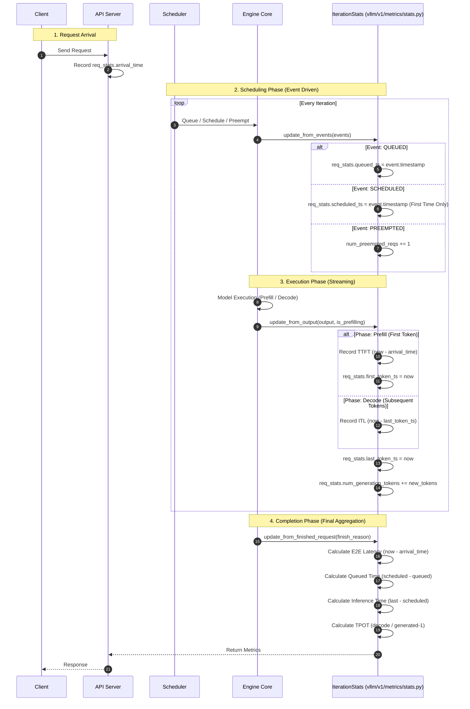

# vLLM Metrics 计算详解


本文档旨在深入剖析 vLLM V1 引擎中 Metrics（指标）的底层计算逻辑。我们将剥离上层 API 的封装，直接深入 `vllm/v1/metrics/stats.py`、`loggers.py` 和 `scheduler.py` 源码，解析从 Request 到达、调度、执行到最终完成的全生命周期中，关键性能指标是如何被精确捕获、计算并暴露给 Prometheus 的。

> **注**：本文分析基于 vLLM V1 架构。

## 1. 核心统计架构：Stats 与 Iteration

在 vLLM V1 的 Core Engine 中，指标计算并非散落在各处，而是高度内聚在 `IterationStats` 类及其关联的数据结构中。这种设计保证了在 Continuous Batching 的高并发场景下，依然能以 Iteration（推理步）为单位，精确追踪每个 Request 的状态。

### 1.1 关键数据结构

理解指标计算的前提是理解承载状态的容器。

*   **`RequestStateStats`**: 这是**每个请求**的私有状态仪表盘。它跨越多次调度（Iteration），持久记录该请求的时间戳锚点和累计计数。
    *   `arrival_time`: 请求到达 API Server 的 Wall-clock 时间。
    *   `queued_ts`: 进入调度队列的单调时间（Monotonic Clock）。
    *   `scheduled_ts`: **首次**被调度执行的时间。
    *   `first_token_ts` & `last_token_ts`: 首个和最新 Token 生成的时间。
    *   `num_generation_tokens`: 累计生成的 Token 数。

*   **`IterationStats`**: 这是**每个推理步（Step）**的统计快照。
    *   它聚合了当前 Step 中所有活跃请求产生的增量数据（如新生成的 Token 数）。
    *   它收集了当前 Step 发生的系统事件（如抢占 `PREEMPTED`）。
    *   它承载了刚完成请求的最终报告 `FinishedRequestStats`。

---

## 2. 统计机制时序图谱 (Visual Analysis)

为了宏观理解 vLLM 指标的触发与计算流程，我们梳理了从请求到达（Arrival）到请求完成（Finished）的全生命周期时序图。

此图展示了 `IterationStats` 类中的三个核心方法 —— `update_from_events`、`update_from_output` 和 `update_from_finished_request` —— 是如何在不同的系统阶段被调用的。



---

## 3. 完整 Metrics 参考手册 (Complete Metrics Reference)

下表是 vLLM V1 暴露的完整 Prometheus 指标清单。包含数据类型、计算逻辑源头及对应的代码位置。

**代码位置说明**:
*   `loggers.py`: 指标定义与暴露文件 (`vllm/v1/metrics/loggers.py`)
*   `stats.py`: 核心计算逻辑文件 (`vllm/v1/metrics/stats.py`)
*   `scheduler.py`: 调度器状态文件 (`vllm/v1/core/sched/scheduler.py`)
*   `spec_decode/metrics.py`: 投机采样指标 (`vllm/v1/spec_decode/metrics.py`)

### 3.1 延迟与时间 (Latency & Timing)

所有延迟指标均为 **Histogram** 类型，记录了操作耗时的分布。

| Metric Name (Prometheus) | Type | Description & Calculation Logic | Internal Source | Code Location |
| :--- | :--- | :--- | :--- | :--- |
| `vllm:time_to_first_token_seconds` | Histogram | **TTFT**。Prefill 结束时记录：`iteration_ts - arrival_time`。 | `iteration_stats.time_to_first_tokens_iter` | [stats.py:L270](file:///Users/admin/Documents/Docs/HugoBlogs/external/vllm/vllm/v1/metrics/stats.py#L270) |
| `vllm:inter_token_latency_seconds` | Histogram | **ITL**。Decode 阶段每个 Token 生成间隔：`now - last_token_ts`。 | `iteration_stats.inter_token_latencies_iter` | [stats.py:L300](file:///Users/admin/Documents/Docs/HugoBlogs/external/vllm/vllm/v1/metrics/stats.py#L300) |
| `vllm:e2e_request_latency_seconds` | Histogram | **E2E Latency**。请求结束时记录：`now - arrival_time`。 | `finished_request.e2e_latency` | [stats.py:L336](file:///Users/admin/Documents/Docs/HugoBlogs/external/vllm/vllm/v1/metrics/stats.py#L336) |
| `vllm:request_queue_time_seconds` | Histogram | **Queued Time**。请求在队列中等待的时间：`scheduled_ts - queued_ts`。 | `finished_request.queued_time` | [stats.py:L339](file:///Users/admin/Documents/Docs/HugoBlogs/external/vllm/vllm/v1/metrics/stats.py#L339) |
| `vllm:request_inference_time_seconds` | Histogram | **Inference Time**。请求在 GPU 上执行的总时间（含被抢占时间）：`last_ts - scheduled_ts`。 | `finished_request.inference_time` | [stats.py:L351](file:///Users/admin/Documents/Docs/HugoBlogs/external/vllm/vllm/v1/metrics/stats.py#L351) |
| `vllm:request_prefill_time_seconds` | Histogram | **Prefill Time**。预填充阶段耗时：`first_ts - scheduled_ts`。 | `finished_request.prefill_time` | [stats.py:L343](file:///Users/admin/Documents/Docs/HugoBlogs/external/vllm/vllm/v1/metrics/stats.py#L343) |
| `vllm:request_decode_time_seconds` | Histogram | **Decode Time**。解码阶段耗时：`last_ts - first_ts`。 | `finished_request.decode_time` | [stats.py:L347](file:///Users/admin/Documents/Docs/HugoBlogs/external/vllm/vllm/v1/metrics/stats.py#L347) |
| `vllm:request_time_per_output_token_seconds` | Histogram | **Mean TPOT**。请求级平均每 Token 生成时间：`decode_time / (gen_tokens - 1)`。 | `finished_request.mean_time_per_output_token` | [stats.py:L354](file:///Users/admin/Documents/Docs/HugoBlogs/external/vllm/vllm/v1/metrics/stats.py#L354) |

### 3.2 吞吐量与 Token 统计 (Throughput & Tokens)

| Metric Name (Prometheus) | Type | Description & Calculation Logic | Internal Source | Code Location |
| :--- | :--- | :--- | :--- | :--- |
| `vllm:prompt_tokens_total` | Counter | **Total Prompt Tokens**。累计处理的 Prompt Token 总数。 | `iteration_stats.num_prompt_tokens` | [stats.py:L267](file:///Users/admin/Documents/Docs/HugoBlogs/external/vllm/vllm/v1/metrics/stats.py#L267) |
| `vllm:generation_tokens_total` | Counter | **Total Gen Tokens**。累计生成的 Token 总数。 | `iteration_stats.num_generation_tokens` | [stats.py:L265](file:///Users/admin/Documents/Docs/HugoBlogs/external/vllm/vllm/v1/metrics/stats.py#L265) |
| `vllm:iteration_tokens_total` | Histogram | **Tokens Per Step**。每个推理步处理的总 Token 数 (Prompt + Gen)。 | `num_prompt + num_gen` | [loggers.py:L628](file:///Users/admin/Documents/Docs/HugoBlogs/external/vllm/vllm/v1/metrics/loggers.py#L628) |
| `vllm:request_prompt_tokens` | Histogram | **Prompt Length**。每个完成请求的 Prompt 长度分布。 | `finished_request.num_prompt_tokens` | [stats.py:L363](file:///Users/admin/Documents/Docs/HugoBlogs/external/vllm/vllm/v1/metrics/stats.py#L363) |
| `vllm:request_generation_tokens` | Histogram | **Output Length**。每个完成请求的生成长度分布。 | `finished_request.num_generation_tokens` | [stats.py:L364](file:///Users/admin/Documents/Docs/HugoBlogs/external/vllm/vllm/v1/metrics/stats.py#L364) |
| `vllm:request_prefill_kv_computed_tokens` | Histogram | **Computed Prefill Tokens**。实际计算的 KV Token 数（排除 Cache 命中）。 | `prompt_tokens - cached_tokens` | [loggers.py:L873](file:///Users/admin/Documents/Docs/HugoBlogs/external/vllm/vllm/v1/metrics/loggers.py#L873) |
| `vllm:request_params_n` | Histogram | **Best of N**。请求参数 `n` 的分布。 | `finished_request.n` | [loggers.py:L648](file:///Users/admin/Documents/Docs/HugoBlogs/external/vllm/vllm/v1/metrics/loggers.py#L648) |
| `vllm:request_params_max_tokens` | Histogram | **Max Tokens**。请求参数 `max_tokens` 的分布。 | `finished_request.max_tokens` | [loggers.py:L658](file:///Users/admin/Documents/Docs/HugoBlogs/external/vllm/vllm/v1/metrics/loggers.py#L658) |
| `vllm:request_max_num_generation_tokens` | Histogram | **Max Gen Tokens**。请求实际生成的最大 Token 数（与参数限制对比）。 | `iteration_stats.max_num_generation_tokens_iter` | [loggers.py:L638](file:///Users/admin/Documents/Docs/HugoBlogs/external/vllm/vllm/v1/metrics/loggers.py#L638) |

### 3.3 系统状态与调度 (System & Scheduler)

| Metric Name (Prometheus) | Type | Description & Calculation Logic | Internal Source | Code Location |
| :--- | :--- | :--- | :--- | :--- |
| `vllm:num_requests_running` | Gauge | **Running Requests**。当前在 GPU 上执行的请求数。 | `scheduler.running` (len) | [scheduler.py:L1504](file:///Users/admin/Documents/Docs/HugoBlogs/external/vllm/vllm/v1/core/sched/scheduler.py#L1504) |
| `vllm:num_requests_waiting` | Gauge | **Waiting Requests**。当前在队列中等待的请求数。 | `scheduler.waiting` (len) | [scheduler.py:L1505](file:///Users/admin/Documents/Docs/HugoBlogs/external/vllm/vllm/v1/core/sched/scheduler.py#L1505) |
| `vllm:engine_sleep_state` | Gauge | **Sleep State**。引擎休眠状态 (0=Awake, 1=Offloaded, 2=Discard)。 | `engine_core.is_sleeping` | [loggers.py:L434](file:///Users/admin/Documents/Docs/HugoBlogs/external/vllm/vllm/v1/metrics/loggers.py#L434) |
| `vllm:kv_cache_usage_perc` | Gauge | **GPU Cache Usage**。KV Cache 使用率 (0.0-1.0)。 | `block_pool.get_usage()` | [kv_cache_manager.py:L150](file:///Users/admin/Documents/Docs/HugoBlogs/external/vllm/vllm/v1/core/kv_cache_manager.py#L150) |
| `vllm:num_preemptions` | Counter | **Preemption Count**。请求因资源不足被抢占的次数。 | `iteration_stats.num_preempted_reqs` | [stats.py:L325](file:///Users/admin/Documents/Docs/HugoBlogs/external/vllm/vllm/v1/metrics/stats.py#L325) |
| `vllm:request_success_total` | Counter | **Finished Requests**。按 `finished_reason` 分类的完成请求数。 | `iteration_stats.finished_requests` | [loggers.py:L588](file:///Users/admin/Documents/Docs/HugoBlogs/external/vllm/vllm/v1/metrics/loggers.py#L588) |
| `vllm:corrupted_requests` | Counter | **Corrupted Requests**。出现 NaN Logits 的异常请求数。 | `iteration_stats.num_corrupted_reqs` | [stats.py:L378](file:///Users/admin/Documents/Docs/HugoBlogs/external/vllm/vllm/v1/metrics/stats.py#L378) |

### 3.4 缓存性能 (Cache Performance)

| Metric Name (Prometheus) | Type | Description & Calculation Logic | Internal Source | Code Location |
| :--- | :--- | :--- | :--- | :--- |
| `vllm:prefix_cache_hits` | Counter | **Prefix Cache Hits**。Prefix Cache 命中的 Token 总数。 | `prefix_cache_stats.hits` | [scheduler.py:L1506](file:///Users/admin/Documents/Docs/HugoBlogs/external/vllm/vllm/v1/core/sched/scheduler.py#L1506) |
| `vllm:prefix_cache_queries` | Counter | **Prefix Cache Queries**。Prefix Cache 查询的 Token 总数。 | `prefix_cache_stats.queries` | [scheduler.py:L1506](file:///Users/admin/Documents/Docs/HugoBlogs/external/vllm/vllm/v1/core/sched/scheduler.py#L1506) |
| `vllm:external_prefix_cache_hits`| Counter | **Ext Prefix Hits**。跨实例 KV Connector 缓存命中数。 | `connector_cache_stats.hits` | [loggers.py:L519](file:///Users/admin/Documents/Docs/HugoBlogs/external/vllm/vllm/v1/metrics/loggers.py#L519) |
| `vllm:external_prefix_cache_queries`| Counter | **Ext Prefix Queries**。跨实例 KV Connector 缓存查询数。 | `connector_cache_stats.queries` | [loggers.py:L507](file:///Users/admin/Documents/Docs/HugoBlogs/external/vllm/vllm/v1/metrics/loggers.py#L507) |
| `vllm:mm_cache_hits` | Counter | **Multi-Modal Hits**。多模态（图片/视频）缓存命中数。 | `mm_cache_stats.hits` | [loggers.py:L546](file:///Users/admin/Documents/Docs/HugoBlogs/external/vllm/vllm/v1/metrics/loggers.py#L546) |
| `vllm:mm_cache_queries` | Counter | **Multi-Modal Queries**。多模态缓存查询数。 | `mm_cache_stats.queries` | [loggers.py:L535](file:///Users/admin/Documents/Docs/HugoBlogs/external/vllm/vllm/v1/metrics/loggers.py#L535) |

### 3.5 投机采样 (Speculative Decoding)

仅当启用 Speculative Decoding 时可用。

| Metric Name (Prometheus) | Type | Description |
| :--- | :--- | :--- |
| `vllm:spec_decode_num_drafts` | Counter | 投机采样尝试次数 (Drafts)。 |
| `vllm:spec_decode_num_draft_tokens` | Counter | 生成的 Draft Token 总数。 |
| `vllm:spec_decode_num_accepted_tokens` | Counter | 被验证通过并接受的 Token 总数。 |
| `vllm:spec_decode_num_accepted_tokens_per_pos` | Counter | 按位置（Position）统计的接受 Token 数。 |

> **计算 Acceptance Rate**: `rate(accepted_tokens) / rate(draft_tokens)`

### 3.6 KV Cache 驻留 (KV Cache Residency)

需开启 `--kv-cache-metrics-sample` 采样。

| Metric Name (Prometheus) | Type | Description |
| :--- | :--- | :--- |
| `vllm:kv_block_lifetime_seconds` | Histogram | KV Block 从分配到被驱逐的存活时间。 |
| `vllm:kv_block_idle_before_evict_seconds` | Histogram | KV Block 被驱逐前的空闲（未被访问）时间。 |
| `vllm:kv_block_reuse_gap_seconds` | Histogram | 连续两次访问同一 KV Block 的时间间隔（Reuse Gap）。 |

### 3.7 LoRA 指标 (LoRA Metrics)

| Metric Name (Prometheus) | Type | Description | Internal Source | Code Location |
| :--- | :--- | :--- | :--- | :--- |
| `vllm:lora_requests_info` | Gauge | **LoRA Info**。当前运行和等待的 LoRA Adapters 信息。Labels 包含 `running_lora_adapters`, `waiting_lora_adapters`。 | `scheduler_stats.running_lora_adapters` | [loggers.py:L977](file:///Users/admin/Documents/Docs/HugoBlogs/external/vllm/vllm/v1/metrics/loggers.py#L977) |

### 3.8 指标配置与桶定义 (Metric Configuration & Buckets)

vLLM 使用 Prometheus Histogram 来记录延迟和分布数据。默认的 Bucket 配置决定了观测的粒度。以下是 `loggers.py` 中定义的典型配置参数：

*   **Request Latency Buckets**: 用于 E2E, Queue, Inference, Prefill, Decode Time 等。
    *   **Range**: `0.3s` ~ `7680.0s` (覆盖从毫秒级到数小时的长请求)
    *   **Buckets**: `[0.3, 0.5, 0.8, 1.0, 1.5, 2.0, 2.5, 5.0, 10.0, 15.0, 20.0, 30.0, 40.0, 50.0, 60.0, 120.0, ...]`
*   **TTFT Buckets**: 用于 Time to First Token。
    *   **Range**: `0.001s` ~ `2560.0s` (重点关注 1s 以内的亚秒级响应)
    *   **Buckets**: `[0.001, 0.005, 0.01, 0.02, 0.04, 0.06, 0.08, 0.1, 0.25, 0.5, 0.75, 1.0, ...]`
*   **ITL Buckets**: 用于 Inter-Token Latency。
    *   **Range**: `0.01s` ~ `80.0s` (重点关注 10ms - 100ms 区间)
    *   **Buckets**: `[0.01, 0.025, 0.05, 0.075, 0.1, 0.15, 0.2, 0.3, 0.4, 0.5, 0.75, 1.0, ...]`
*   **Token Buckets**: 用于 Token 计数 (Prompt/Gen/Iteration)。
    *   **Range**: `1` ~ `16384` (指数增长，覆盖短文本到长上下文)
    *   **Buckets**: `[1, 8, 16, 32, 64, 128, 256, 512, 1024, 2048, 4096, 8192, 16384]`

---

## 4. 核心代码深度解析 (Deep Dive)

vLLM 的 Metrics 系统采用精密的双层架构，配合事件驱动机制，确保了在 Continuous Batching 高并发场景下的低开销与高精度。

*   **Request-level (微观)**: 由 `stats.py` 追踪单个请求的生命周期（到达、排队、调度、生成、结束），计算 TTFT, ITL 等延迟指标。
*   **System-level (宏观)**: 由 `scheduler.py` 周期性快照系统状态，监控队列长度、KV Cache 利用率等资源指标。
*   **Integration (输出)**: 由 `loggers.py` 将上述内部对象映射为 Prometheus 指标格式。

以下按代码文件结构进行深度剖析。

### 4.1 `vllm/v1/metrics/stats.py`

此文件定义了核心统计类 `IterationStats`，它是一个短暂存在的容器，仅存活于一个推理 Step 中，负责收集该 Step 内产生的所有增量数据。

#### 4.1.1 Class `IterationStats`

**Function: `update_from_events`**

此函数是**时间锚点 (Time Anchoring)** 的核心。它监听调度器发出的状态变更事件，将抽象的系统状态转换为精确的时间戳。

*   **Trigger**: 当 Scheduler 决定将请求放入运行队列、从队列取出或发生抢占时。
*   **State Transitions**: 完整涵盖了请求在调度系统中的生命周期。

```python
def update_from_events(
    self,
    req_id: str,
    events: list["EngineCoreEvent"],
    is_prefilling: bool,
    req_stats: RequestStateStats,
    ...
):
    for event in events:
        # 1. QUEUED: 请求到达并被放入等待队列
        if event.type == EngineCoreEventType.QUEUED:
            # 记录绝对时间，用于计算总排队耗时
            req_stats.queued_ts = event.timestamp
            
        # 2. SCHEDULED: 请求首次获得 GPU 资源
        elif event.type == EngineCoreEventType.SCHEDULED:
            # 关键逻辑：仅记录第一次被调度的时间
            # 如果请求被抢占后重新调度，不会重置此时间，从而保证 Queued Time 准确
            if req_stats.scheduled_ts == 0.0:
                req_stats.scheduled_ts = event.timestamp
                
        # 3. PREEMPTED: 请求因显存不足被强制换出 (Swap out)
        elif event.type == EngineCoreEventType.PREEMPTED:
            # 累加抢占计数，用于监控系统颠簸 (Thrashing)
            self.num_preempted_reqs += 1
            # 注意：此处不修改时间戳，Preemption 耗时会计入 Inference Time
```

**Function: `update_from_output`**

此函数在每个推理 Step 调用，处理模型输出，是**流式指标 (Streaming Metrics)** 的计算源头。

*   **Trigger**: 模型完成一次 Forward Pass 并生成 Token 后。
*   **Logic**: 严格区分 Prefill (首字) 和 Decode (后续) 阶段。

```python
def update_from_output(
    self,
    output: "EngineCoreOutput",
    engine_core_timestamp: float,
    is_prefilling: bool,
    prompt_len: int,
    req_stats: RequestStateStats,
    ...
):
    # 1. 基础计数：累加生成 Token 数
    num_new_tokens = len(output.new_token_ids)
    self.num_generation_tokens += num_new_tokens
    req_stats.num_generation_tokens += num_new_tokens

    if is_prefilling:
        # === Prefill Phase (First Token) ===
        self.num_prompt_tokens += prompt_len
        
        # [Metric: TTFT] Time to First Token
        # 计算逻辑：当前时间 (Prefill结束) - 到达时间
        ttft = self._time_since(req_stats.arrival_time)
        self.time_to_first_tokens_iter.append(ttft)
        
        # 锚定首字时间，作为后续 ITL 计算的基准
        req_stats.first_token_ts = engine_core_timestamp
    else:
        # === Decode Phase (Subsequent Tokens) ===
        # [Metric: ITL] Inter-Token Latency
        # 计算逻辑：当前时间 - 上次 Token 生成时间
        itl = engine_core_timestamp - req_stats.last_token_ts
        self.inter_token_latencies_iter.append(itl)

    # 更新“上次 Token 时间”，为下一个 Step 的 ITL 计算做准备
    req_stats.last_token_ts = engine_core_timestamp
```

**Function: `update_from_finished_request`**

当请求生命周期结束时调用，负责**最终聚合 (Final Aggregation)**。

*   **Trigger**: 请求生成了 EOS Token、达到 Max Tokens 或被用户取消。
*   **Metrics**: 计算所有跨越整个生命周期的长时指标。

```python
def update_from_finished_request(
    self,
    finish_reason: "FinishReason",
    req_stats: RequestStateStats,
    ...
):
    # 1. [Metric: E2E Latency] 端到端总耗时
    e2e_latency = self._time_since(req_stats.arrival_time)

    # 2. [Metric: Queued Time] 纯排队耗时
    # 准确性保证：得益于 SCHEDULED 事件的幂等处理，即使被抢占也不会虚高
    queued_time = req_stats.scheduled_ts - req_stats.queued_ts

    # 3. [Metric: Inference Time] GPU 执行耗时
    # 包含：Prefill 计算 + Decode 计算 + 被抢占期间的等待
    inference_time = req_stats.last_token_ts - req_stats.scheduled_ts

    # 4. [Metric: Weighted TPOT] 加权平均每 Token 耗时
    # 仅计算 Decode 阶段，排除 Prefill 的干扰
    mean_tpot = 0
    if req_stats.num_generation_tokens > 1:
        decode_time = req_stats.last_token_ts - req_stats.first_token_ts
        mean_tpot = decode_time / (req_stats.num_generation_tokens - 1)
    
    # 构造最终统计对象
    finished_req = FinishedRequestStats(
        e2e_latency=e2e_latency,
        queued_time=queued_time,
        inference_time=inference_time,
        mean_time_per_output_token=mean_tpot,
        # ...
    )
    self.finished_requests.append(finished_req)
```

### 4.2 `vllm/v1/core/sched/scheduler.py`

调度器不仅决定谁跑谁等，还负责生成系统级的状态快照。

#### 4.2.1 Class `Scheduler`

**Function: `make_stats`**

此函数在每个调度周期结束时被调用，生成 `SchedulerStats` 对象。它不关注单个请求，而是关注**资源池 (Resource Pool)** 的整体水位。

*   **Trigger**: `scheduler.schedule()` 方法执行完毕后。

```python
def make_stats(
    self,
    spec_decoding_stats: SpecDecodingStats | None = None,
    ...
) -> SchedulerStats | None:
    
    # 1. Prefix Cache 统计 (命中率)
    # 从 Block Manager 获取当前 Block 的复用情况
    prefix_cache_stats = self.kv_cache_manager.make_prefix_cache_stats()
    
    # 2. KV Cache 驱逐事件 (Residency Metrics)
    # 收集本周期内被强制驱逐的 Block 信息
    eviction_events = self.kv_metrics_collector.drain_events() 

    # 3. 构造系统快照
    return SchedulerStats(
        # [Metric: Running/Waiting Reqs] 队列深度
        num_running_reqs=len(self.running),
        num_waiting_reqs=len(self.waiting),
        
        # [Metric: GPU Cache Usage] 显存负载
        kv_cache_usage=self.kv_cache_manager.usage,
        
        # 缓存与推测解码统计
        prefix_cache_stats=prefix_cache_stats,
        kv_cache_eviction_events=eviction_events,
        spec_decode_stats=spec_decoding_stats,
    )
```

### 4.3 `vllm/v1/metrics/loggers.py`

这是 Metrics 系统与外部世界的桥梁。它解耦了“统计逻辑”与“展示格式”。

#### 4.3.1 Class `PrometheusStatLogger`

**Function: `record`**

此函数将 Python 对象 (`SchedulerStats`, `IterationStats`) 转换为 Prometheus 的 Gauge, Counter, Histogram。

*   **Trigger**: 每个 Step 结束，Metrics Manager 收集完所有数据后。
*   **Logic**: 清晰地将数据分流为 System Metrics 和 Request Metrics。

```python
def record(
    self,
    scheduler_stats: SchedulerStats | None,
    iteration_stats: IterationStats | None,
    ...
):
    # === Part 1: System Level Metrics (Gauge/Counter) ===
    # 特点：反映当前瞬时状态，通常使用 Gauge
    if scheduler_stats is not None:
        # 并发度监控
        self.gauge_scheduler_running.set(scheduler_stats.num_running_reqs)
        self.gauge_scheduler_waiting.set(scheduler_stats.num_waiting_reqs)
        
        # 资源监控
        self.gauge_kv_cache_usage.set(scheduler_stats.kv_cache_usage)
        
        # 缓存命中监控 (Counter 持续累加)
        self.counter_prefix_cache_queries.inc(scheduler_stats.prefix_cache_stats.queries)
        self.counter_prefix_cache_hits.inc(scheduler_stats.prefix_cache_stats.hits)

    # === Part 2: Request Level Metrics (Histogram/Counter) ===
    # 特点：反映分布情况，数据量大，使用 Histogram 观测
    if iteration_stats is not None:
        # 吞吐量 (Counter)
        self.counter_prompt_tokens.inc(iteration_stats.num_prompt_tokens)
        self.counter_generation_tokens.inc(iteration_stats.num_generation_tokens)

        # 延迟分布 (Histogram)
        # 遍历当前 Step 产生的所有 TTFT 数据点
        for ttft in iteration_stats.time_to_first_tokens_iter:
            self.histogram_time_to_first_token.observe(ttft)
            
        # 遍历当前 Step 产生的所有 ITL 数据点
        for itl in iteration_stats.inter_token_latencies_iter:
            self.histogram_inter_token_latency.observe(itl)

        # 完成请求的最终统计 (Histogram)
        for finished_req in iteration_stats.finished_requests:
            self.histogram_e2e_time_request.observe(finished_req.e2e_latency)
            self.histogram_queue_time_request.observe(finished_req.queued_time)
            # ...
```


