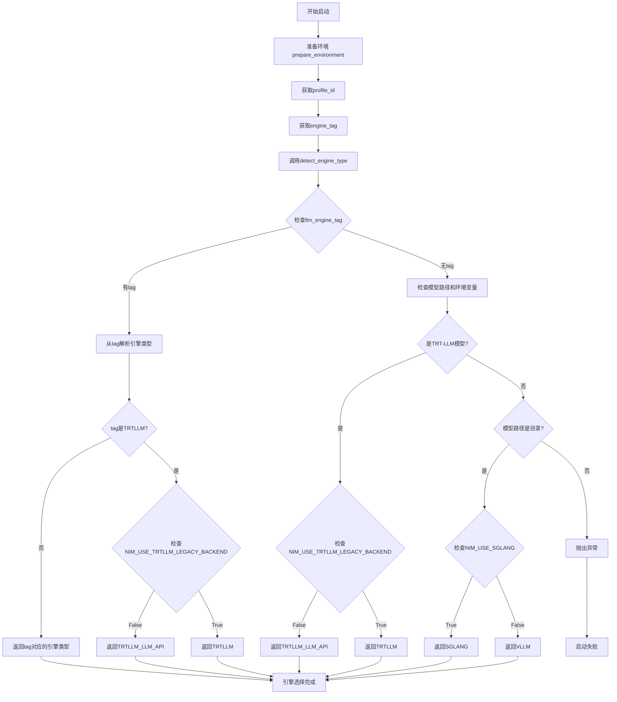

# NIM-SDK快速开始


## 通用LLM容器nim-sdk项目结构总览
## 1. 项目结构及功能

### 1.1 核心目录结构

```
nim_llm_sdk_common/
├── entrypoints/
│   ├── launch.py          # 主启动入口，负责引擎选择和进程管理
│   └── args.py            # 参数解析和环境配置
├── engine/
│   ├── arg_utils.py       # 引擎参数工具类和配置
│   ├── async_trtllm_engine.py  # TensorRT-LLM异步引擎
│   └── metrics.py         # 性能监控和指标收集
├── hub/
│   ├── ngc_injector.py    # NGC配置注入和优化
│   ├── ngc_profile.py     # 配置文件管理和选择
│   └── profile_utils.py   # 配置工具函数
├── trtllm/
│   ├── utils.py           # TensorRT-LLM工具函数
│   ├── parse_config.py    # 配置解析
│   └── llm_api_utils.py   # LLM API工具
└── envs.py               # 环境变量定义和管理
```

### 1.2 主要功能模块

#### 1.2.1 启动管理模块 (`entrypoints/`)
- **launch.py**: 主启动脚本，负责：
  - 引擎类型检测和选择
  - 多节点/单节点部署管理
  - 进程生命周期管理
  - 信号处理和优雅关闭

- **args.py**: 参数处理，负责：
  - CLI参数解析
  - 环境变量集成
  - 默认值配置
  - 参数验证和转换

#### 1.2.2 引擎管理模块 (`engine/`)
- **arg_utils.py**: 引擎参数配置，包含：
  - `EngineType` 枚举定义
  - `NimAsyncEngineArgs` 配置类
  - 引擎检测逻辑 `detect_engine_type()`

#### 1.2.3 配置管理模块 (`hub/`)
- **ngc_injector.py**: NGC配置优化，负责：
  - 最优配置选择
  - 硬件适配
  - 精度转换优化
  - 并行配置调整

#### 1.2.4 TensorRT-LLM模块 (`trtllm/`)
- 专门处理TensorRT-LLM引擎的配置、构建和运行时管理

## 2. 推理引擎选择策略

### 2.1 引擎选择调用链

```
launch.py:main() 
  → prepare_environment() 
    → args.py:prepare_environment()
      → ngc_injector.py:inject_ngc_hub_config()
  → get_engine_type(inference_env)
    → get_profile_id() → get_engine_tag()
    → engine_args.detect_engine_type(engine_tag)
```

### 2.2 引擎选择逻辑流程图



### 2.3 引擎选择判断逻辑

#### 2.3.1 优先级顺序
1. **显式标签优先**: 如果profile配置中有`llm_engine`标签，优先使用
2. **模型类型检测**: 通过`is_trt_llm_model()`检测是否为TensorRT-LLM模型
3. **环境变量控制**: 
   - `NIM_USE_TRTLLM_LEGACY_BACKEND`: 控制使用传统TRT-LLM还是新API
   - `NIM_USE_SGLANG`: 控制在vLLM和SGLang之间选择

#### 2.3.2 具体判断条件
```python
# 1. 标签检测
if llm_engine_tag is not None:
    tag_type = EngineType.from_name(llm_engine_tag)
    if tag_type == EngineType.TRTLLM:
        return EngineType.TRTLLM_LLM_API if not NIM_USE_TRTLLM_LEGACY_BACKEND else EngineType.TRTLLM

# 2. 模型类型检测
if is_trt_llm_model(self):
    return EngineType.TRTLLM_LLM_API if not NIM_USE_TRTLLM_LEGACY_BACKEND else EngineType.TRTLLM

# 3. 目录模型检测
elif model_path.is_dir():
    return EngineType.SGLANG if NIM_USE_SGLANG else EngineType.VLLM
```

## 3. 启动参数确定和优化分析

### 3.1 参数传递流程

```
CLI参数 → 环境变量默认值 → NGC配置注入 → 引擎特定优化 → 最终参数
```

### 3.2 参数优化策略

#### 3.2.1 环境变量默认值系统
NIM SDK通过`envs.py`定义了391个环境变量，提供比原生引擎更丰富的配置选项：

**核心优化环境变量**:
- `NIM_KVCACHE_PERCENT`: GPU内存利用率优化
- `NIM_DISABLE_CUDA_GRAPH`: CUDA图优化控制
- `NIM_ENABLE_KV_CACHE_REUSE`: KV缓存重用
- `NIM_MAX_MODEL_LEN`: 模型最大长度
- `NIM_GUIDED_DECODING_BACKEND`: 引导解码后端

#### 3.2.2 NGC配置注入优化
通过`ngc_injector.py`实现的智能优化：

1. **硬件适配优化**:
   ```python
   def _should_convert_dtype(engine_args, optimal_config, selected_gpus):
       # 自动检测GPU计算能力，对于7.x系列GPU自动转换bf16到fp16
       compute_capability = gpus.device_compute_capability(gpu_id)
       return compute_capability[0] == 7 and precision in ('bf16', 'bfloat16')
   ```

2. **精度自动优化**:
   ```python
   # 从profile获取精度配置并自动设置
   precision_from_tags = tags.get("precision")
   if precision_from_tags in PRECISION:
       engine_args.dtype = PRECISION.get(precision_from_tags)
   ```

3. **并行配置优化**:
   ```python
   # 自动调整张量并行和流水线并行配置
   if k == 'tp':
       engine_args.tensor_parallel_size = tag_value
   if k == 'pp':
       engine_args.pipeline_parallel_size = tag_value
   ```

#### 3.2.3 引擎特定参数优化

**vLLM引擎优化**:
- 自动启用`enable_chunked_prefill`当使用LoRA时
- 内存不足时自动添加`--enforce_eager`标志
- 支持前缀缓存和KV缓存重用

**TensorRT-LLM引擎优化**:
- 自动检测和配置LoRA插件
- 智能选择分块上下文注意力
- 自动优化GEMM插件配置

**SGLang引擎优化**:
- 引导解码后端映射优化
- 自动配置多节点部署参数

### 3.3 相比直接使用原生引擎的优化

#### 3.3.1 参数默认值优化
| 参数类别 | 原生引擎 | NIM SDK优化 |
|---------|---------|------------|
| 内存管理 | 固定默认值 | 基于硬件动态调整 |
| 精度配置 | 手动指定 | 自动硬件适配 |
| 并行配置 | 用户计算 | Profile自动配置 |
| 缓存策略 | 基础配置 | 智能缓存重用 |

#### 3.3.2 智能配置选择
1. **Profile驱动**: 基于NGC Hub的预优化配置
2. **硬件感知**: 自动检测GPU能力并调整参数
3. **工作负载优化**: 根据模型特性自动调整
4. **错误预防**: 自动检测和修复常见配置问题

#### 3.3.3 部署简化
- **一键部署**: 通过环境变量简化复杂配置
- **多引擎统一**: 统一的参数接口支持多种引擎
- **自动故障恢复**: 智能参数调整避免OOM等问题

### 3.4 参数传递优化示例

```python
# 原生vLLM启动
python -m vllm.entrypoints.openai.api_server \
  --model /path/to/model \
  --tensor-parallel-size 4 \
  --gpu-memory-utilization 0.9 \
  --dtype bfloat16

# NIM SDK优化启动
export NIM_MODEL_NAME=/path/to/model
export NIM_KVCACHE_PERCENT=0.95  # 更激进的内存使用
# 自动检测硬件并调整精度、并行度等参数
python -m nim_llm_sdk.entrypoints.launch
```

## 4. 总结

NIM LLM SDK通过以下方式实现了对原生推理引擎的显著优化：

1. **智能引擎选择**: 基于模型类型、硬件环境和用户偏好自动选择最优引擎
2. **参数自动优化**: 通过NGC配置和硬件检测实现参数的智能调优
3. **部署简化**: 提供统一的配置接口和环境变量系统
4. **错误预防**: 自动检测和修复常见的配置问题
5. **性能优化**: 针对不同硬件和工作负载的专门优化策略

这些优化使得用户可以更容易地部署和运行大语言模型，同时获得更好的性能和稳定性。

## 具体LLM容器nim-sdk项目结构总览

```bash
root@c7a38a1d075a:/opt/nim/llm/nim_llm_sdk# tree .
.
|-- __init__.py
|-- constants.py
|-- engine
|   |-- __init__.py
|   |-- async_trtllm_engine.py
|   |-- async_trtllm_engine_factory.py
|   |-- metrics.py
|   |-- trtllm_errors.py
|   `-- trtllm_model_runner.py
|-- entrypoints
|   |-- __init__.py
|   |-- args.py
|   |-- launch.py
|   |-- llamastack
|   |   |-- protocol.py
|   |   |-- serving_chat.py
|   |   |-- serving_completion.py
|   |   `-- serving_engine.py
|   `-- openai
|       |-- __init__.py
|       |-- api_extensions.py
|       `-- api_server.py
|-- env_utils.py
|-- envs.py
|-- hub
|   `-- ....
|-- logger.py
|-- logging
|   `-- ....
|-- lora
|   |-- __init__.py
|   `-- source.py
|-- mem_estimators
|   `-- ....
|-- model_specific_modules
|   |-- README.md
|   |-- __init__.py
|   `-- dynamic_module_loader.py
|-- perf
|   `-- ....
|-- trtllm
|   |-- __init__.py
|   |-- configs.py
|   |-- parse_config.py
|   |-- request.py
|   |-- utils.py
|   `-- weight_manager
|       |-- __init__.py
|       |-- build_utils.py
|       `-- nim_optimize.py
`-- utils
    |-- __init__.py
    `-- caches.py
```

- 核心入口 `entrypoints/`
  - `launch.py`：统一入口，准备环境与并行配置，启动 API Server（单进程或 `mpirun`）。
  - `args.py`：解析 CLI/环境变量，构建 `AsyncEngineArgs`；支持 `--async-engine-args`；读取 `runtime_params.json`。
  - `openai/api_server.py`：OpenAI 兼容 RESTful 服务。
  - `llamastack/`：适配 LlamaStack 协议与服务。

- 引擎实现 `engine/`
  - `async_trtllm_engine.py`：TRT‑LLM 异步引擎（禁用 Ray）；`_TRTLLMEngine` / `AsyncTRTLLMEngine`。
  - `async_trtllm_engine_factory.py`：按模型类型选择 TRT‑LLM 或 vLLM 引擎并构建客户端。
  - `metrics.py`：指标与统计日志。
  - `trtllm_model_runner.py`：TRT‑LLM 推理执行封装。

- TRT‑LLM 支持 `trtllm/`
  - `configs.py` / `parse_config.py`：解析配置、并行参数与权重。
  - `weight_manager/`：权重优化与构建工具。

- 运行环境与资源 `hub/`
  - `ngc_injector.py`：判定是否为 TRT‑LLM（`is_trt_llm_model`），并可自动设置 `tp/pp`。
  - 其它：硬件检测、NGC 下载、缓存与工作空间管理。

- 扩展与工具
  - `model_specific_modules/`：按模型动态加载专用模块。
  - `lora/`：LoRA 适配器源管理。
  - `mem_estimators/`：显存估算工具。
  - `perf/`：基准与压力测试。
  - `logging/`：日志格式与收集。
  - `utils/`：通用工具与缓存。

### 引擎选择逻辑（入口与后端）

#### 1. 模型类型判定（`hub/ngc_injector.py`）

**`is_trt_llm_model()` 函数**是引擎选择的核心判定逻辑：

```python
def is_trt_llm_model(engine_args: AsyncEngineArgs):
    # 方式1：显式标记为可构建的TRT-LLM模型
    if hasattr(engine_args, "tllm_buildable") and getattr(engine_args, "tllm_buildable"):
        return True
    
    # 方式2：检查模型目录是否包含预构建的TRT-LLM引擎
    model_path = Path(engine_args.model)
    if model_path.is_dir() and (model_path / "trtllm_engine").is_dir():
        return True
    
    return False
```

**判定条件**：
- **显式标记**：`engine_args.tllm_buildable = True`
- **目录检测**：模型路径下存在 `trtllm_engine/` 目录（包含预构建的TRT-LLM引擎文件）

#### 2. 启动入口选择（`entrypoints/launch.py`）

**并行配置计算**：
```python
engine_world_size = tensor_parallel_size * pipeline_parallel_size
use_trtllm_backend = is_trt_llm_model(engine_args)
```

**启动策略决策树**：
```
├─ 非TRT-LLM模型 OR engine_world_size == 1
│  └─ 单进程启动：python -m nim_llm_sdk.entrypoints.openai.api_server
│
└─ TRT-LLM模型 AND engine_world_size > 1  
   └─ MPI多进程启动：mpirun -n <world_size> python -m nim_llm_sdk.entrypoints.openai.api_server
      ├─ rank 0：接收完整CLI参数 + --async-engine-args
      └─ rank 1~N：仅启动worker进程
```

**GPU资源校验**：
- 默认GPU选择：`selected_gpus = range(engine_world_size)`
- 严格校验：`engine_world_size == len(selected_gpus)`
- 多节点检测：若两者成整数倍关系，判定为多节点部署尝试（当前脚本不支持）

#### 3. 引擎工厂选择（`engine/async_trtllm_engine_factory.py`）

**`AsyncLLMEngineFactory.from_engine_args()` 核心逻辑**：

```python
is_tllm = is_trt_llm_model(engine_args)
if is_tllm:
    from nim_llm_sdk.engine.async_trtllm_engine import AsyncTRTLLMEngine
    engine_cls = AsyncTRTLLMEngine  # TRT-LLM后端，禁用Ray
else:
    engine_cls = AsyncLLMEngine     # vLLM后端，支持Ray
```

**引擎特性对比**：

| 特性 | AsyncTRTLLMEngine (TRT-LLM) | AsyncLLMEngine (vLLM) |
|------|----------------------------|----------------------|
| **Ray支持** | ❌ 强制禁用 (`worker_use_ray=False`) | ✅ 支持分布式 |
| **多进程** | ✅ MPI-based | ✅ Ray/Multiprocessing |
| **性能优化** | ✅ TensorRT优化推理 | ✅ 通用GPU推理 |
| **LoRA支持** | ✅ TrtllmLoraSource | ✅ vLLM LoRA |
| **JIT编译** | ✅ JITTrtllmConfig | ❌ |

#### 4. 并行参数自动修正（`hub/ngc_injector.py`）

**TRT-LLM配置自动读取**：
```python
def _maybe_override_parallel_config(engine_args, should_set_parallel_size_from_env=False):
    if not tllm_buildable and is_trt_llm_model(engine_args):
        profile_dir = select_trt_profile(Path(engine_args.model))
        cfg = parse_trtllm_config(profile_dir)[1]
        engine_args.tensor_parallel_size = cfg.tp_size    # 从profile读取
        engine_args.pipeline_parallel_size = cfg.pp_size  # 从profile读取
```

**配置优先级**：
1. **用户显式指定** → 保持用户设置
2. **TRT-LLM profile** → 从 `trtllm_engine/` 读取构建时的并行配置
3. **环境变量** → 回退到环境变量设置

#### 5. 运行时参数注入（`entrypoints/args.py`）

**配置文件搜索路径**：
```python
config_paths = [
    os.path.join(engine_args.model, "runtime_params.json"),           # 模型根目录
    os.path.join(engine_args.model, "trtllm_engine", "runtime_params.json")  # TRT-LLM目录
]
```

**支持的运行时参数**：
- `tokenizer_mode`：分词器模式（auto/slow/fast）
- `guided_decoding_backend`：引导解码后端（outlines/guidance）

**参数注入流程**：
1. 读取 `runtime_params.json`
2. 设置 `engine_args` 对应属性
3. 写入环境变量（如 `NIM_TOKENIZER_MODE`）
4. 传递给引擎初始化
### 推理参数优化策略
面向吞吐、延迟与稳定性的通用建议（结合本 SDK 的实现）：
- 并行与设备映射
- 将 `tensor_parallel_size` 与可用 GPU 数一致；`pipeline_parallel_size` 仅在超大模型时使用（跨层拆分）。
- 保持 `engine_world_size == len(selected_gpus)`；使用 MIG 时明确 `selected_gpus` 映射，避免默认映射导致不一致。
- TRT‑LLM 模型优先使用已构建的 `trtllm_engine` profile；必要时调整并行度后重新构建或选择匹配的 profile。

- 批处理与调度
- 增大并发序列数（`scheduler_config.max_num_seqs` 由 `engine_args.create_engine_config()` 填充），提升吞吐；同时关注单请求延迟。
- 根据场景设置 `max_model_len`（上下文长度越大越耗显存与带宽）。对短文本场景可降低以提升密度与稳定性。
- 采用流式生成以降低首 token 延迟；合理设置采样参数（`temperature`、`top_p`、`top_k`、`min_p`）确保稳定性与可控性。
- 内存与缓存
- 预估显存占用（可参考 `mem_estimators/`），为 KV 缓存与并发预留空间。
- 在支持的情况下，优先使用高效的 KV 缓存精度与页大小以提高命中率与带宽利用率（具体取决于模型与后端能力）。
- 分词与后处理
- 根据吞吐目标设置 `tokenizer_pool_config.pool_size`（在引擎内用于控制后处理线程数）；常见做法是与 GPU 数或并发近似匹配。
- 使用 `runtime_params.json` 的 `tokenizer_mode` 与 `guided_decoding_backend`（默认 `outlines`）以提升一致性与可维护性。
- LoRA 与规格化
- 按需加载 LoRA 适配器，避免过多适配器导致初始化与切换开销；在高并发场景可预热常用适配器。
- 控制 LoRA 工作线程数与切换频率（本实现默认 2），在稳定性与吞吐间折中。
- 推测式解码与 JIT（TRT‑LLM）
- 在模型与业务允许时启用推测式解码（`SpeculativeConfig`），显著提升吞吐与降低延迟。
- 使用 `JITTrtllmConfig` 与匹配的构建形状，减少不必要的回退与重编译。
- 日志与观测
- 压测环境中可关闭或降低日志量（`disable_log_stats`、`disable_log_requests`），减轻 I/O 与格式化开销。
- 保持指标采集（如 vLLM 的 `VllmStatLogger`）以便容量规划与回归监控。

### 启动示例

- 单机/单进程（非 TRT‑LLM 或单 GPU）：
```bash

python -m nim_llm_sdk.entrypoints.openai.api_server \
--model /models/your-model \
--async-engine-args '{"model":"/models/your-model"}'
```
- 通过统一入口自动选择后端：
```bash
python -m nim_llm_sdk.entrypoints.launch \
--model /models/your-model \
--tensor-parallel-size 4 \
--pipeline-parallel-size 1
```

>[!WARNING]
> TRT‑LLM 多 GPU（由入口脚本触发 `mpirun`）：确保 `selected_gpus` 与 `tp*pp` 一致；模型目录包含 `trtllm_engine` profile。


