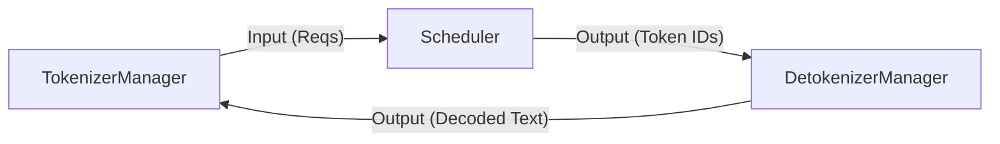

# SGLang Metrics 快速开始


调研目标
SGLang
e2e_request_latency_seconds
sglang:time_to_first_token_seconds
sglang:num_running_reqs
sglang:num_queue_reqs
sglang:time_per_output_token_seconds

## SGLang

### Metrics 计算详解 (SGLang Runtime)

以下分析基于 SGLang Runtime (SRT) 架构。SGLang 版本为 0.5.4， 发布于 2025 年 10月 26日。

#### 1. /v1/chat/completions 接口调用流程图

**Metrics 路由注册与采集机制**
在 `launch_server` 启动 FastAPI 服务时，`lifespan` 函数调用 `add_prometheus_middleware` (`sglang/srt/utils/common.py`) 注册 `/metrics` 路由。该路由由 `prometheus_client` 的 ASGI App 处理，通过 `MultiProcessCollector` 实现多进程指标聚合。
*   **Collector (`sglang/srt/metrics/collector.py`)**: 定义了 `TokenizerMetricsCollector` 和 `SchedulerMetricsCollector` 类，封装了 Prometheus 的 Counter/Gauge/Histogram。
*   **TokenizerManager (`sglang/srt/managers/tokenizer_manager.py`)**: 运行在主进程，持有 `TokenizerMetricsCollector`，负责记录 E2E Latency、TTFT 等请求级指标。

SGLang 采用多进程架构（TokenizerManager 主进程 + Scheduler 子进程 + Detokenizer 子进程 + Model Workers），Metric 采集面临多进程数据聚合的问题。

1.  **进程分工与代码位置**:
    *   **主进程 (TokenizerManager)**:
        *   **代码**: `sglang/srt/managers/tokenizer_manager.py`
        *   **职责**: 处理 HTTP 请求、分词 (Tokenize)、接收 Detokenizer 结果并返回响应。
        *   **Metrics**: 持有 `TokenizerMetricsCollector`，负责记录 **Request 级别** 的指标（如 `sglang:e2e_request_latency_seconds`, `sglang:ttft_seconds`）。
    *   **子进程 (Scheduler)**:
        *   **代码**: `sglang/srt/managers/scheduler.py` (入口函数 `run_scheduler_process`)。
        *   **职责**: 接收 Tokenized 请求，进行 Batch 调度，管理 KV Cache，驱动 Model Runner 执行推理，并将生成的 Token IDs 发送给 Detokenizer。
        *   **Metrics**: 混入 `SchedulerMetricsMixin` (`sglang/srt/managers/scheduler_metrics_mixin.py`)，持有 `SchedulerMetricsCollector`，负责记录 **System 级别** 的指标（如 `sglang:token_usage`, `sglang:num_running_reqs`）。
    *   **子进程 (DetokenizerManager)**:
        *   **代码**: `sglang/srt/managers/detokenizer_manager.py` (入口函数 `run_detokenizer_process`)。
        *   **职责**: 接收 Scheduler 生成的 Token IDs，解码为文本 (Detokenize)，并将最终结果或流式增量发送回 TokenizerManager。
        *   **Metrics**: 通常不直接负责核心指标采集，但其处理延迟会包含在 E2E Latency 中。

2.  **进程间交互 (IPC)**:
    *   **控制流**: 形成闭环 `TokenizerManager` -> (ZMQ PUSH) -> `Scheduler` -> (ZMQ PUSH) -> `DetokenizerManager` -> (ZMQ PUSH) -> `TokenizerManager`。
    *   **数据流**: Metric 数据 **不通过** ZMQ 回传。主进程和子进程各自独立计算指标，并写入同一个共享存储后端。

3.  **共享目录 (PROMETHEUS_MULTIPROC_DIR) 技术细节**:
    *   **实现原理**: 利用 `prometheus_client` 的多进程支持 (`multiprocess` 模块)。
    *   **目录创建**: 在 `sglang/srt/utils/common.py` 的 `set_prometheus_multiproc_dir` 函数中，系统使用 `tempfile.TemporaryDirectory` 创建一个临时目录（并非固定的 Linux 系统目录，除非手动指定）。
    *   **环境传递**: 该目录的路径被写入环境变量 `PROMETHEUS_MULTIPROC_DIR`。Python 的 `multiprocessing` 机制确保 Scheduler 子进程继承该环境变量，从而指向同一个临时目录。
    *   **存储格式**: 每个进程在该目录下创建内存映射文件 (`.db` files)，Prometheus Client 直接对文件进行原子写操作，无需进程锁。

4.  **Controller (/metrics 后端)**:
    *   **路由注册**: 在 `launch_server.py` 启动时，调用 `add_prometheus_middleware`。
    *   **核心组件**: 创建 `prometheus_client.make_asgi_app`，并配置 `registry` 使用 `multiprocess.MultiProcessCollector`。
    *   **聚合逻辑**: 当外部系统（如 Prometheus Server）访问 `/metrics` 接口时，`MultiProcessCollector` 会扫描共享目录下的所有 `.db` 文件，聚合主进程和所有子进程的 Counter/Gauge/Histogram 数据，最终返回统一的 Metrics 文本响应。

    ```python
    # sglang/srt/metrics/collector.py

    # 示例：E2E Latency Histogram
    self.histogram_e2e_request_latency = Histogram(
        "sglang:e2e_request_latency_seconds",
        "End-to-end request latency in seconds.",
        labelnames=labels,
        buckets=[0.1, 0.5, 1.0, ..., 60.0], # Buckets 定义
        registry=registry,
    )
    ```

为了实现高吞吐和低延迟，SGLang 采用了多进程架构，进程间通过 **ZMQ (ZeroMQ)** 进行通信。以下是核心的通信链路详解。

**特别说明：Metrics 数据流与 ZMQ 的区别**

虽然 SGLang 的核心推理数据（Request, Token IDs, Decoded Text）通过 **ZMQ** 在进程间高效传输，但 **Metrics 数据** 并不占用 ZMQ 通道，而是通过上述的 **共享目录** 机制进行异步聚合。向该共享目录写入数据的组件如下：

1.  **主进程 (TokenizerManager)**:
    *   **代码**: `sglang/srt/managers/tokenizer_manager.py`
    *   **职责**: 记录 Request 级指标 (E2E Latency, TTFT, ITL)。
    *   **触发**: 收到 Detokenizer 结果时 (`handle_loop`)。
    *   **调用栈 (Call Stack)**:
        1.  `handle_loop` (接收 `recv_obj` 数据)
        2.  `collect_metrics` (计算指标逻辑)
        3.  `metrics_collector.observe_...` (调用 `TokenizerMetricsCollector` 方法)
        4.  `prometheus_client.Histogram.observe` (更新内存对象)
        5.  **`prometheus_client.multiprocess`** (写入 `PROMETHEUS_MULTIPROC_DIR` 下的 `.db` 文件)
    *   **核心写入逻辑**:
        ```python
        # sglang/srt/managers/tokenizer_manager.py
        def collect_metrics(self, state, recv_obj, i):
            # ...
            # 1. 调用 Collector 方法
            self.metrics_collector.observe_time_to_first_token(...)

        # sglang/srt/metrics/collector.py
        class TokenizerMetricsCollector:
            def observe_time_to_first_token(self, labels, value):
                # 2. 调用 Prometheus Client
                self.histogram_time_to_first_token.labels(**labels).observe(value)
        ```

2.  **子进程 (Scheduler)**:
    *   **代码**: `sglang/srt/managers/scheduler.py` (逻辑位于 `scheduler_metrics_mixin.py`)
    *   **职责**: 记录 System 级指标 (Token Usage, Throughput, Queue Length)。
    *   **触发**: 周期性 (Per-Batch / Per-N-Steps)。
    *   **调用栈 (Call Stack)**:
        1.  `run_scheduler_process` (主循环)
        2.  `log_decode_stats` / `log_prefill_stats` (构建 `SchedulerStats` 对象)
        3.  `metrics_collector.log_stats` (调用 `SchedulerMetricsCollector` 方法)
        4.  `prometheus_client.Gauge.set` (更新内存对象)
        5.  **`prometheus_client.multiprocess`** (写入 `PROMETHEUS_MULTIPROC_DIR` 下的 `.db` 文件)
    *   **核心写入逻辑**:
        ```python
        # sglang/srt/managers/scheduler_metrics_mixin.py
        def log_decode_stats(self, ...):
            self.stats.num_running_reqs = len(batch.reqs)
            # 1. 调用 Collector 方法
            self.metrics_collector.log_stats(self.stats)

        # sglang/srt/metrics/collector.py
        class SchedulerMetricsCollector:
            def log_stats(self, stats: SchedulerStats):
                # 2. 调用 Prometheus Client (Gauge.set)
                self._log_gauge(self.num_running_reqs, stats.num_running_reqs)
        ```
    Python 生态中常用 gunicorn/uwsgi 等 多进程 模式，单纯把 metrics 放在每个进程内存会导致采集不到子进程的值。为此 prometheus_client 提供了 multiprocess 模式（prometheus_client.multiprocess）。这个模式会把每个进程的指标写成文件（在由环境变量 PROMETHEUS_MULTIPROC_DIR 指定的目录），然后当 /metrics 被请求时，主进程/collector 会读取这些文件并做聚合。

3.  **子进程 (DetokenizerManager)**:
    *   **注意**: 不直接写入 Metrics。其解码耗时被包含在 TokenizerManager 记录的 E2E Latency 中。

##### 通信架构概览 (The Architecture)

SGLang 的推理流程主要涉及三个核心进程，它们形成了一个闭环的数据流：



*   **TokenizerManager**: 系统入口，负责 HTTP 处理、分词、请求状态管理。
*   **Scheduler**: 推理引擎，负责 Batch 调度、模型推理 (GPU)、KV Cache 管理。
*   **DetokenizerManager**: 解码服务，负责将模型生成的 Token IDs 转回文本。

##### 代码实现与调用栈 (Code Implementation)

以下是各环节的关键代码位置和调用逻辑：

##### A. Scheduler -> Detokenizer
*   **文件**: `sglang/srt/managers/scheduler.py`
*   **Socket**: `self.send_to_detokenizer` (PUSH 模式)
*   **关键方法**: `stream_output` (通常定义在 `SchedulerOutputProcessorMixin` 中)
*   **代码片段**:
    ```python
    # sglang/srt/managers/scheduler_output_processor_mixin.py
    def stream_output(self, ...):
        # ...
        # 发送 BatchTokenIDOutput 给 Detokenizer
        self.send_to_detokenizer.send_output(
            BatchTokenIDOutput(
                finished_reasons,
                decoded_texts,
                # ...
            )
        )
    ```

##### B. Detokenizer -> Tokenizer
*   **文件**: `sglang/srt/managers/detokenizer_manager.py`
*   **Socket**: `self.recv_from_scheduler` (PULL), `self.send_to_tokenizer` (PUSH)
*   **关键方法**: `event_loop`
*   **代码片段**:
    ```python
    # sglang/srt/managers/detokenizer_manager.py
    def event_loop(self):
        while True:
            # 1. 从 Scheduler 接收
            recv_obj = self.recv_from_scheduler.recv_pyobj()
            # 2. 处理 (解码)
            output = self._request_dispatcher(recv_obj)
            # 3. 发送给 TokenizerManager
            if output is not None:
                self.send_to_tokenizer.send_pyobj(output)
    ```

##### C. Tokenizer (接收端)
*   **文件**: `sglang/srt/managers/tokenizer_manager.py`
*   **Socket**: `self.recv_from_detokenizer` (PULL)
*   **关键方法**: `handle_loop`
*   **代码片段**:
    ```python
    # sglang/srt/managers/tokenizer_manager.py
    async def handle_loop(self):
        while True:
            # 接收最终结果 (即文档中提到的 recv_obj)
            recv_obj = await self.recv_from_detokenizer.recv_pyobj()
            # 分发处理 (Metrics 计算在此触发)
            self._result_dispatcher(recv_obj)
    ```


#### 2. Time-Related Metrics 计算逻辑 (sglang/srt/managers/tokenizer_manager.py)

这些 Metrics 主要在 `TokenizerManager` 中计算，因为它持有请求的完整生命周期状态 (`ReqState`)。具体的 Metrics 记录由 `TokenizerMetricsCollector` (`sglang/srt/metrics/collector.py`) 完成。

##### 核心机制：`recv_obj` 与数据流转

在深入具体 Metrics 之前，必须理解 `TokenizerManager` 如何通过 `recv_obj` 接收推理结果。

*   **定义与来源**: `recv_obj` 是 `TokenizerManager` 通过 ZMQ (`recv_from_detokenizer`) 从 **Detokenizer** 进程接收的 Python 对象（通常是 `BatchStrOutput` 或 `BatchTokenIDOutput`）。
*   **粒度 (Granularity)**: **Batch-Step 级别**。它**不是**单个 Request 的完整结果，而是**当前 Batch 中所有活跃 Request 在最近一次（或几次）推理步产生的输出增量**。
*   **数据流 (Data Flow)**:
    1.  **Scheduler/Engine**: 完成一次推理步，生成 Token IDs。
    2.  **Detokenizer**: 接收 Token IDs，解码为文本字符串。
    3.  **TokenizerManager**: 接收包含解码结果的 `recv_obj`。
*   **运行机制**:
    *   `TokenizerManager.handle_loop` 处于无限循环中，不断 `await recv_pyobj()`。
    *   每当收到 `recv_obj`，系统会遍历其中的 `rids` (Request IDs)。
    *   对于每个 RID，更新其内部状态 `ReqState`（追加生成的文本/Token，更新 Token 计数）。
*   **与 Metrics 的关系**:
    *   **时间锚点**: `recv_obj` 到达的时间点被视为当前 Step 的“完成时间”。
    *   **TTFT**: 如果某 Request 第一次出现在 `recv_obj` 中且有 Token 生成，计算 TTFT。
    *   **ITL (TPOT)**: 通过比较同一 Request 在连续两个 `recv_obj` 中的到达时间差来计算。
    *   **E2E**: 当 `recv_obj` 中某 Request 的 `finished_reasons` 不为空时，标记该 Request 结束并计算总延时。

##### sglang:e2e_request_latency_seconds
*   **位置**: `TokenizerManager` 接收请求 -> 请求处理完成
*   **计算公式**: `state.finished_time - state.created_time`
*   **代码**: `self.metrics_collector.observe_one_finished_request(..., state.finished_time - state.created_time, ...)`

**调用栈 (以 `/v1/chat/completions` 接口为例)**

1.  **Request Entry**:
    *   `sglang/srt/entrypoints/http_server.py`: `openai_v1_chat_completions` (HTTP Endpoint)
    *   `sglang/srt/entrypoints/openai/serving_base.py`: `OpenAIServingBase.handle_request` (Request Processing - **Inherited Method**)
        *   *注: `OpenAIServingChat` 继承自 `OpenAIServingBase`，`handle_request` 在父类中定义。*
    *   `sglang/srt/entrypoints/openai/serving_chat.py`: `OpenAIServingChat._handle_streaming_request` (Implementation for Chat)
    *   `sglang/srt/entrypoints/openai/serving_chat.py`: `_generate_chat_stream` (Streaming Response Generation)
    *   `sglang/srt/managers/tokenizer_manager.py`: `TokenizerManager.generate_request` (Initialization, mark `created_time`)

2.  **Response Handling (Async Loop)**:
    *   `sglang/srt/managers/tokenizer_manager.py`: `TokenizerManager.handle_loop` (Event Loop, receives `recv_obj` from Detokenizer)
    *   `sglang/srt/managers/tokenizer_manager.py`: `_result_dispatcher` (Dispatches based on type)
    *   `sglang/srt/managers/tokenizer_manager.py`: `_handle_batch_output` (Callback for processing output)
    *   `sglang/srt/managers/tokenizer_manager.py`: `collect_metrics` (Calculate & Observe)

**注意**: `_handle_batch_output` 并非由 `generate_request` 直接调用，而是通过 `TokenizerManager.__init__` 中注册的 `TypeBasedDispatcher` 在 `handle_loop` 接收到 Detokenizer 返回的结果时触发。

**代码实现逻辑**:
```python
# sglang/srt/managers/tokenizer_manager.py

# 1. 请求初始化 (generate_request)
async def generate_request(self, obj, ...):
    # ...
    created_time = time.time()  # 记录请求到达时间
    # ...
    state = self._create_tokenized_object(...)
    # ...

# 2. 异步结果处理 (handle_loop -> _handle_batch_output)
async def handle_loop(self):
    while True:
        recv_obj = await self.recv_from_detokenizer.recv_pyobj()
        self._result_dispatcher(recv_obj) # 触发 _handle_batch_output

def _handle_batch_output(self, recv_obj):
    # ...
    if state.finished:
        state.finished_time = time.time() # 记录请求结束时间
        # ...
        if self.enable_metrics:
            self.collect_metrics(state, recv_obj, i)

def collect_metrics(self, state, recv_obj, i):
    # ...
    if state.finished:
        self.metrics_collector.observe_one_finished_request(
            labels,
            ...,
            state.finished_time - state.created_time, # E2E Latency
            ...
        )
```

##### sglang:time_to_first_token_seconds (TTFT)
*   **位置**: `TokenizerManager` 接收请求 -> 收到第一个 Output Token
*   **计算公式**: `state.first_token_time - state.created_time`
*   **代码**: `self.metrics_collector.observe_time_to_first_token(..., state.first_token_time - state.created_time)`

**调用栈 (以 `/v1/chat/completions` 接口为例)**

1.  **Request Entry**:
    *   `sglang/srt/entrypoints/http_server.py`: `openai_v1_chat_completions`
    *   `sglang/srt/managers/tokenizer_manager.py`: `TokenizerManager.generate_request` (Request arrival, mark `created_time`)

2.  **First Response (Async Loop)**:
    *   `sglang/srt/managers/tokenizer_manager.py`: `TokenizerManager.handle_loop` (Receives **first** `recv_obj` from Detokenizer)
    *   `sglang/srt/managers/tokenizer_manager.py`: `_handle_batch_output` -> `collect_metrics`
    *   `collect_metrics`: Check `if state.first_token_time == 0.0` -> Calculate TTFT -> Observe

**代码实现逻辑**:
```python
# sglang/srt/managers/tokenizer_manager.py

def collect_metrics(self, state, recv_obj, i):
    # 如果是首个 Token (first_token_time 为 0) 且非纯 Prefill 模式
    if state.first_token_time == 0.0 and self.disaggregation_mode != DisaggregationMode.PREFILL:
        state.first_token_time = state.last_time = time.time()
        
        # 记录 TTFT
        self.metrics_collector.observe_time_to_first_token(
            labels, 
            state.first_token_time - state.created_time
        )
```

##### sglang:inter_token_latency_seconds (对应 vLLM 的 TPOT)
*   **位置**: 上一个 Token 时间 -> 当前 Token 时间
*   **计算公式**: `current_time - last_token_time`
*   **说明**: SGLang 使用 Inter-Token Latency (ITL) 来衡量解码速度，这与 Time Per Output Token (TPOT) 的概念基本一致。
*   **代码**: `self.metrics_collector.observe_inter_token_latency(..., interval, num_new_tokens)`

**调用栈 (以 `/v1/chat/completions` 接口为例)**

1.  **Subsequent Responses (Async Loop)**:
    *   `sglang/srt/managers/tokenizer_manager.py`: `TokenizerManager.handle_loop` (Receives **subsequent** `recv_obj` from Detokenizer)
    *   `sglang/srt/managers/tokenizer_manager.py`: `_handle_batch_output` -> `collect_metrics`
    *   `collect_metrics`: Check `else` branch (not first token) -> Calculate Interval -> Observe

**代码实现逻辑**:
```python
# sglang/srt/managers/tokenizer_manager.py

def collect_metrics(self, state, recv_obj, i):
    # ...
    else: # 非首个 Token
        num_new_tokens = completion_tokens - state.last_completion_tokens
        if num_new_tokens:
            new_time = time.time()
            interval = new_time - state.last_time # 计算间隔时间
            
            # 记录 ITL
            self.metrics_collector.observe_inter_token_latency(
                labels,
                interval,
                num_new_tokens, # 如果一次生成多个 token (如 speculative decoding)，会计算平均值
            )
            state.last_time = new_time
```

#### 3. Capacity & Other Metrics 计算逻辑 (sglang/srt/managers/scheduler_metrics_mixin.py)

这些 Metrics 反映了系统的实时负载状态和吞吐能力，由 `Scheduler` 进程周期性统计。与 Request 级 Metrics 不同，这些指标是 **System 级别** 的采样快照。

代码主要位于 `sglang/srt/managers/scheduler_metrics_mixin.py` 中的 `SchedulerMetricsMixin` 类。该 Mixin 被混入到 `Scheduler` 类中。

**统计频率与触发机制 (Frequency & Trigger)**:

SGLang 的 System Metrics 并非基于固定的时间间隔（Time Interval）触发，而是基于 **批处理事件 (Batch Events)** 触发。具体规律如下：

1.  **Prefill 阶段**: **Per-Batch Trigger (每批次触发)**
    *   **触发时机**: 每当调度器成功调度一个新的 Prefill Batch 时触发。
    *   **频率**: 取决于新请求到达和被调度的速率。如果没有新请求进行 Prefill，则不会记录该阶段的 Metrics。
    *   **代码位置**: `Scheduler.get_new_batch_prefill` -> `self.log_prefill_stats(...)`。

2.  **Decode 阶段**: **Per-N-Steps Trigger (每 N 步触发)**
    *   **触发时机**: 在 Decode 循环中，每执行一定数量的连续批处理步（Steps）后触发。
    *   **频率**: 由 `forward_ct_decode % decode_log_interval == 0` 控制。默认间隔 (`decode_log_interval`) 为 **40 步**。这意味着每进行 40 次 Decode Forward 操作，才会记录一次 Decode 相关的 Metrics。
    *   **代码位置**: `SchedulerOutputProcessorMixin.process_batch_result_decode` -> `self.log_decode_stats(...)`。

**调用栈 (Call Stack)**:

*   **Prefill 阶段 (Cache Hit Rate 等)**:
    `Scheduler.run_scheduler_process` -> `Scheduler.event_loop_normal` (or `overlap`) -> `Scheduler.get_next_batch_to_run` -> `Scheduler.get_new_batch_prefill` -> `SchedulerMetricsMixin.log_prefill_stats`
*   **Decode 阶段 (Throughput, Token Usage 等)**:
    `Scheduler.run_scheduler_process` -> `Scheduler.event_loop_normal` (or `overlap`) -> `Scheduler.process_batch_result` -> `SchedulerOutputProcessorMixin.process_batch_result_decode` -> `SchedulerMetricsMixin.log_decode_stats`

统计触发点主要有两个：
1.  **Prefill 阶段**: `log_prefill_stats` (每 Prefill Batch)
2.  **Decode 阶段**: `log_decode_stats` (每 40 Decode Steps)

##### sglang:num_running_reqs
*   **含义**: 当前调度器中正在处理 (Running) 的请求数量。
*   **位置**: `Scheduler` 周期性统计 (Prefill/Decode loop)。
*   **计算公式**: `len(batch.reqs)` (Decode) 或 `running_bs` (Prefill)。
*   **代码**: `self.stats.num_running_reqs = num_running_reqs`

**代码实现逻辑**:
```python
# sglang/srt/managers/scheduler_metrics_mixin.py

# Decode 阶段
def log_decode_stats(self, ...):
    # ...
    num_running_reqs = len(batch.reqs)
    # ...
    if self.enable_metrics:
        self.stats.num_running_reqs = num_running_reqs
        self.metrics_collector.log_stats(self.stats)

# Prefill 阶段
def log_prefill_stats(self, ..., running_bs, ...):
    # ...
    if self.enable_metrics:
        self.stats.num_running_reqs = running_bs
        # ...
```

##### sglang:num_queue_reqs
*   **含义**: 当前调度器等待队列 (Waiting Queue) 中尚未被调度的请求数量。
*   **位置**: `Scheduler` 周期性统计。
*   **计算公式**: `len(self.waiting_queue)`。
*   **代码**: `self.stats.num_queue_reqs = len(self.waiting_queue)`

**代码实现逻辑**:
```python
# sglang/srt/managers/scheduler_metrics_mixin.py

def log_decode_stats(self, ...):
    # ...
    if self.enable_metrics:
        # 直接读取 waiting_queue 的长度
        self.stats.num_queue_reqs = len(self.waiting_queue)
        self.metrics_collector.log_stats(self.stats)
```

##### sglang:token_usage (GPU KV Cache Usage)
*   **含义**: GPU KV Cache 内存池的使用率 (0.0 - 1.0)。
*   **位置**: `Scheduler` 周期性统计。
*   **计算公式**: `num_used_tokens / max_total_num_tokens`。
*   **代码**: `self.stats.token_usage = token_usage`

**代码实现逻辑**:
```python
# sglang/srt/managers/scheduler_metrics_mixin.py

def log_decode_stats(self, ...):
    # 获取 Token 使用情况 (根据内存池类型：普通/Hybrid/Mamba)
    if self.is_hybrid:
        # ...
        token_usage = max(full_token_usage, swa_token_usage)
    else:
        num_used, token_usage, _, _ = self._get_token_info()
    
    if self.enable_metrics:
        self.stats.token_usage = token_usage
        self.metrics_collector.log_stats(self.stats)
```

##### sglang:gen_throughput (Token Generation Throughput)
*   **含义**: 系统当前的生成吞吐量 (Tokens/second)。
*   **位置**: 仅在 `log_decode_stats` 中计算。
*   **计算公式**: `num_generated_tokens / time_gap`。
*   **代码**: `self.stats.gen_throughput = self.last_gen_throughput`

**代码实现逻辑**:
```python
# sglang/srt/managers/scheduler_metrics_mixin.py

def log_decode_stats(self, ...):
    # 计算距离上次统计的时间间隔
    gap_latency = time.perf_counter() - self.last_decode_stats_tic
    
    # 计算吞吐量: 本次生成的 token 数 / 时间间隔
    self.last_gen_throughput = self.num_generated_tokens / gap_latency
    
    # 重置计数器
    self.num_generated_tokens = 0
    
    if self.enable_metrics:
        self.stats.gen_throughput = self.last_gen_throughput
        self.metrics_collector.log_stats(self.stats)
```

##### sglang:cache_hit_rate (Prefix Cache Hit Rate)
*   **含义**: Prefill 阶段的 Radix Cache 命中率。
*   **位置**: 仅在 `log_prefill_stats` 中计算。
*   **计算公式**: `hit_tokens / (input_tokens + hit_tokens)`。

**代码实现逻辑**:
```python
# sglang/srt/managers/scheduler_metrics_mixin.py

def log_prefill_stats(self, adder, ...):
    # ...
    if self.enable_metrics:
        total_tokens = adder.log_input_tokens + adder.log_hit_tokens
        cache_hit_rate = (
            adder.log_hit_tokens / total_tokens if total_tokens > 0 else 0.0
        )
        self.stats.cache_hit_rate = cache_hit_rate
        self.metrics_collector.log_stats(self.stats)
```

#### 4. 指标统计函数详解

略

#### 5. 指标梳理

基于调研目标，整理了 SGLang 的关键核心指标如下。

| 指标名称 (Metric Name) | 类型 (Type) | 统计频率 (Frequency) | 描述 (Description) |
| :--- | :--- | :--- | :--- |
| `sglang:e2e_request_latency_seconds` | Histogram | Per-Request | **端到端延迟 (E2E Latency)**。<br>请求从到达系统到结束的总耗时。 |
| `sglang:time_to_first_token_seconds` | Histogram | Per-Request | **首字延迟 (TTFT)**。<br>从请求到达系统到生成第一个 Token 的时间。 |
| `sglang:num_running_reqs` | Gauge | Per-Batch / Per-N-Steps | **正在运行的请求数**。<br>系统当前正在处理的请求总数 (Running + Prefill + Decode)。 |
| `sglang:num_queue_reqs` | Gauge | Per-Batch / Per-N-Steps | **等待队列中的请求数**。<br>当前由于资源不足而在队列中等待调度的请求数量。 |
| `sglang:inter_token_latency_seconds` | Histogram | Per-Token | **Token 间延迟 (ITL)**。<br>生成相邻两个 Token 之间的时间间隔。(对应调研目标中的 `time_per_output_token`) |

**说明**:
*   **Per-Batch / Per-N-Steps**: System Metrics (`num_running_reqs`, `num_queue_reqs`) 在 Prefill 阶段每调度一个 Batch 触发一次，在 Decode 阶段每隔一定步数 (默认 40 步) 触发一次。
*   **Per-Token**: `inter_token_latency_seconds` 虽然是在 Tokenizer Manager 处理输出 Batch 时计算，但其 Histogram 记录的是每个 Token 的生成耗时分布。

#### 6. SGLang 核心类详解

##### TokenizerManager
*   **文件位置**: `sglang/srt/managers/tokenizer_manager.py`
*   **功能**: SGLang 的 "大脑" (主进程)。负责接收 HTTP 请求，进行 Tokenization，将请求发送给 Scheduler，接收 Detokenizer 的结果，并维护请求状态 (`ReqState`)。
*   **Metrics**: 负责计算 Request 级别的 Latency 指标 (TTFT, E2E, ITL)。

##### Scheduler
*   **文件位置**: `sglang/srt/managers/scheduler.py` (Mixin in `scheduler_metrics_mixin.py`)
*   **功能**: 运行在独立进程中。负责 Batch 调度，KV Cache 管理。
*   **Metrics**: 负责计算 System 级别的 Capacity 指标 (Running/Queue reqs, Throughput)。

##### DetokenizerManager
*   **文件位置**: `sglang/srt/managers/detokenizer_manager.py`
*   **功能**: 运行在独立进程中。负责将 Scheduler 生成的 Token IDs 解码 (Detokenize) 为文本字符串，并处理 Stop Conditions (如 Stop Strings)。
*   **Metrics**: 本身不直接计算 Metrics，但其处理速度影响 E2E Latency。

##### TokenizerMetricsCollector / SchedulerMetricsCollector
*   **文件位置**: `sglang/srt/metrics/collector.py`
*   **功能**: 封装了 Prometheus Client 的调用，定义了具体的 Metric Name 和 Buckets。

