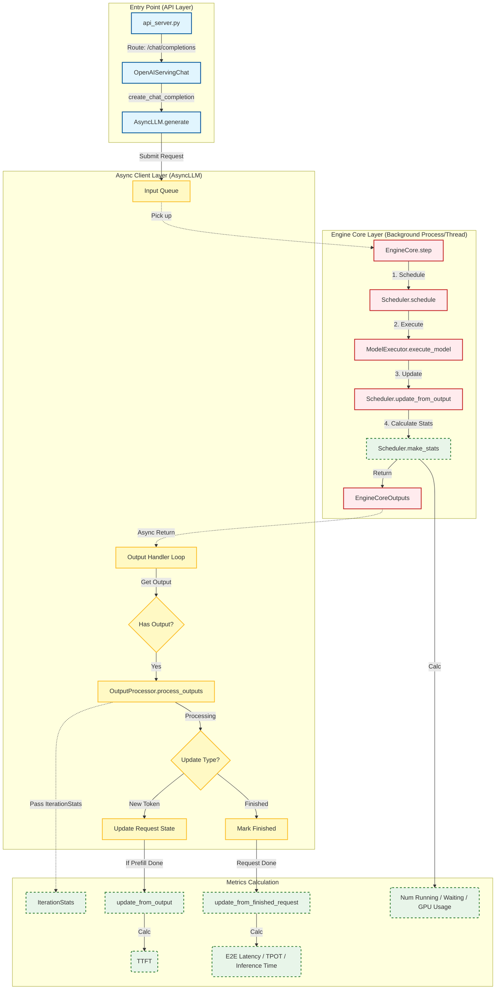

# vLLM Metrics 快速开始


## 核心关注指标

> [!NOTE] 调研目标
> 本文旨在深入分析 vLLM (V1 Engine) 的核心指标计算逻辑，重点关注以下关键指标的实现原理与代码位置：
> *   **`vllm:e2e_request_latency_seconds`**: 端到端延迟
> *   **`vllm:time_to_first_token_seconds`**: 首字延迟 (TTFT)
> *   **`vllm:time_per_output_token_seconds`**: Token 生成速度 (TPOT)
> *   **`vllm:num_requests_running`**: 并发请求数
> *   **`vllm:gpu_cache_usage_perc`**: 显存 KV Cache 使用率

## Metrics 计算详解 (vLLM V1 Engine)

> [!IMPORTANT] 版本说明
> 以下分析基于 **vLLM V1 引擎架构** (`vllm/v1`)，版本 **0.11.0** (发布于 2025 年 10月 3日)。
> *注意：vLLM V1 是 vLLM 的下一代架构，与 V0 (AsyncLLMEngine) 在实现上有显著差异。*

#### 1. /v1/chat/completions 接口调用流程图




#### 2. Time-Related Metrics 计算逻辑 (vllm/v1/metrics/stats.py)

这些 Metrics 主要在 `vllm/v1/metrics/stats.py` 中的 `IterationStats` 类里计算。

##### vllm:e2e_request_latency_seconds
*   **位置**: `api_server.py` 接收请求 -> 请求结束 (FinishedRequest)
*   **计算公式**: `now() - req_stats.arrival_time`
*   **代码**: `e2e_latency = self._time_since(req_stats.arrival_time)`

**调用栈**
1. entrypoints/openai/api_server.py: chat / create_chat_completion (Entry Point)
2. entrypoints/openai/serving_chat.py: OpenAIServingChat.create_chat_completion
3. entrypoints/openai/serving_engine.py: OpenAIServing.generate
4. vllm/v1/engine/async_llm.py: AsyncLLM.generate (Submit Request)
5. vllm/v1/engine/async_llm.py: _run_output_handler (Output Loop)
6. vllm/v1/engine/output_processor.py: OutputProcessor.process_outputs
7. vllm/v1/engine/output_processor.py: _update_stats_from_finished
8. vllm/v1/metrics/stats.py: IterationStats.update_from_finished_request

**代码实现逻辑**:
```python
# vllm/v1/metrics/stats.py
def update_from_finished_request(self, req_stats: RequestStateStats, ...):
    # 从请求到达 (arrival_time) 到请求结束的总时间
    e2e_latency = self._time_since(req_stats.arrival_time)
    # ...
```

##### vllm:time_to_first_token_seconds (TTFT)
*   **位置**: `api_server.py` 接收请求 -> 首个 Token 生成 (`first_token_ts`)
*   **计算公式**: `req_stats.first_token_ts - req_stats.arrival_time`
*   **代码**: `first_token_latency = self._time_since(req_stats.arrival_time)`

**调用栈**
1. entrypoints/openai/api_server.py: chat / create_chat_completion (Entry Point)
2. entrypoints/openai/serving_chat.py: OpenAIServingChat.create_chat_completion
3. entrypoints/openai/serving_engine.py: OpenAIServing.generate
4. vllm/v1/engine/async_llm.py: AsyncLLM.generate (Submit Request)
5. vllm/v1/engine/async_llm.py: _run_output_handler (Output Loop)
6. vllm/v1/engine/output_processor.py: OutputProcessor.process_outputs
7. vllm/v1/engine/output_processor.py: _update_stats_from_output
8. vllm/v1/metrics/stats.py: IterationStats.update_from_output

**代码实现逻辑**:
```python
# vllm/v1/metrics/stats.py
def update_from_output(self, output: ModelRunnerOutput, ...):
    # 仅在 Prefill 阶段 (is_prefilling=True) 触发
    if is_prefilling:
         # first_token_latency = now() - arrival_time
         first_token_latency = self._time_since(req_stats.arrival_time)
```

##### vllm:request_inference_time_seconds
*   **位置**: 请求被调度 (Scheduled) -> 最后一个 Token 生成 (`last_token_ts`)
*   **计算公式**: `req_stats.last_token_ts - req_stats.scheduled_ts`
*   **说明**: 排除在队列中等待的时间 (Queued Time)。

**调用栈**
1. entrypoints/openai/api_server.py: chat / create_chat_completion (Entry Point)
2. entrypoints/openai/serving_chat.py: OpenAIServingChat.create_chat_completion
3. entrypoints/openai/serving_engine.py: OpenAIServing.generate
4. vllm/v1/engine/async_llm.py: AsyncLLM.generate (Submit Request)
5. vllm/v1/engine/async_llm.py: _run_output_handler (Output Loop)
6. vllm/v1/engine/output_processor.py: OutputProcessor.process_outputs
7. vllm/v1/engine/output_processor.py: _update_stats_from_finished
8. vllm/v1/metrics/stats.py: IterationStats.update_from_finished_request

**代码实现逻辑**:
```python
# vllm/v1/metrics/stats.py
def update_from_finished_request(self, req_stats: RequestStateStats, ...):
    # 请求实际在 GPU 上运行的时间 (Running phase)
    # inference_time = last_token_ts - scheduled_ts
    inference_time = req_stats.last_token_ts - req_stats.scheduled_ts
```

##### vllm:time_per_output_token_seconds
*   **位置**: 首个 Token 生成 -> 最后一个 Token 生成 (Decode Phase)
*   **计算公式**: `decode_time / (num_generation_tokens - 1)`
*   **说明**: 计算的是 Decode 阶段生成每个 Token 的平均时间。

**调用栈**
1. entrypoints/openai/api_server.py: chat / create_chat_completion (Entry Point)
2. entrypoints/openai/serving_chat.py: OpenAIServingChat.create_chat_completion
3. entrypoints/openai/serving_engine.py: OpenAIServing.generate
4. vllm/v1/engine/async_llm.py: AsyncLLM.generate (Submit Request)
5. vllm/v1/engine/async_llm.py: _run_output_handler (Output Loop)
6. vllm/v1/engine/output_processor.py: OutputProcessor.process_outputs
7. vllm/v1/engine/output_processor.py: _update_stats_from_finished
8. vllm/v1/metrics/stats.py: IterationStats.update_from_finished_request

**代码实现逻辑**:
```python
# vllm/v1/metrics/stats.py
def update_from_finished_request(self, req_stats: RequestStateStats, ...):
    # Decode 阶段生成每个 Token 的平均时间
    # mean_time = decode_time / (generated_tokens - 1)
    decode_time = req_stats.last_token_ts - req_stats.first_token_ts
    mean_time_per_output_token = (
        decode_time / (req_stats.num_generation_tokens - 1)
        if req_stats.num_generation_tokens > 1 else 0
    )
```

#### 3. Capacity & Other Metrics 计算逻辑 (vllm/v1/core/sched/scheduler.py)

这些 Metrics 反映了系统的实时状态，由 `Scheduler.make_stats` 方法周期性统计。

##### vllm:num_requests_running
*   **含义**: 当前在 GPU 上运行 (Running) 的请求数量。
*   **计算方式**: `len(self.running)`
*   **代码位置**: `vllm/v1/core/sched/scheduler.py` -> `make_stats`

**调用栈**
1. vllm/v1/engine/core.py: EngineCore.step (Engine Loop)
2. vllm/v1/core/sched/scheduler.py: Scheduler.update_from_output
3. vllm/v1/core/sched/scheduler.py: Scheduler.make_stats

**代码实现逻辑**:
```python
# vllm/v1/core/sched/scheduler.py
def make_stats(self) -> SchedulerStats:
    # 当前正在运行 (Running) 的请求数
    num_running_reqs = len(self.running)
    return SchedulerStats(num_running_reqs=num_running_reqs, ...)
```

##### vllm:num_requests_waiting
*   **含义**: 当前在队列中等待 (Waiting) 的请求数量。
*   **计算方式**: `len(self.waiting)`
*   **代码位置**: `vllm/v1/core/sched/scheduler.py` -> `make_stats`

**调用栈**
1. vllm/v1/engine/core.py: EngineCore.step (Engine Loop)
2. vllm/v1/core/sched/scheduler.py: Scheduler.update_from_output
3. vllm/v1/core/sched/scheduler.py: Scheduler.make_stats

**代码实现逻辑**:
```python
# vllm/v1/core/sched/scheduler.py
def make_stats(self) -> SchedulerStats:
    # 当前在队列中等待 (Waiting) 的请求数
    num_waiting_reqs = len(self.waiting)
    return SchedulerStats(num_waiting_reqs=num_waiting_reqs, ...)
```

##### vllm:gpu_cache_usage_perc
*   **含义**: GPU KV Cache 的使用率 (0.0 - 1.0)。
*   **计算方式**: `self.kv_cache_manager.usage`
*   **代码位置**: `vllm/v1/core/kv_cache_manager.py` (Manager 计算) -> `scheduler.py` (收集)
*   **逻辑**: `num_used_blocks / num_total_blocks`

**调用栈**
1. vllm/v1/engine/core.py: EngineCore.step (Engine Loop)
2. vllm/v1/core/sched/scheduler.py: Scheduler.update_from_output
3. vllm/v1/core/sched/scheduler.py: Scheduler.make_stats

**代码实现逻辑**:
```python
# vllm/v1/core/sched/scheduler.py
def make_stats(self) -> SchedulerStats:
    # GPU KV Cache 使用率
    # 由 KVCacheManager 计算: used_blocks / total_blocks
    gpu_cache_usage = self.kv_cache_manager.usage
    return SchedulerStats(gpu_cache_usage=gpu_cache_usage, ...)
```


#### 4.指标统计函数详解

本节详细展示 vLLM V1 中计算核心指标的源码，并解析其背后的计算逻辑。

**深度解析：统计频率与 Batch 处理关系**

为准确理解 vLLM 的指标计算机制，需厘清三种不同的调用频率及其与 Batch 处理的关系：

1.  **每个推理步一次 (Per-Step)**
    *   **典型函数**: `Scheduler.update_from_output`, `Scheduler.make_stats`。
    *   **核心逻辑**: 维护**系统级**全局状态。在每个 Engine Step 结束时执行一次，负责更新调度器状态（如 Running/Waiting 队列长度）和资源使用情况（如 GPU KV Cache 使用率）。
    *   **与 Batch 的关系**: 此时系统以 **Batch** 为操作单元，关注整体负载与资源水位，而非单个请求的内容。

2.  **每个请求的每个推理步一次 (Per-Request-Per-Step)**
    *   **典型函数**: `IterationStats.update_from_output`。
    *   **核心逻辑**: 维护**流式/增量**指标。在 `OutputProcessor` 处理阶段，系统会遍历 Batch 中的每一个请求输出，逐一调用此函数。
        *   **TTFT/ITL**: 若 Batch 中有 N 个请求同时产生数据（如同时完成 Prefill），该函数执行 N 次，记录 N 个独立的观测值（如 TTFT），从而在 Prometheus 中准确体现 P99 等分布情况。
        *   **Token 计数**: `len(output.new_token_ids)` 仅代表**当前请求**在**当前步**生成的 Token 数（通常为 1，投机采样时可能 > 1），而非整个 Batch 的总产出。
    *   **与 Batch 的关系**: 尽管 vLLM 核心采用 Continuous Batching 并行计算，但在指标统计层，Batch 结果被**拆解**回独立的 Request 粒度。因此，实时指标是基于**单个请求**的视角精确计算的，不受 Batch Size 聚合的干扰。

3.  **每个请求一次 (Per-Request)**
    *   **典型函数**: `IterationStats.update_from_finished_request`。
    *   **核心逻辑**: 维护**终态**指标。仅在请求完成（Finish/Abort）时调用一次，计算全链路耗时（E2E Latency）、总推理耗时（Inference Time）及平均生成速度（TPOT）。
    *   **与 Batch 的关系**: 此时完全脱离 Batch 上下文，仅聚焦于单个请求从到达（Arrival）到结束（Finished）的完整生命周期。


##### update_from_output

该函数位于 `vllm/v1/metrics/stats.py` 的 `IterationStats` 类中。它在每一个 Engine Step 结束后被调用，用于更新正在运行的请求的实时统计信息。

```python
    def update_from_output(self, output: "EngineCoreOutput",
                           engine_core_timestamp: float, is_prefilling: bool,
                           prompt_len: int, req_stats: RequestStateStats,
                           lora_stats: Optional[LoRAStats]):
        # 获取当前步骤生成的 Token 数量 (通常为 1，Speculative Decoding 下可能 > 1)
        num_new_generation_tokens = len(output.new_token_ids)

        # 更新 Batch 级别的总生成 Token 数 (用于 Prometheus Counter: vllm:num_generation_tokens_total)
        self.num_generation_tokens += num_new_generation_tokens
        
        if is_prefilling:
            # 如果是 Prefill 阶段，累加 Prompt Token 数量 (vllm:num_prompt_tokens_total)
            self.num_prompt_tokens += prompt_len

            # 计算 Time To First Token (TTFT)
            # arrival_time 是请求到达 API Server 的时间，由 OpenAIServing 层记录
            first_token_latency = self._time_since(req_stats.arrival_time)
            
            # 记录到 TTFT 直方图数据中 (vllm:time_to_first_token_seconds)
            self.time_to_first_tokens_iter.append(first_token_latency)
            
            # 更新请求状态中的 TTFT，供后续 logging 使用
            req_stats.first_token_latency = first_token_latency

        # 更新该请求累计生成的 Token 计数
        req_stats.num_generation_tokens += num_new_generation_tokens

        # 处理请求级别的事件 (如 PREEMPT, FINISH 等)
        if output.events is not None:
            self.update_from_events(output.request_id, output.events,
                                    is_prefilling, req_stats, lora_stats)

        # 处理 Batch 级别的 "new tokens" 事件，用于计算 Token 间延迟
        if is_prefilling:
            # 如果是 Prefill，记录第一个 Token 生成的时间戳 (作为 Decode 阶段计算 ITL 的基准)
            req_stats.first_token_ts = engine_core_timestamp
        else:
            # 如果是 Decode，计算 Inter-Token Latency (ITL)
            # ITL = 当前时间戳 - 上一个 Token 生成的时间戳
            itl = engine_core_timestamp - req_stats.last_token_ts
            
            # 记录到 ITL 直方图数据中 (vllm:inter_token_latencies_seconds) (注意：Prometheus 中通常体现为 Histogram)
            self.inter_token_latencies_iter.append(itl)

        # 更新最后一次生成 Token 的时间戳
        req_stats.last_token_ts = engine_core_timestamp
```

**指标说明与计算方式：**

1.  **TTFT (Time To First Token)**:
    *   **计算条件**: 仅在 `is_prefilling=True` 时计算。
    *   **公式**: `Current Time - Request Arrival Time`。
    *   **意义**: 用户发出请求到看到第一个字符的时间，反映系统的响应速度。

2.  **ITL (Inter-Token Latency)**:
    *   **计算条件**: 仅在 Decode 阶段计算。
    *   **公式**: `Current Token Timestamp - Previous Token Timestamp`。
    *   **意义**: 生成两个相邻 Token 之间的时间间隔，反映生成过程的流畅度。

3.  **Token Counts**:
    *   分别统计 Prompt Tokens 和 Generation Tokens，用于计算系统的吞吐量 (Tokens/s)。

---

##### update_from_finished_request

该函数位于 `vllm/v1/metrics/stats.py` 的 `IterationStats` 类中。当一个请求完成（或被取消/报错）时调用，用于计算最终的请求级指标。

```python
    def update_from_finished_request(self, finish_reason: "FinishReason",
                                     num_prompt_tokens: int,
                                     max_tokens_param: Optional[int],
                                     req_stats: RequestStateStats):
        # 计算端到端延迟 (E2E Latency): 请求到达 -> 请求结束
        # 对应指标: vllm:e2e_request_latency_seconds
        e2e_latency = self._time_since(req_stats.arrival_time)

        # Queued Time (排队时间): 到达队列 -> 第一次被调度
        # req_stats.queued_ts: 请求加入 Scheduler 等待队列的时间
        # req_stats.scheduled_ts: 请求第一次被 Scheduler 选中运行的时间
        queued_time = req_stats.scheduled_ts - req_stats.queued_ts

        # Prefill Time (首字生成时间): 第一次调度 -> 生成第一个 Token
        # 注意：这包含了 Prefill 计算时间以及在此期间可能发生的被抢占(Preemption)时间
        prefill_time = req_stats.first_token_ts - req_stats.scheduled_ts

        # Decode Time (解码时间): 第一个 Token -> 最后一个 Token
        # 注意：包含了 Decode 阶段的计算时间以及可能发生的被抢占时间
        decode_time = req_stats.last_token_ts - req_stats.first_token_ts

        # Inference Time (总推理时间): 第一次调度 -> 最后一个 Token
        # = Prefill Time + Decode Time
        # 对应指标: vllm:request_inference_time_seconds
        inference_time = req_stats.last_token_ts - req_stats.scheduled_ts

        # Mean Time Per Output Token (平均每个输出 Token 的生成时间)
        # 排除 Prefill 阶段生成的那个 Token (即 First Token)
        # 公式: Decode Time / (Generated Tokens - 1)
        # 对应指标: vllm:time_per_output_token_seconds
        mean_time_per_output_token = (decode_time /
                                      (req_stats.num_generation_tokens - 1)
                                      if req_stats.num_generation_tokens -
                                      1 > 0 else 0)

        # 创建 FinishedRequestStats 对象，用于后续上报 Metrics
        finished_req = \
            FinishedRequestStats(finish_reason=finish_reason,
                                 e2e_latency=e2e_latency,
                                 num_prompt_tokens=num_prompt_tokens,
                                 num_generation_tokens=req_stats.num_generation_tokens,
                                 max_tokens_param=max_tokens_param,
                                 queued_time=queued_time,
                                 prefill_time=prefill_time,
                                 inference_time=inference_time,
                                 decode_time=decode_time,
                                 mean_time_per_output_token=mean_time_per_output_token)
        self.finished_requests.append(finished_req)
```

**指标说明与计算方式：**

1.  **E2E Latency (End-to-End Latency)**:
    *   **公式**: `now() - arrival_time`
    *   **包含**: 排队时间 + Prefill 时间 + Decode 时间 + 网络开销(如果在 API Server 测)。
    *   **意义**: 用户感受到的总延迟。

2.  **Inference Time**:
    *   **公式**: `last_token_ts - scheduled_ts`
    *   **包含**: Prefill 时间 + Decode 时间。**不包含** 排队时间。
    *   **意义**: 衡量模型在 GPU 上处理该请求的实际耗时（包含被抢占挂起的时间）。

3.  **Mean Time Per Output Token**:
    *   **公式**: `decode_time / (num_generation_tokens - 1)`
    *   **意义**: 仅衡量 Decode 阶段的生成速度，排除了 Prefill 阶段（Prefill 通常是计算密集型，耗时特性不同）。这是衡量生成吞吐量的关键指标。

---

##### Scheduler.update_from_output -> Scheduler.make_stats

这两个函数位于 `vllm/v1/core/sched/scheduler.py`。`update_from_output` 负责更新请求状态（如 Speculative Decoding 的接受/拒绝），而 `make_stats` 负责生成系统级的状态快照。

```python
    # vllm/v1/core/sched/scheduler.py

    def update_from_output(
        self,
        scheduler_output: SchedulerOutput,
        model_runner_output: ModelRunnerOutput,
    ) -> dict[int, EngineCoreOutputs]:
        # ... (省略部分代码) ...
        
        # 遍历 Model Runner 返回的输出
        for req_id, num_tokens_scheduled in num_scheduled_tokens.items():
            # ...
            
            # [Speculative Decoding] 处理投机采样的统计
            scheduled_spec_token_ids = (
                scheduler_output.scheduled_spec_decode_tokens.get(req_id))
            if scheduled_spec_token_ids:
                num_draft_tokens = len(scheduled_spec_token_ids)
                # 计算接受的 Token 数 (实际生成的 - 1，因为 generated 包含原本的 last token 和新生成的)
                num_accepted = len(generated_token_ids) - 1
                
                # 聚合 Spec Decoding 统计信息 (如接受率、草稿 Token 数)
                spec_decoding_stats = self.make_spec_decoding_stats(
                    spec_decoding_stats,
                    num_draft_tokens=num_draft_tokens,
                    num_accepted_tokens=num_accepted)

            # ... (检查 Stop 条件，更新 stopped_running_reqs 等) ...

        # ... (移除已停止的请求) ...

        # 调用 make_stats 生成系统状态统计
        if (stats := self.make_stats(spec_decoding_stats,
                                     kv_connector_stats)) is not None:
             # 将统计信息附加到输出中，传回给 OutputProcessor
             if (eco := next(iter(engine_core_outputs.values()), None)) is None:
                engine_core_outputs[0] = eco = EngineCoreOutputs()
             eco.scheduler_stats = stats

        return engine_core_outputs

    def make_stats(
        self,
        spec_decoding_stats: Optional[SpecDecodingStats] = None,
        kv_connector_stats: Optional[KVConnectorStats] = None,
    ) -> Optional[SchedulerStats]:
        if not self.log_stats:
            return None
            
        # 获取 Prefix Cache (公共前缀缓存) 统计
        prefix_cache_stats = self.kv_cache_manager.make_prefix_cache_stats()
        
        return SchedulerStats(
            # 1. 并发请求数统计
            # vllm:num_requests_running
            num_running_reqs=len(self.running),
            # vllm:num_requests_waiting
            num_waiting_reqs=len(self.waiting),
            
            # 2. 显存使用统计
            # vllm:gpu_cache_usage_perc
            # kv_cache_manager.usage = used_blocks / total_blocks
            kv_cache_usage=self.kv_cache_manager.usage,
            
            # 3. Cache 命中统计
            prefix_cache_stats=prefix_cache_stats,
            
            # 4. 投机采样统计 (如果有)
            spec_decoding_stats=spec_decoding_stats,
            
            # 5. 异常统计
            num_corrupted_reqs=sum(req.is_output_corrupted
                                                     for req in self.running),
            # 6. KV 传输统计 (KV Cache Transfer, 用于分离式架构)
            kv_connector_stats=kv_connector_stats.data
            if kv_connector_stats else None)
```

**指标说明与计算方式：**

1.  **Capacity Metrics (容量指标)**:
    *   `num_running_reqs`: 调度器 `running` 队列的长度。反映当前负载。
    *   `num_waiting_reqs`: 调度器 `waiting` 队列的长度。反映积压情况。

2.  **Resource Usage (资源使用)**:
    *   `kv_cache_usage`: GPU KV Cache Block 的使用率。接近 1.0 表示显存已满，可能触发抢占。

3.  **Speculative Decoding Stats**:
    *   记录 Draft Tokens 的数量和 Accepted Tokens 的数量，用于计算投机采样的加速比和接受率。


#### 5. 指标梳理

基于 Prometheus 指标输出，将 vLLM 的指标归纳整理如下。这些指标涵盖了系统负载、请求延迟、Token 吞吐以及资源使用情况。

> [!NOTE] 分类说明
> *   **Batch/System**: 描述整个 vLLM 实例或当前 Batch 的状态。
> *   **Request**: 描述单个请求的统计分布（通常以 Histogram 形式存在）。
> *   **Resource**: 描述计算和存储资源的使用情况。

##### Prometheus 指标类型说明

> [!WARNING] 理解 Prometheus 数据类型
> 在阅读下列指标时，理解 Prometheus 的三种核心数据类型至关重要：

1.  **Counter (计数器)**
    *   **特点**: **只增不减**的累加数值。
    *   **用途**: 记录累计发生的次数，如 `vllm:num_preemptions_total` (抢占总次数)。
    *   **如何阅读**: 单看当前值意义不大（因为它一直在涨）。通常配合 `rate()` 函数使用，计算**增长速率**（例如：每秒产生的 Token 数 = `rate(vllm:generation_tokens_total[1m])`）。
    *   **示例**:

        ```bash
        # HELP vllm:generation_tokens_total Number of generation tokens processed.
        # TYPE vllm:generation_tokens_total counter
        vllm:generation_tokens_total{engine="0",model_name="Qwen3-1.7B"} 12345.0
        ```

2.  **Gauge (仪表盘)**
    *   **特点**: **可增可减**的瞬时数值。
    *   **用途**: 记录系统的当前状态，如 `vllm:num_requests_running` (当前并发数) 或 `vllm:gpu_cache_usage_perc` (显存使用率)。
    *   **如何阅读**: 直接读取当前值即可反映系统现状。
    *   **示例**:

        ```bash
        # HELP vllm:num_requests_running Number of requests in model execution batches.
        # TYPE vllm:num_requests_running gauge
        vllm:num_requests_running{engine="0",model_name="Qwen3-1.7B"} 12.0
        ```

3.  **Histogram (直方图)**
    *   **特点**: 将观测到的数值（如延迟、Request长度）放入预设的多个**桶 (Bucket)** 中进行统计。
    *   **用途**: 描述数据的**分布情况**，而非仅仅是平均值。适用于 `vllm:e2e_request_latency_seconds` 等指标。
    *   **为什么会有这么多行?**: 一个 Histogram 指标在 Prometheus `/metrics` 接口中会展开为三类数据：
        *   `<metric_name>_bucket{le="0.1"}`: 数值小于等于 0.1 的样本数量 (累积计数)。
        *   `<metric_name>_bucket{le="0.5"}`: 数值小于等于 0.5 的样本数量。
        *   `...`: 更多的桶。
        *   `<metric_name>_sum`: 所有样本值的总和。
        *   `<metric_name>_count`: 样本总数。
    *   **如何阅读**: 不要直接看 Bucket 的原始值。应使用 `histogram_quantile(0.99, ...)` 函数来计算 P99 延迟，或用 `_sum / _count` 计算平均值。
    *   **示例 (TTFT)**:

        ```bash
        # HELP vllm:time_to_first_token_seconds Histogram of time to first token in seconds.
        # TYPE vllm:time_to_first_token_seconds histogram
        # 桶数据：TTFT <= 0.001s 的请求有 0 个
        vllm:time_to_first_token_seconds_bucket{le="0.001",model_name="Qwen3-1.7B"} 0.0
        # 桶数据：TTFT <= 0.005s 的请求有 5 个
        vllm:time_to_first_token_seconds_bucket{le="0.005",model_name="Qwen3-1.7B"} 5.0
        # ... 中间省略更多桶 ...
        # 桶数据：TTFT <= 正无穷 的请求有 100 个 (即总请求数)
        vllm:time_to_first_token_seconds_bucket{le="+Inf",model_name="Qwen3-1.7B"} 100.0
        # 统计汇总：总请求数 100
        vllm:time_to_first_token_seconds_count{model_name="Qwen3-1.7B"} 100.0
        # 统计汇总：所有请求的 TTFT 总和 2.5s (平均 TTFT = 2.5/100 = 0.025s)
        vllm:time_to_first_token_seconds_sum{model_name="Qwen3-1.7B"} 2.5
        ```
---

##### 1. System Status & Throughput (系统状态与吞吐)

反映 vLLM 引擎的整体负载和处理能力。

| 指标名称 (Metric Name)             | 类型 (Type) | 统计频率 (Frequency) | 描述 (Description)                                                                             |
| :----------------------------- | :-------- | :--- | :------------------------------------------------------------------------------------------- |
| `vllm:num_requests_running`    | Gauge     | Per-Step | **正在运行的请求数**。<br>当前在 GPU 上进行推理的请求数量。                                                         |
| `vllm:num_requests_waiting`    | Gauge     | Per-Step | **等待队列中的请求数**。<br>当前由于资源不足而在队列中排队的请求数量。                                                      |
| `vllm:num_preemptions_total`   | Counter   | Per-Request-Per-Step | **抢占总次数**。<br>请求因显存不足被挂起 (Preempt) 的累计次数。                                                    |
| `vllm:request_success_total`   | Counter   | Per-Request | **成功请求总数**。<br>按结束原因 (`finished_reason`) 分类，如 `stop` (正常结束), `length` (超长), `abort` (客户端中断)。 |
| `vllm:prompt_tokens_total`     | Counter   | Per-Request-Per-Step | **Prompt Token 总数**。<br>累计处理的输入 (Prefill) Token 数量。                                          |
| `vllm:generation_tokens_total` | Counter   | Per-Request-Per-Step | **Generation Token 总数**。<br>累计生成的输出 (Decode) Token 数量。                                       |
| `vllm:iteration_tokens_total`  | Histogram | Per-Step | **每次调度 Token 数**。<br>引擎每一次 Step 处理的 Token 总量分布 (Batch Size in Tokens)。                       |

##### 2. Request Performance & Stats (请求性能与统计)

反映单个请求的延迟表现和属性分布，通常用于计算 P50/P90/P99 指标。

| 指标名称 (Metric Name)                           | 类型 (Type) | 统计频率 (Frequency) | 描述 (Description)                                                        |
| :------------------------------------------- | :-------- | :--- | :---------------------------------------------------------------------- |
| `vllm:e2e_request_latency_seconds`           | Histogram | Per-Request | **端到端延迟 (E2E Latency)**。<br>请求从到达 API Server 到结束的总耗时。                   |
| `vllm:time_to_first_token_seconds`           | Histogram | Per-Request-Per-Step | **首字延迟 (TTFT)**。<br>从请求到达系统到生成第一个 Token 的时间分布。                          |
| `vllm:request_queue_time_seconds`            | Histogram | Per-Request | **排队时间 (Queue Time)**。<br>请求在 Waiting 队列中等待调度的时间。                       |
| `vllm:request_inference_time_seconds`        | Histogram | Per-Request | **推理时间 (Inference Time)**。<br>请求实际在 GPU 上运行的时间 (Running phase)。         |
| `vllm:request_prefill_time_seconds`          | Histogram | Per-Request | **Prefill 阶段耗时**。<br>处理 Prompt 输入阶段的耗时。                                 |
| `vllm:request_decode_time_seconds`           | Histogram | Per-Request | **Decode 阶段耗时**。<br>生成 Output Token 阶段的耗时。                              |
| `vllm:inter_token_latency_seconds`           | Histogram | Per-Request-Per-Step | **Token 间延迟 (ITL)**。<br>Decode 阶段生成相邻两个 Token 之间的时间间隔。                  |
| `vllm:request_time_per_output_token_seconds` | Histogram | Per-Request | **平均 TPOT**。<br>请求维度的平均每个 Output Token 生成时间 (Decode Time / Gen Tokens)。 |
| `vllm:request_prompt_tokens`                 | Histogram | Per-Request | **Prompt 长度分布**。<br>请求输入的 Token 数量分布。                                   |
| `vllm:request_generation_tokens`             | Histogram | Per-Request | **生成长度分布**。<br>请求实际生成的 Token 数量分布。                                      |
| `vllm:request_params_max_tokens`             | Histogram | Per-Request | **Max Tokens 参数分布**。<br>用户请求中设置的 `max_tokens` 参数分布。                     |
| `vllm:request_max_num_generation_tokens`     | Histogram | Per-Request | **最大生成 Token 数分布**。<br>请求实际允许生成的最大 Token 数。                             |
| `vllm:request_params_n`                      | Histogram | Per-Request | **N 参数分布**。<br>用户请求中设置的 `n` (返回序列个数) 参数分布。                              |

##### 3. Cache & Resources (缓存与资源)

反映 GPU 显存（特别是 KV Cache）和 CPU 资源的使用情况。

| 指标名称 (Metric Name) | 类型 (Type) | 统计频率 (Frequency) | 描述 (Description) |
| :--- | :--- | :--- | :--- |
| `vllm:kv_cache_usage_perc` | Gauge | Per-Step | **KV Cache 使用率**。<br>GPU KV Cache 的使用比例 (0.0 - 1.0)。1.0 表示显存耗尽。 |
| `vllm:prefix_cache_queries_total` | Counter | Per-Step | **Prefix Cache 查询总数**。<br>尝试查询公共前缀缓存的 Token 总数。 |
| `vllm:prefix_cache_hits_total` | Counter | Per-Step | **Prefix Cache 命中总数**。<br>成功命中公共前缀缓存的 Token 总数。 |
| `vllm:cache_config_info` | Gauge |  | **Cache 配置信息**。<br>记录了 Block Size, GPU Memory Utilization 等配置。 |
| `process_resident_memory_bytes` | Gauge |  | **进程驻留内存**。<br>vLLM 进程占用的物理内存大小 (Bytes)。 |
| `process_virtual_memory_bytes` | Gauge |  | **进程虚拟内存**。<br>vLLM 进程占用的虚拟内存大小 (Bytes)。 |
| `process_cpu_seconds_total` | Counter |  | **CPU 时间**。<br>进程消耗的 CPU 总时间 (User + System)。 |
| `process_open_fds` | Gauge |  | **打开文件描述符**。<br>进程当前打开的文件描述符数量。 |
| `python_gc_objects_collected_total` | Counter |  | **GC 对象回收数**。<br>Python 垃圾回收器回收的对象总数。 |
| `python_gc_collections_total` | Counter |  | **GC 回收次数**。<br>Python 垃圾回收器执行回收的次数。 |

##### 4. HTTP Metrics (API Server)

FastAPI/Uvicorn 提供的 HTTP 层面的监控指标。

| 指标名称 (Metric Name) | 类型 (Type) | 描述 (Description) |
| :--- | :--- | :--- |
| `http_requests_total` | Counter | **HTTP 请求总数**。<br>按 Method, Status, Handler 分类。 |
| `http_request_duration_highr_seconds` | Histogram | **HTTP 请求耗时**。<br>高精度的请求处理耗时分布。 |

---

### vLLM V1 核心类详解

以下是 vLLM V1 架构中与 Request 处理和 Metrics 计算密切相关的核心类。

#### 1. OutputProcessor
*   **文件位置**: `vllm/v1/engine/output_processor.py`
*   **功能说明**: 负责将 `EngineCore` 输出的 `EngineCoreOutputs` 转换为面向用户的 `RequestOutput`。它是 Metrics 计算的核心场所。
*   **核心方法**:
    *   `process_outputs`: 主循环，遍历所有 `EngineCoreOutput`。它调用 `_update_stats_from_output` 更新实时指标，调用 `detokenizer` 解码文本，并生成 `RequestOutput`。
    *   `_update_stats_from_finished`: 当请求结束时被调用，计算最终的 E2E Latency、Decode Time 等指标。
*   **与 Metrics 关系**:
    *   直接计算 Time-Related Metrics (`e2e_request_latency_seconds`, `time_to_first_token_seconds`, `time_per_output_token_seconds`)。
    *   维护 `IterationStats` 对象。

#### 2. OpenAIServing (及子类)
*   **文件位置**: `vllm/entrypoints/openai/serving_engine.py` / `serving_chat.py`
*   **功能说明**: OpenAI API 协议的实现层。负责接收 HTTP 请求，解析参数，并将其转换为 vLLM 内部的 Request 对象提交给 Engine。
*   **核心方法**:
    *   `create_chat_completion` (`OpenAIServingChat`): 处理 `/v1/chat/completions` 请求的入口。
    *   `generate` (`OpenAIServing`): 将解析后的请求提交给 `AsyncLLM`。
*   **与 Metrics 关系**:
    *   请求的 `arrival_time` 通常在此层或 API Server 入口处被标记，作为 E2E Latency 计算的起点。

#### 3. AsyncLLM
*   **文件位置**: `vllm/v1/engine/async_llm.py`
*   **功能说明**: vLLM V1 引擎的异步客户端。它管理着后台的 `EngineCore` 进程/线程，并提供异步接口供前端调用。
*   **核心方法**:
    *   `generate`: 提交请求到 `EngineCore`。
    *   `_run_output_handler`: 一个后台 Loop，不断从 `EngineCore` 获取输出，并调用 `OutputProcessor.process_outputs` 处理结果。
*   **与 Metrics 关系**:
    *   它是连接 API 层和 Core 层的桥梁。`_run_output_handler` 驱动了 Metrics 的计算流程。

#### 4. IterationStats
*   **文件位置**: `vllm/v1/metrics/stats.py`
*   **功能说明**: 一个数据容器和计算器，用于跟踪当前迭代（Iteration）和请求（Request）的统计信息。
*   **核心方法**:
    *   `update_from_output`: 根据单步输出更新请求状态（如 Token 计数、First Token Latency）。
    *   `update_from_finished_request`: 在请求结束时汇总统计信息（如 Inference Time, Queued Time）。
*   **与 Metrics 关系**:
    *   封装了所有 Time-Related Metrics 的具体计算公式（如 `now - arrival_time`）。

#### 5. Scheduler
*   **文件位置**: `vllm/v1/core/sched/scheduler.py`
*   **功能说明**: 调度器。决定下一轮迭代运行哪些请求，分配 KV Cache，处理抢占等。
*   **核心方法**:
    *   `schedule`: 执行调度策略（如 FCFS, Priority），返回 `SchedulerOutput`。
    *   `make_stats`: 生成调度器状态统计。
*   **与 Metrics 关系**:
    *   直接提供 Capacity Metrics (`num_requests_running`, `num_requests_waiting`, `gpu_cache_usage_perc`)。

#### 6. EngineCore
*   **文件位置**: `vllm/v1/engine/core.py`
*   **功能说明**: 引擎的核心循环，通常运行在独立进程中。负责协调 Scheduler 和 ModelExecutor。
*   **核心方法**:
    *   `step`: 执行一步完整的推理：调度 -> 模型执行 -> 更新状态。
*   **与 Metrics 关系**:
    *   每一轮 `step` 都会生成 `EngineCoreOutputs`，其中包含了 Metrics 计算所需的原始数据（如 Token 生成时间戳、Token ID）。


